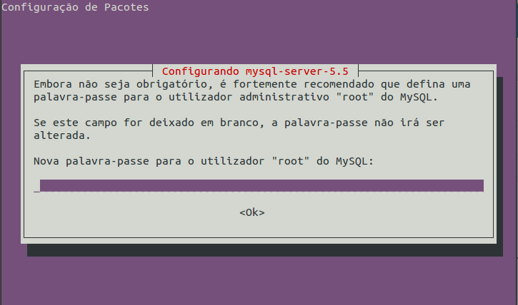
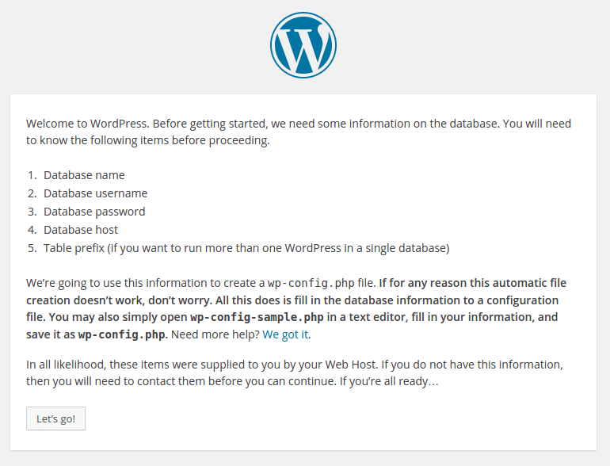
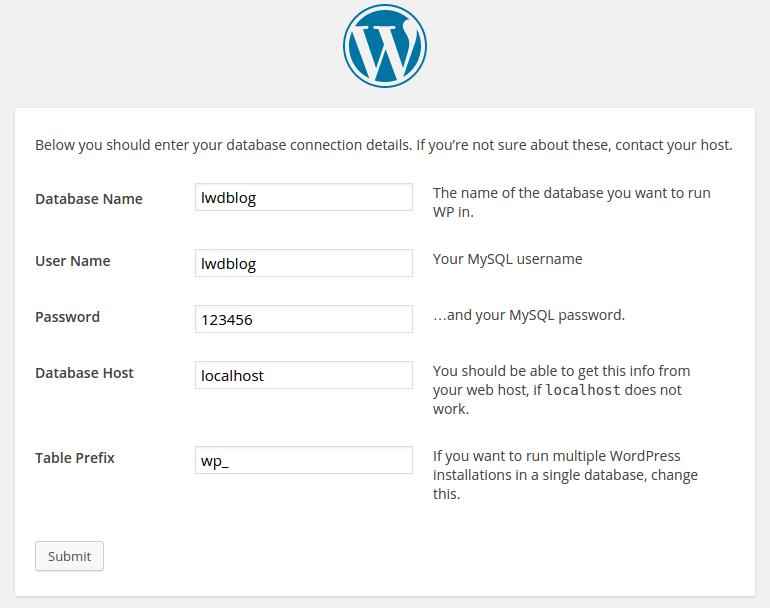
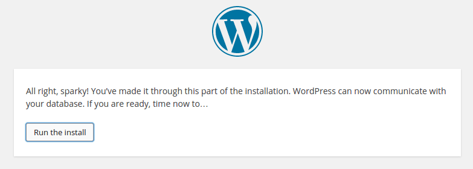
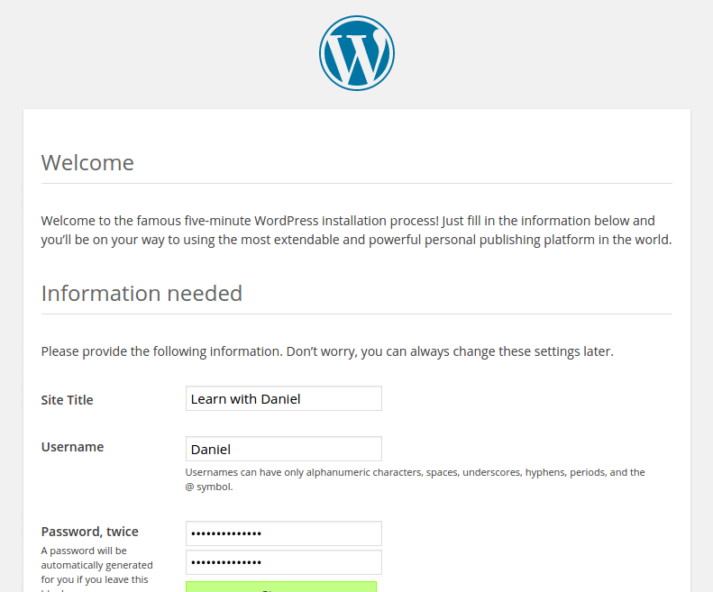
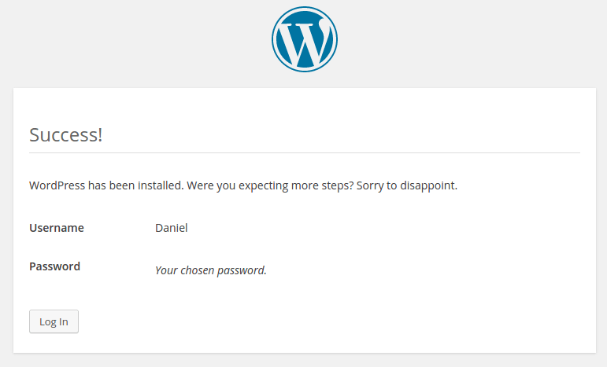

WordPress is the "de facto" standard for blogs.

Furthermore, WP is not restricted to blogs only – WP is largely used as a CMS to create non-blog websites. [23% of the whole internet](https://w3techs.com/technologies/details/cm-wordpress/all/all) is built on WordPress. Sites like Time, TechCrunch, The New Yorker, Fortune, Variety, Sony, Reuters, GM, Best Buy, and so on. And more important: WP is the platform I chose to publish this blog :)
<!-- more -->

If you want to start a blog, the fastest way is to go to [wordpress.com](wordpress.com) and create a free account. But beware: wordpress.com is **NOT** "the" WordPress.

wordpress.com is just a hosting enterprise that uses WordPress. "The" WP is an open-source PHP software that you can download and install on your own server and that can be downloaded at wordpress.org.

Hosting at wordpress.com is okay, but your domain will be something like "my-blog.wordpress.com" and not just "my-blog.com" – not very professional.

If you want a custom domain name, you pay them and they do all the process for you. It is an easy option, but I personally don't like it. I like to have max control over my things, like a Stalin of software. I like to be free to change the code, install plugins, and so on. That's why I decided to migrate from wordpress.com to my own server. And I recommend you to do the same (if you are like me).

---

## The recipe

### 1. Get a domain

There are many domain name registrar providers. I chose Go Daddy to buy my awesome `learnwithdaniel.com` domain, and I paid just US$ 0.99, but was a promotional discount, a bait – by now the prices are about US$ 13/year.

### 2. Get a cloud server

There are many options of cloud servers to buy. I'm using a local provider (from my city, because I choose local due to my moral superiority), but there are many options like AWS (you can have one machine for free, they use it as a bait like GoDaddy, but you will need a credit card to create an account), or Digital Ocean (US$ 5/month). Or you can host at your home or at your own company – if you have a fixed IP and a specific computer for that.

### 3. Download WordPress

Go to wordpress.org and [download it](https://wordpress.org/latest.tar.gz). I'm using the 4.1 version. It's a small file (5.9 MB).

On your server:

```bash
mkdir -p ~/install
cd ~/install
wget http://wordpress.org/latest.tar.gz
tar -xf latest.tar.gz
cd wordpress
```

### 4. Have Apache + PHP 5 + MySQL installed

I'm using Apache 2.4 and PHP 5.6. Check my tutorial on how to install [Apache + PHP](/2015/01/17/how-to-install-php-5-6-as-an-apache-module-on-ubuntu-server-14-0414-10/) if you need it.

Check if your Apache + PHP is working before proceeding. Check the versions with: `apache2 -v` and `php5 -v`.

For the database, I'm using MySQL 5.5, installed via apt-get (check with `mysql --version`):

```bash
sudo apt-get install mysql-server-5.5 mysql-client-5.5 php5-mysql
```



Yeap, my PC is configured to the Portuguese language

```bash
mysql -u root -p
```

Provide the password you defined when installing the server. Once you are in MySQL, create a user and database for our blog. For our example, the user will be `wordpress_user`, the password `123456`, and the database `wordpress_db`.

```sql
CREATE DATABASE wordpress_db;
GRANT USAGE on wordpress_db.* to wordpress_user@localhost identified by '123456';
GRANT ALL privileges on wordpress_db.* to wordpress_user@localhost;
```

Exit (type `quit` and press Enter) and test the new user/database:

```bash
mysql -u wordpress_user -p
  Password: 123456
```

```sql
mysql> USE wordpress_db;
```

::: tip
To change the password (to `102030`, for example), type `SET PASSWORD = PASSWORD('102030');` on MySQL prompt.
:::

The best way to manage a MySQL server is with **Oracle's MySQL Workbench**. You can install it for free on your PC (not on the server). But to be possible to access a remote database, you need to change the MySQL server file `/etc/mysql/my.cnf`:

```ini
#bind-address = 127.0.0.1 <--- comment this line and add the next line
bind-address = 0.0.0.0
```

### 5. Create a PHP folder for the WP and create the Apache configuration

Move WP to Apache folder (`/var/www/`):

```bash
sudo mkdir -p /var/www/learnwithdaniel
sudo mv ~/install/wordpress /var/www/learnwithdaniel/current
```

Set permissions:

```bash
cd /var/www/learnwithdaniel
```

```bash
chown www-data:www-data  -R * # Let Apache be owner
find . -type d -exec chmod 755 {} \; # Change directory permissions rwxr-xr-x
find . -type f -exec chmod 644 {} \;  # Change file permissions rw-r--r--
```

Create the Apache configuration:

```bash
sudo nano /etc/apache2/sites-available/learnwithdaniel.conf
```

::: tip
You can name this ".conf" file to whatever you want, but **NEVER** forget the `.conf` extension!
:::

```apacheconf
<VirtualHost *:80>
  ServerAdmin info@learnwithdaniel.com

  ServerName learnwithdaniel.com
  ServerAlias www.learnwithdaniel.com

  DocumentRoot /var/www/learnwithdaniel/current
  <Directory /var/www/learnwithdaniel/current>
    Options Indexes FollowSymLinks
    AllowOverride All
    Require all granted
  </Directory>

  ErrorLog /var/www/learnwithdaniel/error.log
  CustomLog /var/www/learnwithdaniel/access.log combined

  DirectoryIndex index.php
  AddHandler php-script .php
</VirtualHost>
```

Notice the `*:80`. Never use something like `<VirtualHost learnwithdaniel.com:80>`. Always use `*:80` even if you have many virtual hosts. `ServerName` and the `ServerAlias` are the directives that tell Apache which `VirtualHost` to use. If you have multiple domain names pointing to this server, you can add multiple `ServerAlias`.

Also, notice that I prefer to have "**current**" sub-folder for the site itself. You can see this structure in many places, like on Engine Yard. The logs stay at the project root, without external access. For a staging installation, I like to put it on a "**staging**" sub-folder.

### 5. Enable the site, test, restart Apache

```bash
sudo a2ensite learnwithdaniel

apachectl -t
  Syntax OK

sudo /etc/init.d/apache2 restart
```

### 6. Point your DNS to your cloud server

Usually, your domain name registrar provider (GoDaddy, NameCheap, ...) have an interface to manage the DNS records. Add an `A` record with the IP of your cloud server, and an `A` `www` record also pointing to that IP.

### 7. Access your site on a browser and configure WP

Step 1:


Step 2:


Step 3:


Step 4:


Step 5:


The process is quick and easy. Now, if you access your domain, you will see your blog.

---

## Hints

- To access your Admin Settings, go to "/wp-admin/" (ex.: `https://learnwithdaniel.com/wp-admin/`);

- If you want pretty URLs like `https://learnwithdaniel.com/2015/01/how-to` instead of the ugly `https://learnwithdaniel.com/?p=12`, you need to enable mod_rewrite (`sudo a2enmod rewrite`).

- If you want to force a "www" to your URL (or force a non-www), you need to configure the `Admin` > `Settings` > `General` > `WordPress Address (URL)` field and put a `www` (or remove it).

## Done!

You can now look for a template on the internet or make your own!
