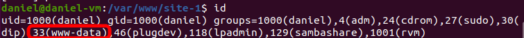

Let's run a Rails server using Puma and Apache. We will use Apache's reverse proxy and Puma's Jungle service.
<!-- more -->

## Passenger vs Puma vs Unicorn

As for 2019, there are three main options to serve a Rails application:

- **Phusion Passenger**
- **Puma**
- **Unicorn**

**Phusion Passenger** is an Apache/Nginx module. It works just like mod_php (it is sometimes referred to `mod_rails`). Passenger is probably the most used solution in production environments.

**Puma** and **Unicorn**, are stand-alone web servers. If you call them inside a Rails project root folder, they will listen to the port 80 (or any other you specify), wait for web connections, run the Rails code and answer to the browser – no need for Apache, Nginx, or anything else.

This tutorial shows how to run **Puma with Apache**. The only way to do this is through a **reverse proxy**, as there are no FastCGI or Apache/Nginx modules available.

---

## 1. Add puma to `Gemfile`

::: warning
Ignore this entire step 1 for Rails 5+, as Puma is the default webserver.
:::

```bash
cd /var/www/site-1
nano Gemfile
```

```ruby
# Gemfile
source 'https://rubygems.org'
...
gem 'puma'
...
```

```bash
bundle install
```

## 2. Create/replace contents of `puma.rb`

First, check how many CPU cores you have:

```bash
grep -c processor /proc/cpuinfo
  2
```

Set `./config/puma.rb`:

```ruby{3}
# /var/www/site-1/config/puma.rb
# Change to match your CPU core count
workers 2

# Min and Max threads per worker
threads 1, 6

# Project folder
app_dir = File.expand_path("../..", __FILE__)

# Default to production
rails_env = ENV.fetch("RAILS_ENV") { "production" }
environment rails_env

# Set up socket location
bind "unix://#{app_dir}/tmp/puma/puma.sock"

# Logs
stdout_redirect "#{app_dir}/log/puma.stdout.log", "#{app_dir}/log/puma.stderr.log", true

# Set master PID and state locations
pidfile "#{app_dir}/tmp/puma/pid"
state_path "#{app_dir}/tmp/puma/state"

# Establish db connection for new processes
on_worker_boot do
  require "active_record"
  ActiveSupport.on_load(:active_record) do
    ActiveRecord::Base.establish_connection(YAML.load_file("#{app_dir}/config/database.yml")[rails_env])
  end
end

# Allow puma to be restarted by `rails restart` command.
plugin :tmp_restart

# Puma control rack application
activate_control_app
```

Adjust the number of workers according to the number of CPU cores of your server. This will maximize performance.

## 3. Create a `./tmp/puma` folder

```bash
sudo mkdir -p ./tmp/puma
```

This folder will contain the PID/state/socket files. These file paths are set on `puma.rb` and are expected to be defined as this on the init scripts.

## 4. Permissions: Add your user to `www-data` group

Add your user to the `www-data` group in order to write/read the project folder:

```bash
sudo usermod -a -G www-data daniel
```

Replace `daniel` with the owner of the project files.

Check your groups:

```bash
id
  uid=1000(daniel) gid=1000(daniel) groups=1000(daniel),4(adm),24(cdrom),27(sudo),30(dip),33(www-data),46(plugdev),118(lpadmin),129(sambashare),1001(rvm)
```



If `www-data` group **doesn't appear** for you, do a logout/login. Close/open shell won't work.

## 5. Permissions: Set group permissions

Set group ID on the directory - all new files and sub-directories created within the current directory inherit the group ID:

```bash
sudo chmod g+s /var/www/site-1
sudo find /var/www/site-1 -type d -exec chmod 2775 {} \;
```

Set write permissions to the group:

```bash
sudo chown -R www-data:www-data /var/www/site-1
sudo chmod -R g+w /var/www/site-1
sudo find /var/www/site-1 -type f -exec chmod ug+rw {} \;
```

## 6. Download init scripts (`Jungle`)

```bash
cd ~
wget https://raw.githubusercontent.com/puma/puma/master/tools/jungle/init.d/puma
wget https://raw.githubusercontent.com/puma/puma/master/tools/jungle/init.d/run-puma
```

## 7. Install init scripts

```bash
# Copy the init script to services directory
sudo mv puma /etc/init.d
sudo chmod +x /etc/init.d/puma

# Make it start at boot time.
sudo update-rc.d -f puma defaults

# Move the Puma runner to an accessible location
sudo mv run-puma /usr/local/bin
sudo chmod +x /usr/local/bin/run-puma

# Create an empty configuration file
sudo touch /etc/puma.conf
```

## 8. Set which projects will be managed by Jungle

```ini
# /etc/puma.conf
/var/www/site-1,www-data
#/var/www/site-2,www-data
#/var/www/site-3,www-data
```

## 9. Start Puma (Jungle) service

```bash
sudo service puma restart
```

Check socket:

```bash
ls -lh /var/www/site-1/tmp/puma/puma.sock
```

If the file doesn't exist, check the logs (`./log/puma*`)

## 10. Test if service can be stopped

To be able to stop / restart the service, the **root user** must have Ruby and Puma installed:

```bash
sudo pumactl -v
```

If you see the "*command not found*" error, you need to install Puma for the root user:


A quick fix is to run `sudo apt install puma`. This won't mess your rbenv/rvm.

## 11. Install `mod_proxy` and `mod_proxy_http`

```bash
sudo a2enmod proxy
sudo a2enmod proxy_http
sudo service apache2 reload
```

## 12. Edit your domain #1 configuration

File `/etc/apache2/sites-available/site-1.conf`:

```apacheconf
<VirtualHost *:80>
  ServerName site-1.com
  ServerAlias www.site-1.com
  DocumentRoot /var/www/site-1/public

  <Location /assets>
    ProxyPass !
  </Location>
  <Location /system>
    ProxyPass !
  </Location>

  ProxyPass / unix:///var/www/site-1/tmp/puma/puma.sock|http://localhost/
  ProxyPassReverse / unix:///var/www/site-1/tmp/puma/puma.sock|http://localhost/
</VirtualHost>
```

Notice that `ProxyPass` ignores `/assets` and `/system` folders, so they won't be processed by Ruby.

## 13. Enable your domain #1 and restart Apache

```bash
sudo a2ensite site-1

apachectl -t
  Syntax Ok

sudo /etc/init.d/apache2 restart
```

---

## OPTIONAL: Using a different user other than `www-data` for Puma processes

As an example, let's create a `deploy` user for the Puma processes. We will also use a group with the same name, `deploy`.

### All commands as root user

```bash
sudo su
```

### Create the user/group

```bash
# create user deploy (password 102030)
useradd -m deploy -p 102030

# create group deploy
groupadd deploy

# add user to the group
usermod -a -G deploy deploy
```

### Add it to RVM (if using RVM)

```bash
rvm group add rvm deploy
```

### Change folder ownership

```bash
chown -R deploy:deploy /var/www/site-1
```

### Change `/etc/puma.conf`

```ini
/var/www/site-1,deploy
```

### Reload service

```bash
service puma restart
```

::: tip
For extra security, set a different user for each Rails project.
:::

---

That's it. Now you can add another site just repeating the process.
