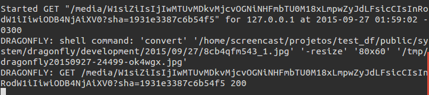
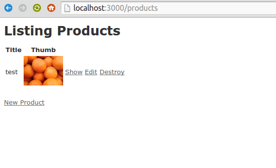
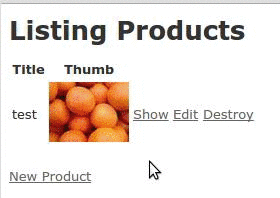

Let's say you want to add a **picture field** to your **product model**. How do you do it?

Unfortunately, Rails' Active Record doesn't provide a native way to work with binary fields, like pictures. We can easily add a string field, but we can't add a file field.
<!-- more -->

Dragonfly is a gem that extends ActiveRecord, allowing to have binary fields, like videos, files, or... pictures. It's a good, or even better, alternative to the famous Paperclip gem.

---

## Before we start

Let's create an example app with these commands:

```bash
rails new test_df
cd test_df
rails g scaffold product title
rake db:migrate
rails s
```

## Installation

### 1. Declare DragonFly gem on Gemfile

```ruby
# Gemfile
gem 'dragonfly'
```

### 2. Install it

```bash
bundle install
```

### 3. Generate the initializer file

```bash
rails g dragonfly
```

This command generates a `config/initializers/dragonfly.rb` file, which can be used to configure DragonFly's core settings.

## Creating an image field

To add a normal string field like `color`, we create a migration like this:

```bash
rails g migration add_field_to_product color
```

That's how we create a `color` string field. To create a Dragonfly field, you need to add an `_uid` at the end of the name. So, in this example, the name would be `color_uid`. If the name is `photo`, that would be `photo_uid`.

Let's use `image` as the field name:

```bash
rails g migration add_field_to_product image_uid
```

Commit the changes with `rake db:migrate`:

```bash
rake db:migrate
```

Now open the `product` model and let Rails know this field isn't a string, but a file:

```ruby
# app/model/product.rb
dragonfly_accessor :image
```

## Saving a file to a record

### 1. For our test, save this image in your `Images` folder as `1.jpg`


### 2. Open the rails console

```bash
rails c
```

### 3. Load the image file, get a record, put the image on it, and save it

```ruby
> i = open('../../Images/1.jpg')
> p = Product.last
> p.image = i
> p.save!
```

::: warning
We are using `../../Images`, because my project is at `~/projects/test-dragonfly`, i.e., 2 folders from `~/Images`. Change it at your will.
:::

### 4. Close the console and re-open it again to make sure the image has been saved

```ruby
> quit

rails c

> p = Product.last
> p.image
# => <Dragonfly Attachment uid="2015/09/26/4ad07k6hin_1.jpg", app=:default>
```

If `p.image` isn't nil, it has been saved.

## Retrieving

### 1. To get the file path, use the `url` method

```ruby
> p.image.url
# => "/media/W1siZiIsIjIwMTUvMDkvMjYvNGFkMDdrNmhpbl8xLmpwZyJdXQ?sha=0d7af674c4891620"
```

### 2. Copy and paste the result on the browser and you will see the file

```bash
http://localhost:3000/media/W1siZiIsIjIwMTUvMDkvMjYvNGFkMDdrNmhpbl8xLmpwZyJdXQ?sha=0d7af674c4891620
```

### 3. For images, we can use the `thumb` method. It generates a new version with different geometries

```ruby
> p.image.thumb('80x60').url
 => "/media/W1siZiIsIjIwMTUvMDkvMjcvOGNiNHFmbTU0M18xLmpwZyJdLFsicCIsInRodW1iIiwiODB4NjAiXV0?sha=1931e3387c6b54f5"
```

### 4. Copy and paste the result on the browser and see the same image with the new dimensions

---

## Dragonfly is on-the-fly

In the rails server window, we can see the logs showing that DragonFly is generating the file on the fly:



Whenever someone loads the thumb image on a browser, Dragonfly gets the original image and converts it, generating a new image.

To see this process happening, just reload the image on the browser and check the logs.

That's why DragonFly has this name – it's on-the-fly, like a Dragonfly :)

---

## Displaying on `index.html` and `show.html`

Now, let's show these images as thumbs in our product index page.

### 1. Open `index.html.erb` and create a `thumb` column

Use `image_tag()` to generate an HTML image tag and the `thumb()` method to generate a smaller version of the image.

Simplified example:

```erb
<!-- apps/views/products/index.html.erb -->
<table>
  <tr>
    <th>Title</th>
    <th>Thumb</th>
  </tr>
  <% @products.each do |product| %>
  <tr>
    <td><%= product.name %></td>
    <td><%= image_tag product.image.thumb('80x60').url %></td>
  </tr>
  <% end %>
</table>
```

Result:


### 2. Do the same for `show.html.erb`

```erb
<!-- apps/views/products/show.html.erb -->
<p>
  <strong>Image:</strong>
  <%= @product.image.url %>
</p>
```

### 3. Check if the image exists

If you run the above code you are going to get an exception. That's because you have some records without any image attached, and you're calling `thumb`/`url` methods from a `nil` value.

To check if the field has an attached file or not, use Rail's core `nil?` method or use the `_stored?` method:

```erb
<!-- apps/views/products/show.html.erb -->
<%= product.image_stored? ? image_tag(product.image.thumb('80x60').url) : "" %>
```

OR

```erb
<!-- apps/views/products/show.html.erb -->
<%= product.image.nil? ? image_tag(product.image.thumb('80x60').url) : "" %>
```

## Using it on forms

We've added images using the console. But how to save the image through a form?

With DragonFly, we can do it in the same way that we would do with a normal field.

### 1. Open `_form.html.erb`, create a new HTML field with the corresponding name, and use the `file_field` method to generate a HTML file field

```erb
<!-- app/views/products/_form.html.erb -->
<%= form_for(@product) do |f| %>
  <div class="field">
    <%= f.label :title %><br>
    <%= f.text_field :title %>
  </div>
  <div class="field">
    <%= f.label :image %><br>
    <%= f.file_field :image %>
  </div>
  <div class="actions">
    <%= f.submit %>
  </div>
<% end %>
```

### 2. Like other fields, we must allow it in strong parameters

```ruby
# app/controllers/products_controller.rb
...
def product_params
  params.require(:product).permit(:title, :image)
end
...
```

Now we can send and save an image using the form:


## Performance with cache

As DragonFly gem generates new versions on the fly, it can be very resource-consuming, so we need to use a server cache solution.

Let's add the `rack-cache gem`.

### 1. Add it to `Gemfile`

```ruby
# Gemfile
gem 'rack-cache', require: 'rack/cache', group: :production
```

### 2. Install it

```bash
bundle install
```

### 3. Enable it on production

```ruby
# config/environments/production.rb
config.action_dispatch.rack_cache = true
```

### 4. Set the cache's temporary folder

```ruby
# config/application.rb
class Application < Rails::Application
  ...
  if defined?(Rack::Cache)
    config.middleware.delete(Rack::Cache)
    config.middleware.insert 0, Rack::Cache, {
      :verbose     => true, # log verbosity
      :metastore   => URI.encode("file:#{Rails.root}/tmp/dragonfly/cache/meta"), # URI encoded in case of spaces
      :entitystore => URI.encode("file:#{Rails.root}/tmp/dragonfly/cache/body")
    }
  end
end
```

::: tip
You don't need to do this if you already use a server cache solution like **Varnish**.
:::

## Validation

Use `validates_property` method on the model to validate properties. Examples:

```ruby
# app/models/product.rb
class Product < ActiveRecord::Base
  dragonfly_accessor :image

  validates_property :width, of: :image, in: (0..400)
  validates_property :mime_type, of: :image, in: %w(image/jpeg image/png)
  validates_property :size, of: :image, maximum: 500.kilobytes
end
```

As an example, let's say you want to validate if the attachment is an image or something else. With this you can make sure your users aren't uploading movies or applications:

```ruby
# app/models/product.rb
class Product < ActiveRecord::Base
  dragonfly_accessor :image

  validates_property :mime_type, of: :image, in: %w(image)
end
```

See a full list of validations here:
[https://markevans.github.io/dragonfly/models#validations](https://markevans.github.io/dragonfly/models#validations)

## S3, Dropbox, Watermarks and More

This concludes our basic DragonFly gem tutorial, but DragonFly has also many advanced features: you can use Amazon S3, Dropbox, and other providers as your storage. You can change the image on-the-fly in so many ways: add a watermark, change to black and white, change the file format, and so on. You can also create your own plugins to extend DragonFly.

You can also work with other binary types like movies or apps, but I won't cover these things here. Maybe on other tutorial ;)

## Common problems

- **"404 - Not Found:** If you get this error, you probably don't have `ImageMagick` installed. On Ubuntu, run a `sudo apt-get install imagemagick` to fix it.

## More info

- **DragonFly gem:** [https://markevans.github.io/dragonfly/](https://markevans.github.io/dragonfly/)
- **On GitHub:** [https://github.com/markevans/dragonfly](https://github.com/markevans/dragonfly)
- **DragonFly author:** Mark Evans
