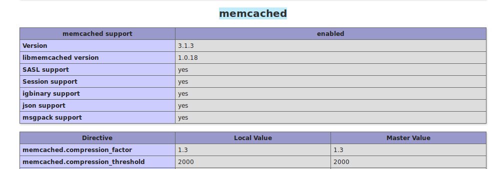
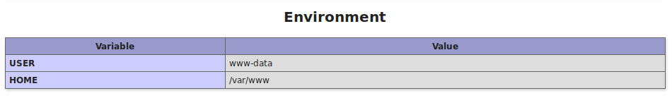
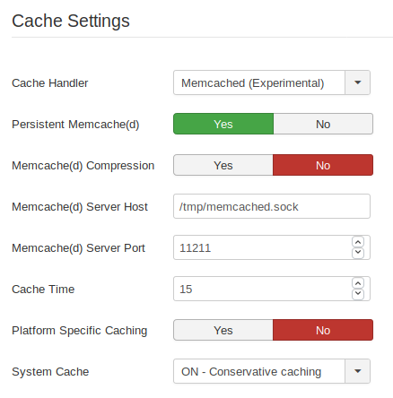
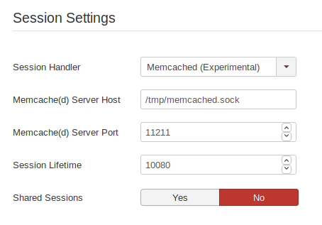

Let's see how to use Memcache to improve the performance of your Joomla installation.
<!-- more -->

## Memcache or Memcached?

They are two different software, made by different authors, but mostly compatible with each other.

This tutorial has been tested with Memcache**d** (with a trailing d), but it should work with Memcache too.

## 1. Installation

### Install server and its PHP module

```bash
sudo apt install php-memcached memcached
```

### To test it, create a `phpinfo.php` file in the Joomla root folder

```php
<?php phpinfo();
```

### Open the page in your browser

Example: `http://localhost/phpinfo.php`

### Look for a memcached reference



---

## 2. Add `memcache` user to `www-data` group

```bash
sudo usermod -g www-data memcache
```

::: warning
Yes, the *memcached* user is named "*memcache*" (without a `d`). I believe this is for compability reasons with `memcache`.
:::

`www-data` is the default nginx/apache user on most Linux distributions. Change it to your actual user if necessary. You can double check this in your phpinfo:



## 3. Enable UNIX sockets

Add these lines to `/etc/memcached.conf`:

```ini
# Create unix sock
-s /tmp/memcached.sock

# Set permissions to the group
-a 775
```

## 4. Disable TCP (optional)

For extra security, disable TCP connections. This prevents accessing it from the outside. Comment these 2 settings on `/etc/memcached.conf`:

```ini
# Default connection port is 11211
#-p 11211

# Specify which IP address to listen on. The default is to listen on all IP addresses
# This parameter is one of the only security measures that memcached has, so make sure
# it's listening on a firewalled interface.
#-l 127.0.0.1
```

## 5. Restart service

```bash
sudo service memcached restart
```

## 6. Configure Joomla

At `Joomla` > `Admin` > `System` > `Global Configuration` > `System Tab` > `Cache Settings`:

- **Handler:** `Memcached`
- **Host:** `/tmp/memcached.sock`
- **System Cache:** `ON`



## 7. Avoid session issues by changing your `public $secret`

You are going to experience **session issues** if multiple Joomla instances are running on the same machine.

To avoid this, do the following:

- Open `configuration.php`
- Change `public $secret = 'a unique string';`

```php
// configuration.php
public $secret = 'a unique string';
```

Needless to say that "**a unique string**" should be replaced with your own unique string. Joomla's memcached controller uses the `$secret` value to differentiate between instances so sessions don't get mixed up.

::: danger
Do this step **NOW** even if you have just one Joomla instance installed. This will prevent future issues.
:::

## 8. Sessions with Memcached

For extra speed, enable Memcached for your Sessions:



---

## TROUBLESHOOTING

If you see the following error message, fix it with **step 6** ("*avoid session issues*"):

```bash
Warning: session_start(): Unable to clear session lock record in /var/www/mysite/staging/libraries/joomla/session/handler/native.php on line 260
Warning: session_start(): Failed to read session data: memcached (path: /tmp/memcached.sock:11211) in /var/www/mysite/staging/libraries/joomla/session/handler/native.php on line 260
Error: Failed to start application: Failed to start the session
```

This is a common issue, especially if you have cloned your website and haven't changed the "secret" variable.
