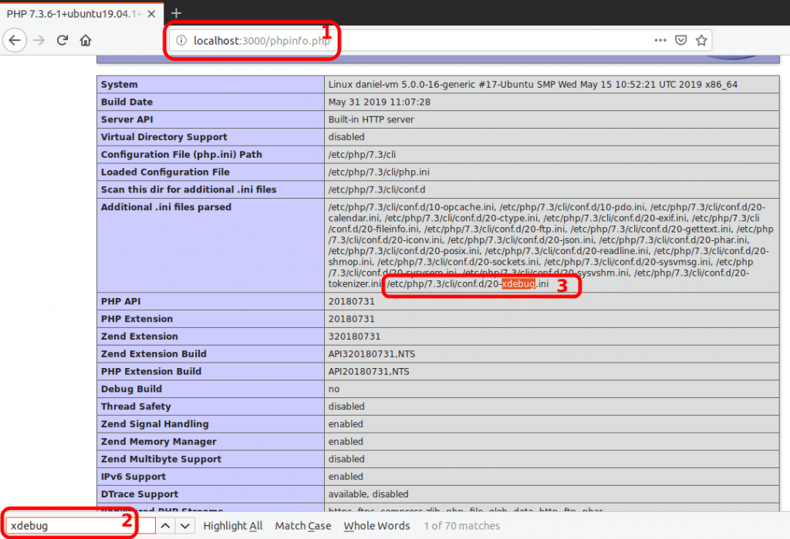
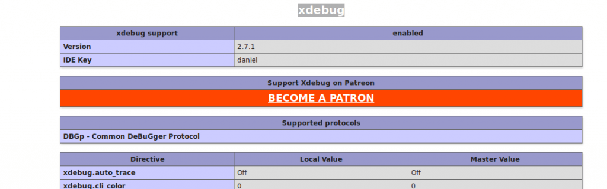
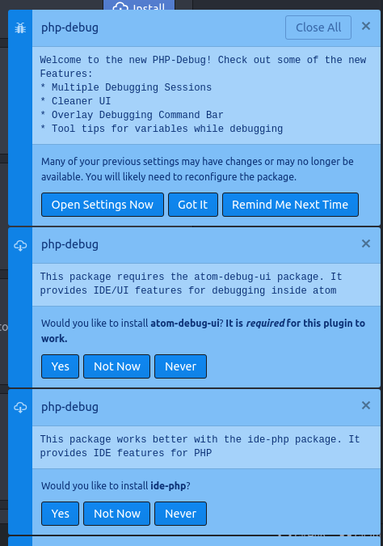

This tutorial shows how to debug PHP on Atom Editor.
<!-- more -->

## 1. Install xdebug

```bash
sudo apt install php-xdebug
```

## 2. Check installation

Create a temporary file to display your `phpinfo` information:

```bash
cd
echo "<?php phpinfo();" > phpinfo.php
php -S localhost:3000
    PHP 7.3.6-1+ubuntu19.04.1+deb.sury.org+1 Development Server started at Wed Jun  5 17:20:29 2019
    Listening on http://localhost:3000
    Document root is /home/daniel
    Press Ctrl-C to quit.
```

Now, **(1)** open the page, **(2)** search for xdebug, and **(3)** get the `xdebug.ini` path:


Down on the same page, check if the module is enabled:


Now you can remove the `phpinfo.php` file (optional):

```bash
cd
rm phpinfo.php
```

## 3. Add these lines to `xdebug.ini`

```ini
# /etc/php/7.3/cli/conf.d/20-xdebug.ini

# xdebug v2.x
xdebug.remote_enable=1
xdebug.remote_host=127.0.0.1
xdebug.remote_connect_back=1    # Not safe for production servers
xdebug.remote_port=9000
xdebug.remote_handler=dbgp
xdebug.remote_mode=req
xdebug.remote_autostart=true

# xdebug v3.x
xdebug.mode=debug
xdebug.start_with_request=yes # try "trigger" if not working
xdebug.client_port=9000
```

## 4. Install `php-debug` plugin on Atom

In Atom, install package `php-debug` by *gwomacks*:
`Ctrl+Shift+P` > `Install Packages and Themes` > `php-debug`

I recommend you to install the suggested plugins:


::: tip
If you click to install the suggested plugins, wait until you get a success notification for each plugin before closing Atom.
:::

## 5. Re-start Atom editor

## 6. To add breakpoints, click on the marker ruler

::: danger
There are 2 breakpoint rulers (the blue dots):
**Use the one at right** (the small blue dot, not the big)


:::

---

## TROUBLESHOOTING

- If it doesn't work, you have probably edited the wrong `xdebug.ini` file. The path with `/cli/` folder on it is for the standalone `php -S` command. If you are using Nginx/Apache or FPM, then it's a different path.

- In older versions of Atom Editor, you had to OPEN the "php debug" panel. You can open it by clicking on the bottom-left button on Atom. If the "php debug" panel is closed, the breakpoints **WILL BE IGNORED**. This has been fixed in more recent versions, but some bugs can return – so double-check this.

- There is a **FAKE breakpoint**: the one on the left. The correct one is the one at **RIGHT**. If you set the other breakpoint, it will be ignored.

- Re-start Atom: **Have you tried turning it off and on again?**
