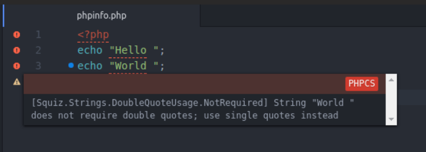
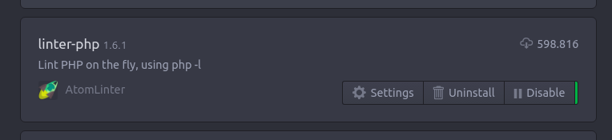
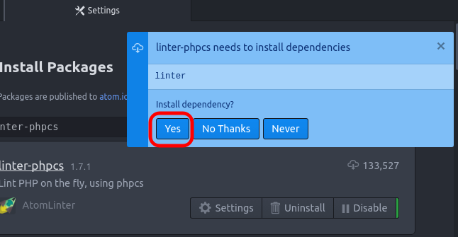
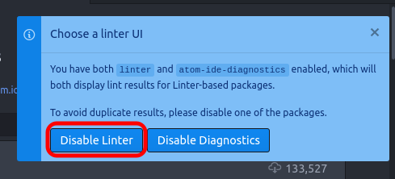
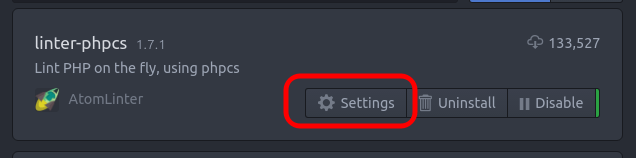
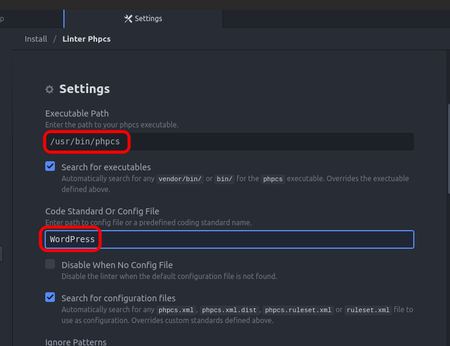

**PHP Code Sniffer** (aka **PHPCS**) is, for me, the most essential tool for professional PHP development.
<!-- more -->

PHPCS warns you about bad practices, bad coding styling, and help you to build better and more professional code.


PHPCS is a **linter**, a class of tools to assist you when writing code.

::: tip
The second most essential tool for me is another popular PHP linter, the PHP Mess Detector (PHPMD). **If you are not using them, start it right now.** [Check my PHPMD tutorial here](/2019/07/phpmd-atom/)
:::

---

## 1. Install PHPCS

Check if *phpcs* is installed:

```bash
phpcs -i
    Command 'phpcs' not found, but can be installed with: sudo apt install php-codesniffer
```

Install it globally with `composer`:

```bash
composer global require squizlabs/php_codesniffer
```

Get the *phpcs* binary path:

```bash
composer global config bin-dir --absolute
    Changed current directory to /home/daniel/.config/composer /home/daniel/.config/composer/vendor/bin
```

In this example, the binary path is `/home/daniel/.config/composer/vendor/bin`.

Add it to your *PATH* environment variable, by editing `~/.profile` and **adding** these lines at the bottom:

```bash
# PHPCS
export PATH=/home/daniel/.config/composer/vendor/bin:$PATH
```

::: danger
Change `/home/daniel/.config/composer/vendor/bin` with your actual phpcs binary path.
:::

### Restart your profile

**Now, do a logout/login.** Closing and re-opening the shell won't work. You could run a "source ~/.profile", but it would work just for the opened shell. So, do a logout/login.

## 2. Check installed coding styles

After logout/login, check if the command is installed:

```bash
phpcs -i
    The installed coding standards are Squiz, PHPCS, Zend, PSR1, PSR2, PEAR and MySource
```

## 3. Install `phpcodesniffer-composer-installer`

This package is a life-saver. Without it, you need to manually set up paths, which can lead to accidental misconfigurations and overwriting.

```bash
composer global require --dev dealerdirect/phpcodesniffer-composer-installer
```

## 4. [OPTIONAL] Install extra coding styles system-wide: WordPress, Joomla, etc

### [WordPress](https://github.com/WordPress-Coding-Standards/WordPress-Coding-Standards)

```bash
composer global require wp-coding-standards/wpcs:*
```

It is also recommended to install the [PHPCompatibilityWP](https://github.com/PHPCompatibility/PHPCompatibilityWP) package too:

```bash
composer global require --dev phpcompatibility/phpcompatibility-wp:*
```

### [WordPress VIP](https://github.com/Automattic/VIP-Coding-Standards)

```bash
composer global require --dev automattic/vipwpcs:*
```

### [Joomla](https://docs.joomla.org/Joomla_CodeSniffer)

```bash
composer global require --dev joomla/coding-standards:*
```

#### Error installing the Joomla package

If you get this error:
> Could not find a version of package joomla/coding-standards matching your minimum-stability (stable). Require it with an explicit version constraint allowing its desired stability.

Then, decrease your stability requirements to `dev`:

```bash
composer global config minimum-stability dev
composer global require --dev joomla/coding-standards:*
composer global config minimum-stability stable
```

---

## 5. Check installed rules

```bash
phpcs -i
    The installed coding standards are Squiz, Zend, PSR1, PSR2, PEAR, MySource, PSR12, PHPCompatibility, Joomla, Joomla-CMS, Joomla-Stats, PHPCompatibilityParagonieRandomCompat, PHPCompatibilityParagonieSodiumCompat, PHPCompatibilityWP, WordPress-VIP-Go, WordPressVIPMinimum, WordPress-Docs, WordPress, WordPress-Core and WordPress-Extra
```

---

## 6. Get the bin path

```bash
which phpcs
    /home/daniel/.config/composer/vendor/bin/phpcs
```

In this example, the bin path is `/home/daniel/.config/composer/vendor/bin/phpcs`.

## 7. In Atom, install `linter` and `linter-php` packages

In Atom, install packages `linter` and `linter-php` by AtomLinter:
`Ctrl+Shift+P` > `Install Packages and Themes` > `linter-php`



## 8. In Atom, install `linter-phpcs` package

In Atom, install package `linter-phpcs` by AtomLinter:
`Ctrl+Shift+P` > `Install Packages and Themes` > `linter-phpcs`

Install suggested dependencies:


Disable `linter`. I know, we have just installed it as a dependency:


Click on `Settings` to configure `linter-phpcs`:


Set the bin path and the coding standard you want to use:


And that's it. Now you will see hints / warnings to improve your code :)

