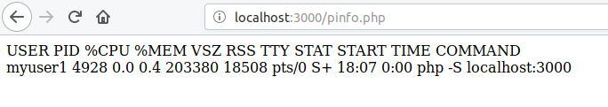

For security reasons, you shouldn't run all your NGINX virtual hosts with the same user.

::: tip
See **why** it's a bad practice to run all sites on the same user at the [end of this article](#why-to-use-multiple-users-security-reasons).
:::
<!-- more -->

Considering that you are using PHP-FPM (you probably are, as it is the most usual), you can create a spool, owned by a different user, for each domain.

## 1. Create spools

Add the spools to `/etc/php/{php-version}/fpm/pool.d/www.conf` or create a new `.conf` file for each new spool.

### Spool #1 (myuser1/mygroup1)

```ini
[myprojectuser1]
user = myuser1
group = mygroup1
..
listen = /run/php/myuser1.sock
...
listen.owner = www-data
listen.group = www-data
```

### Spool #2 (myuser2/mygroup2)

```ini
[myprojectuser2]
user = myuser2
group = mygroup2
..
listen = /run/php/myuser2.sock
...
listen.owner = www-data
listen.group = www-data
```

::: warning
Settings `listen.owner` and `listen.group` are your NGINX user (usually `www-data`).
:::

## 2. Assign each spool to its server block

::: tip
A virtual host is called "server block" on NGINX world.
:::

### Host 1

```nginx
server {
  ...
  location ~ \.php$ {
    fastcgi_pass unix:/run/php/myuser1.sock;
  }
  ...
}
```

### Host 2

```nginx
server {
  ...
  location ~ \.php$ {
    fastcgi_pass unix:/run/php/myuser2.sock;
  }
  ...
}
```

## 3. Restart FPM and NGINX services

```bash
sudo /etc/init.d/php7.0-fpm restart
sudo service nginx restart
```

::: warning
RESTART `fpm service` when you change the fpm settings.
:::

## 4. Testing

Create a `pinfo.php` file (or whatever name) that will show the current process user:

```php
<?php
// pinfo.php
echo str_replace("\n", '<br>', shell_exec('ps -u -p '.getmypid()));
```

Then open "[http://.../pinfo.php](http://.../pinfo.php)" on your browser:


---

## Why to use multiple users (security reasons)

If you run all your websites on the same user (`www-data`), a PHP call to `system()` / `passthru()` / `exec()` will have access to all your websites! **NGINX will not protect you against this.** PHP is just an example, but any popular web-server language has similar calls.

As a hacker, you can "`ls ..`" to navigate through all websites and "`cp`/`echo`/`mv`" to write your own code on any file (including another website files). Even if all websites on the server are owned by the same person (ex. you) it's advisable to run each website with a different user, as it will prevent eventual hackers/virus (ex. WordPress viruses) from accessing your other websites.
