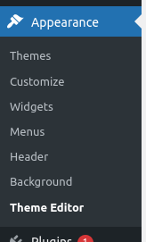
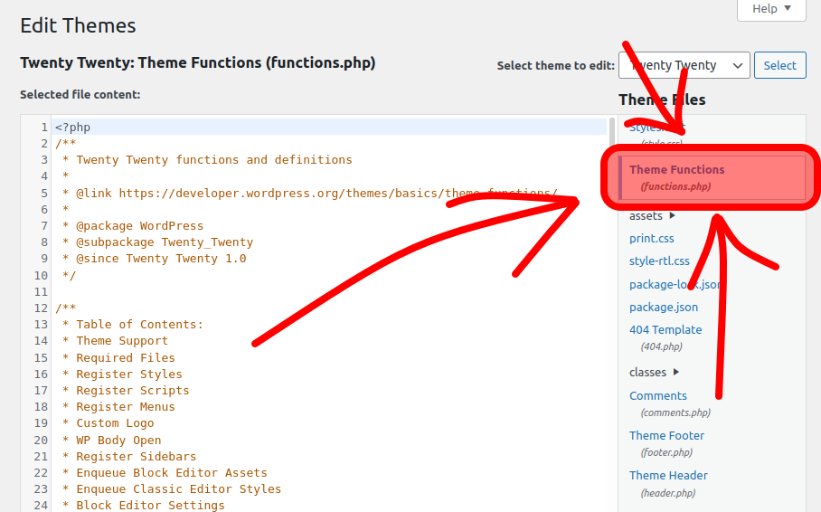
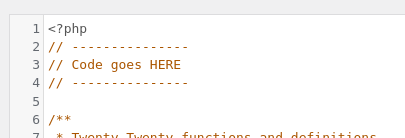
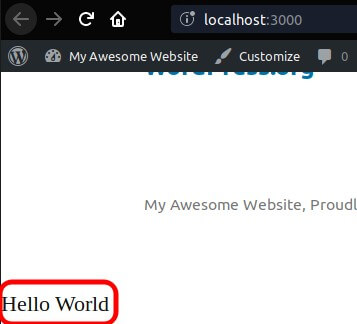

Let's see how to implement `Hello, World!` in WordPress.
<!-- more -->

## The `functions.php`

The quickest way to write code in WordPress is to put the code in the famous `functions.php` file.

The `function.php` file lives in the theme's folder.

<!-- You may have heard of this file before, as the `functions.php` file is popular on WordPress, even for non-developers. It is meant for small custom changes. -->

WordPress automatically loads the `functions.php` file, and its code acts as a plugin.

Let's see it in action.

## Editing `functions.php` on the browser

Go to `Appearance > Theme Editor`


Click on `functions.php` (right sidebar)


Write code after the `<?php` line, and before everything else


## `Hello, World!`

Write this in `functions.php`:

```php
add_action( 'wp_footer', function () {
  echo 'Hello, World!';
} );
```

Now, open the homepage and check the footer:


We just rendered a `Hello, World!` in WordPress.

### Code explanation

We are listening for an event called `wp_footer`. This event happens when WordPress renders the page's footer.

When the event happens, our callback is triggered, printing `Hello, World!`.

In the following article, we will see this in more detail.

## Editing `functions.php` on a Code Editor

You can use your code editor to edit `functions.php`.

The `functions.php` file is in the active theme's root directory.

If your active theme is "Twenty Twenty", which is in a folder named `twenty-twenty`, the functions file path is:
`wp-content/themes/twenty-twenty/functions.php`.

## Child Themes

All your changes to `functions.php` will be lost if you update the theme.

To avoid this, make sure you are using a child theme.

A child theme is a special copy of the theme you are using. It is meant so you can change the theme files (for example, `functions.php`) and protect the changes from theme updates.

See the official instructions for creating child themes:
[https://developer.wordpress.org/themes/advanced-topics/child-themes/](https://developer.wordpress.org/themes/advanced-topics/child-themes/)
