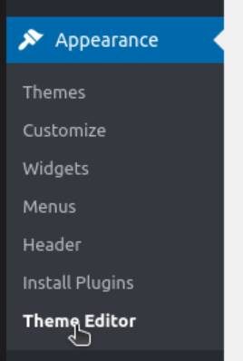
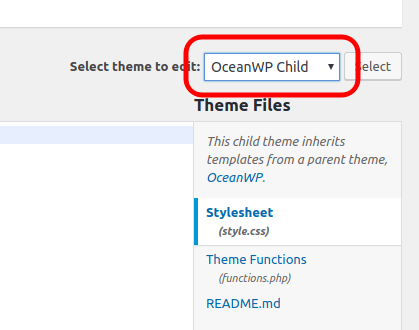
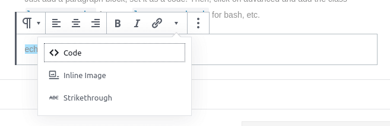
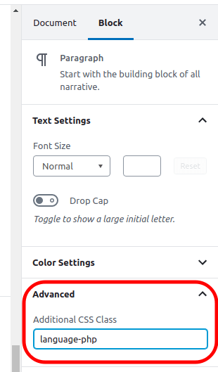
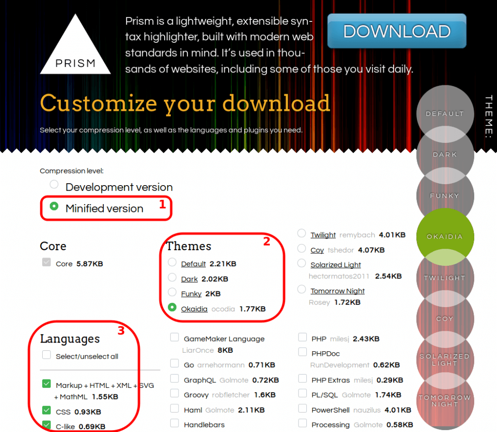
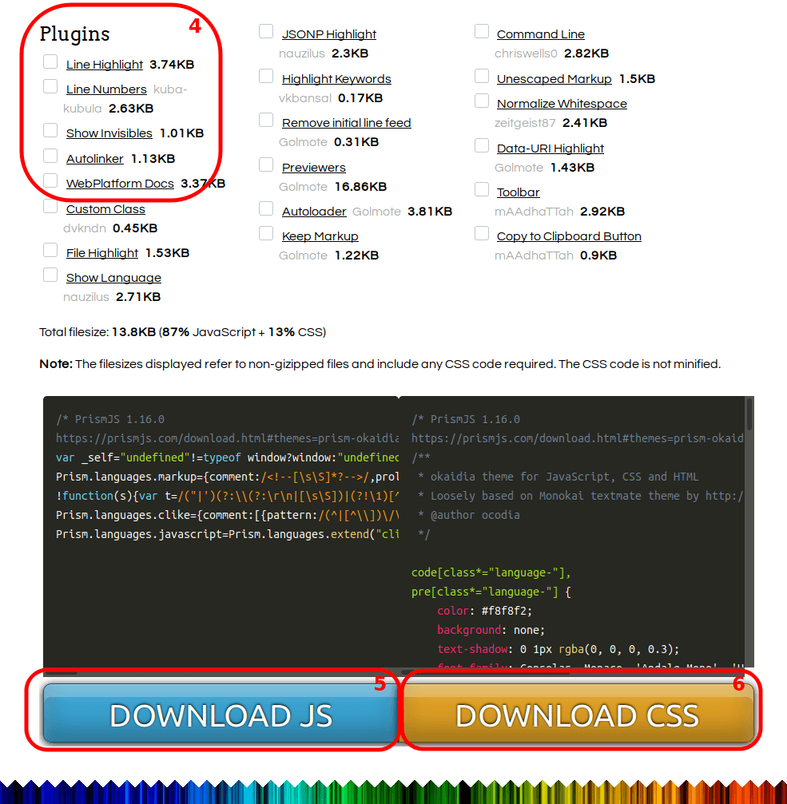

This blog runs on Prism JS to prettify the code blocks. Here I show a quick, 5-minute, simple way to add it on your own WordPress blog. **No plugin required!**
<!-- more -->

::: warning
**UPDATE Nov 2020:** I changed this blog from WordPress to VuePress, which also uses PrismJS. While this blog doesn't run on WP+Prism anymore, this article is still valid.
:::

## 1. Download PrismJS

Download `prism.js` and `prism.css`:
[https://prismjs.com/](https://prismjs.com/)

::: tip
If you get confused downloading the files, [check the end of this article](#extra-downloading-prism-js-css) for detailed instructions.
:::

## 2. Move files to your theme folder

Move `prism.js` and `prism.css` to `wp-content/themes/{your-theme-name}`

---

If you don't know your theme name, go to Admin, click `Appearance` > `Theme Editor`:


Your theme name is shown at the top-right:


## 3. Edit your theme `functions.php`

On the theme editor, click on "**Theme Functions**" and add this code:

```php
// functions.php
function add_prism() {
    wp_enqueue_style( 'prism-css',  get_stylesheet_directory_uri() . '/prism.css' );
    wp_enqueue_script( 'prism-js',  get_stylesheet_directory_uri() . '/prism.js', [], false, true );
}
add_action( 'wp_enqueue_scripts', 'add_prism' );
```

::: success
That's it!
:::

---

## Usage - Gutemberg Editor (WordPress 5+)

Add a **paragraph** block and set it as a **code**:


Then, click on `Advanced` and add the class `language-php` for PHP, `language-bash` for bash, etc.


**Alternatively**, use a `HTML block` with `<pre class="language-php"><code>...</code></pre>`.

::: warning
If your code contains `<` symbols, you need to escape them **OR** use the "[Unescaped markup](https://prismjs.com/plugins/unescaped-markup/" Prism plugin. If you use this plugin, you can replace `<pre><code>` tags with `<script>` tags.
:::

## Usage - Classic Editor (WordPress 4-)

Edit the HTML (`Text` tab) and wrap your code in `<pre class="language-php"><code>...</code></pre>` tags.

If your code contains `<` symbols, you need to escape them **OR** to use the "[Unescaped markup](https://prismjs.com/plugins/unescaped-markup/" Prism plugin. If you use this plugin, you can replace `<pre><code>` tags with `<script>` tags.

---

## EXTRA: Downloading Prism.js/css

On the [official page](https://prismjs.com/), click on `Download`.

Select **(1)** `Minified`, **(2)** your preferred **theme** (I use `Okaidia`), **(3)** the **languages** you are going to use (if in doubt, `select all` - this will increase the js size though):


Then, down on the same page, select **(4)** **plugins** (*you don't need any for basic display, but if in doubt, `select all`*), **(5)** Download JS, **(6)** Download CSS:


Save files as `prism.js` and `prism.css`
