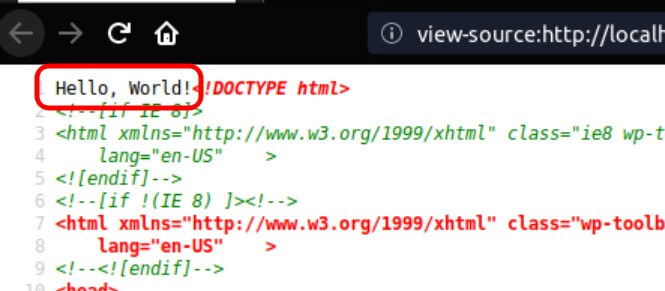

Let's put our code in an actual plugin instead of using `functions.php`.
<!-- more -->

Let's create our `my-plugin` plugin with `wp-cli`. In the WordPress root folder, run:

```bash
wp scaffold plugin my-plugin
  Success: Created plugin files.
  Success: Created test files.
```

This command creates a `my-plugin` folder inside the `wp-content/plugins` folder:

```bash
tree wp-content/plugins/my-plugin
  wp-content/plugins/my-plugin
  ├── bin
  │   └── install-wp-tests.sh
  ├── Gruntfile.js
  ├── my-plugin.php
  ├── package.json
  ├── phpunit.xml.dist
  ├── readme.txt
  └── tests
      ├── bootstrap.php
      └── test-sample.php

  2 directories, 8 files
```

Go to `Plugins` and activate the plugin:


Now, open the `my-plugin/my-plugin.php` file. This is the entry point for our plugin:

```php
<?php
/**
 * Plugin Name:     My Plugin
 * Plugin URI:      PLUGIN SITE HERE
 * Description:     PLUGIN DESCRIPTION HERE
 * Author:          YOUR NAME HERE
 * Author URI:      YOUR SITE HERE
 * Text Domain:     my-plugin
 * Domain Path:     /languages
 * Version:         0.1.0
 *
 * @package         My_Plugin
 */

// Your code starts here.
```

And replace the `// Your code ...` with `echo 'Hello, World!'`:

```php
<?php
/**
 * Plugin Name:     My Plugin
 * Plugin URI:      PLUGIN SITE HERE
 * Description:     PLUGIN DESCRIPTION HERE
 * Author:          YOUR NAME HERE
 * Author URI:      YOUR SITE HERE
 * Text Domain:     my-plugin
 * Domain Path:     /languages
 * Version:         0.1.0
 *
 * @package         My_Plugin
 */

echo 'Hello, World!';
```

Now, open the home page:


Notice the "**Hello, World!**" on the top left. Open the source code and notice that it is the very first string of the code.



::: success
Congratulations! You have created a WordPress plugin!!!
:::

---

## 4. Enable debug mode

Set `define('WP_DEBUG', true)` on your `wp-config.php` (the constant is already defined, just change the value to `true`):

```php{14}
// wp-config.php
/**
 * For developers: WordPress debugging mode.
 *
 * Change this to true to enable the display of notices during development.
 * It is strongly recommended that plugin and theme developers use WP_DEBUG
 * in their development environments.
 *
 * For information on other constants that can be used for debugging,
 * visit the Codex.
 *
 * @link https://codex.wordpress.org/Debugging_in_WordPress
 */
define( 'WP_DEBUG', true );

/* That's all, stop editing! Happy publishing. */

/** Absolute path to the WordPress directory. */
if ( ! defined( 'ABSPATH' ) ) {
        define( 'ABSPATH', dirname( __FILE__ ) . '/' );
}

/** Sets up WordPress vars and included files. */
require_once( ABSPATH . 'wp-settings.php' );
```

::: tip
The log is going to be saved to `wp-content/debug.log`
:::

## 5. Change the headers

Adapt the headers with your information: `plugin name`, `URL`, `version`, etc.

Also, **delete the "echo"** command.

```php
<?php
/**
 * Plugin Name:     My Plugin
 * Description:     My first plugin.
 * Author:          John Snow
 * Text Domain:     my-plugin
 * Domain Path:     /languages
 * Version:         20190604
 *
 * @package         My_Plugin
 */

// echo 'Hello, World!';
```

Save and reload the plugins page:


`Text Domain` and `Domain Path` are optional and used for internationalization (translation). If omitted, "Text Domain" is the plugin slug (ex. "my-plugin"). "Domain Path" is only necessary if your plugin is not in the WP official plugin repository. If not published there, leave the "/languages" set.

## 6. Security: Prevent direct access to your file

Prevent direct access to your file with `defined( 'ABSPATH' ) || exit;`

```php
<?php
/**
 * Plugin Name:     My Plugin
 * Description:     My first plugin.
 * Author:          John Snow
 * Text Domain:     my-plugin
 * Domain Path:     /languages
 * Version:         20190604
 *
 * @package         My_Plugin
 */

defined( 'ABSPATH' ) || exit;
```

## 7. The plugin class

### Next step is to

- Create a class ("MyPlugin");
- Put initialization code in `__construct()`;
- Create an instance object;
- Save the instance as a global variable (optional), so it can be accessed anywhere;
- Do not create if the class already exists;

### The resulting code

```php
// my-plugin/my-plugin.php
// Our plugin class
if ( ! class_exists( 'MyPlugin' ) ) {
  class MyPlugin {
    public function __construct()
    {
      // init code...
    }
  }

  // The instance
  $GLOBALS['my_plugin'] = new MyPlugin();
}
```

## 8. (OPTIONAL) Good Practice: Do not use globals

Saving the instance as a global object is not the best solution.

A better approach is to define a global `my_plugin()` function that returns the current instance. This function is just an alias to the "instance()" method, so we don't need to call "MyPlugin::instance()".

```php{10-17,20-24}
// my-plugin/my-plugin.php
// Our plugin class
if ( ! class_exists( 'MyPlugin' ) ) {
  class MyPlugin {
    public function __construct()
    {
      // init code...
    }

    // Main instance
    protected static $_instance = null;
    public static function instance() {
      if ( is_null( self::$_instance ) ) {
        self::$_instance = new self();
      }
      return self::$_instance;
    }
  }

  // Returns the main instance to prevent the need to use globals.
  function my_plugin() {
    return MyPlugin::instance();
  }
  my_plugin();
}
```

## 9. (OPTIONAL) Good Practice: Keep class definitions in separated files

According to the PSR-1 coding standard:

> A file should declare new symbols (classes, functions, constants, etc.) and cause no other side effects, or it should execute logic with side effects, but should not do both.

This means: **You shouldn't have class definitions and commands in the same file.**

### Incorrect

```php
<!-- my-plugin.php -->
<?php
class MyPlugin {
 // ...
}

$x = new MyPlugin();
```

### Correct

```php
<!-- my-plugin.php -->
<?php
include 'class-myplugin.php'; /** Class file names should start with "class-" */

$x = new MyPlugin();
```

```php
<!-- class-myplugin.php -->
<?php
class MyPlugin {
 // ...
}
```

Notice the "class-" filename prefix. According to the WordPress coding standard, a class filename should start with a "class-" prefix.

### [OPTIONAL] Autoloader (PSR-4)

To improve your code even more, you should replace the code that "check if the class exists/loads class file/create instance" with the standard PHP autoloader:

```php{15-27}
<?php
/**
 * Plugin Name:     My Plugin
 * Description:     My first plugin.
 * Author:          John Snow
 * Text Domain:     my-plugin
 * Domain Path:     /languages
 * Version:         20190604
 *
 * @package         My_Plugin
 */

defined( 'ABSPATH' ) || exit;

/** First, define your auto-load function. */
function my_plugin_autoload( $class_name ) {
  /** "A_NewClass" is in the "class-a-newclass.php" file. */
  $class_name = strtolower( $class_name );
  $class_name = str_replace( '_', '-', $class_name );
  $file_name  = dirname( __FILE__ ) . "/class-{$class_name}.php";
  if ( file_exists( $file_name ) ) { // Check if file exists.
    include_once $file_name;
  }
}

/** Next, register it with PHP. */
spl_autoload_register( 'my_plugin_autoload' );

/** Create instance. */
MyPlugin::instance();
```

PHP won't load the class until it reaches `MyPlugin::instance()`. At this point, it will check if the "MyPlugin" class exists. As it doesn't exist, it will call `my_plugin_autoload( 'MyPlugin' )`, loading the class and proceeding with the execution.

The use of an autoloader saves CPU and memory resources, as it doesn't load unnecessary classes.

---

With this solution, just save your new classes in a `class-<my-class-name-lowercased>.php` file and call the class as if the file was already loaded.

For a "A_NewClass" class, use "class-a_newclass.php" as the filename. You don't need to touch the above code, nor to call include/require to load the new class. Just create the file and whenever you call the class, PHP will autoload it.

Don't forget to rename the "my_plugin_autoload()" with something unique to your plugin - I recommend using your plugin name as the prefix. Also, you may want to change the function logic if you want a different file name convention.

## 10. Hooks: filters and actions

WordPress has a beautiful architecture. It is based on an event-driven design pattern. It is more like Javascript/React than Laravel/Ruby on Rails.

In WordPress, events are called "hooks". There are 2 hook types: `actions` and `filters`.

Actions are like any regular JS event. For example, the "wp_footer" event is triggered whenever the footer is rendered. You can use it to, for example, update a page counter.

Filters are "get" functions that plugins can intercept and make changes to the result. For example, if you need to get the page title, you should call the "wp_title" filter instead of loading it from the database. By doing this, you will allow plugins to make changes to the result, which is good for the extensibility sake.

Now, let's put our hands on actions and filters.

### 10.1. Actions

In WordPress, whenever the footer is rendered, an event called `wp_footer` happens. We can assign our callback to this event, just like we do with the JS "onclick" event.

Put the following code in our constructor:

```php{4-8}
class MyPlugin {
  public function __construct()
  {
    add_action( 'wp_footer', 'my_fnc' );

    function my_fnc() {
      echo 'Hello World';
    }
  }
```

Notice the `add_action( $action, $callback )`. That's how we assign a callback to an action.

Now, open the homepage and check the footer:


When the footer is rendered, it calls a `do_action('wp_footer')`, which triggers all methods assigned to the "wp_footer" action.

The `do_action( $action )` is how we create a new action.

---

#### `do_action()` vs `add_action()`

- `do_action()`: Producer side. I.e. used by the side that defines a new action. Used to create new actions. Example: WordPress core;
- `add_action()`: Consumer side. I.e. used by the side that consumes the action. Used to assign callbacks to actions. Example: plugin;

---

#### Using methods instead of functions

Notice that we have defined our `my_fnc` action as a regular function. That's not a good practice when working with classes. Let's refactor it as a method:

```php{3,6-8}
class MyPlugin {
  public function __construct() {
    add_action( 'wp_footer', [ $this, 'my_fnc' ] );
  }

  public function my_fnc() {
    echo 'Hello World';
  }
}
```

When using a method on `add_action()`, pass the instance object (`$this`) and the method name in an array.

#### Static methods

We can also call static methods. Just pass the class name instead of `$this`. Example:

```php
class MyPlugin {
  public function __construct() {
    add_action( 'wp_footer', [ 'MyPlugin', 'my_fnc' ] );
  }

  public static function my_fnc() {
    echo 'Hello World';
  }
}
```

This is especially useful when calling methods from a **different class**.

#### Localization (multiple idioms, i18n)

To support multiple idioms, instead of `echo 'Hello World'`, we should use the `_e()`  or echo `__()` function.

::: tip
`_e()` is a synonym for echo `__()`.
:::

```php
public function my_fnc()
{
  _e( 'Hello World', 'my-plugin' );
}
```

##### Text Domain

The second parameter is your plugin namespace, aka `text-domain`. By default, the text domain is your plugin slug (your folder name, ex. `my-plugin`), but you can define a different text-domain on the header.

##### Variables, plurals and others

For advanced usage, check the official documentation:
[https://developer.wordpress.org/plugins/internationalization/how-to-internationalize-your-plugin/](https://developer.wordpress.org/plugins/internationalization/how-to-internationalize-your-plugin/)

::: warning
Even if you are not going to translate your plugin to multiple languages, it is a **BEST PRACTICE** to use `__()` and `_e()` for human-readable outputs.
:::

##### Priority

Methods are called in the same order they have been added. Example:

```php
add_action( 'wp_footer', 'my_fnc2' );
add_action( 'wp_footer', 'my_fnc1' );

function my_fnc1() {
  echo 'Hello ';
}

function my_fnc2() {
  echo 'World ';
}
```

This will show a "**World** Hello" (because `fnc2` is called before `fnc1`).

We can also manually specify the order with a 3rd argument - the `priority`. Lower numbers are executed earlier.

```php
add_action( 'wp_footer', 'my_fnc2', 20 );
add_action( 'wp_footer', 'my_fnc1', 10 );
```

This will show a "Hello **World**".

::: tip
If not specified, the **default priority is 10**.
:::

##### Passing arguments

Some actions require extra arguments. For example, let's say we want to do some cleanup when a post is deleted. To implement this, we should listen to the `wp_trash_post` action, which passes a `$post_id` argument:

```php
add_action( 'wp_trash_post', my_trash_fnc, 10, 1 );
function my_trash_fnc( $post_id ) {
  // my cleanup code
}
```

The last argument `1`, is the function argument count.

On WP core, this is executed whenever a post is deleted:

```php
do_action( 'wp_trash_post', $post_id );
```

##### Multiple arguments

If there more than one argument, you should pass them all in an array on `do_action()`:

```php
do_action( 'some_action', [ $a1, $a2, $a3, $a4 ] );
```

To consume this action, just define the arguments as usual and set the argument count (`4`) in the "add_action()".

```php
// Notice the value `4` in the last argument.
add_action( 'some_action', my_fnc, 10, 4 );
function my_fnc( $arg1, $arg2, $arg3, $arg4 ) {
  // code
}
```

##### Other core actions

WordPress has many other actions that we can use to extend it.

The complete list:
[https://codex.wordpress.org/Plugin_API/Action_Reference](https://codex.wordpress.org/Plugin_API/Action_Reference)

Besides those, each plugin/theme can have its own actions which you can use to extend them. For example, Woocommerce has many of them:
[https://docs.woocommerce.com/wc-apidocs/hook-docs.html](https://docs.woocommerce.com/wc-apidocs/hook-docs.html)

##### Custom actions

It is a good practice to add your own hooks to your code, so other developers can extend it.

You define a new action by calling a `do_action('your_unique_name')`. Then, document it, so other plugins will be able to extend your plugin.

### 10.2. Filters

Filters are about getting variables. For example, there is a core filter named `wp_title` that gets the title of tje blog.

Let's say we want to replace all `o`s in the blog's title with `e`s. Just do this:

```php
add_filter( 'wp_title', 'my_fnc' );

function my_fnc( $input ) {
  return replace( $input, 'a', 'e' );
}
```

If the blog title is "Hello World", it will become "H**e**lle W**e**rld".

::: warning
Your filter function should **ALWAYS** have a `return`.
:::

#### Defining a new filter

The filter equivalent of `do_action()` is `apply_filters()`.

Let's see how WP's core gets the title:

```php
$title = apply_filters( 'wp_title', $title );
```

The second argument `$title` is the starting value. It can be also used as a default value if no methods are added to the filter.

#### Syntax

The syntax is the same as in `actions`:

```php
$priority = 10;
$args = 3;
add_filter( 'my_filter', 'my_fnc', $priority, $args );
function my_fnc( $input, $arg1, $arg2 ) {
  return $input;
}
```

Then, call it with (**no need to pass multiple arguments in an array**):

```php
apply_filters( 'my_filter', 'value_to_be_filtered', $arg1, $arg2 );
```

## 11. Debug: Viewing hooks

A handy tool for WordPress development are plugins that show the hooks on screen.

I recommend the "**Simply Show Hooks**" plugin:


### 11.1. Usage

After installing and activate it, you must be logged in as WordPress admin to use it.

`Open any page` > `admin toolbar (the black, topmost bar)` > `Simply Show Hooks` > `Show action hooks`

---

::: success
This ends part 1 of this tutorial. On [Part 2](/2019/06/wordpress-create-menu/) we will see how to create a menu item and present a form on the admin side.
:::
