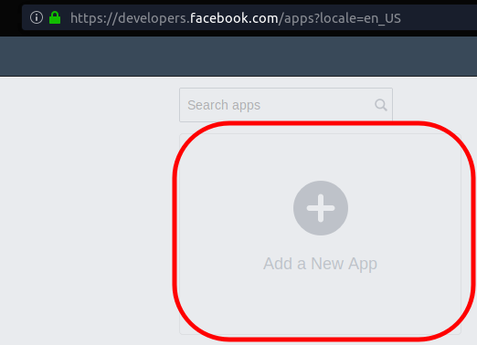
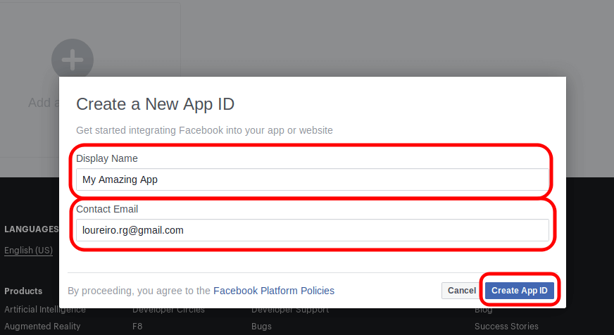
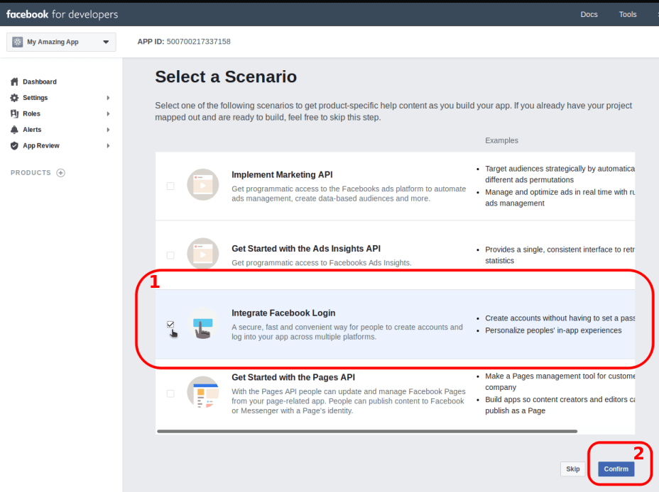
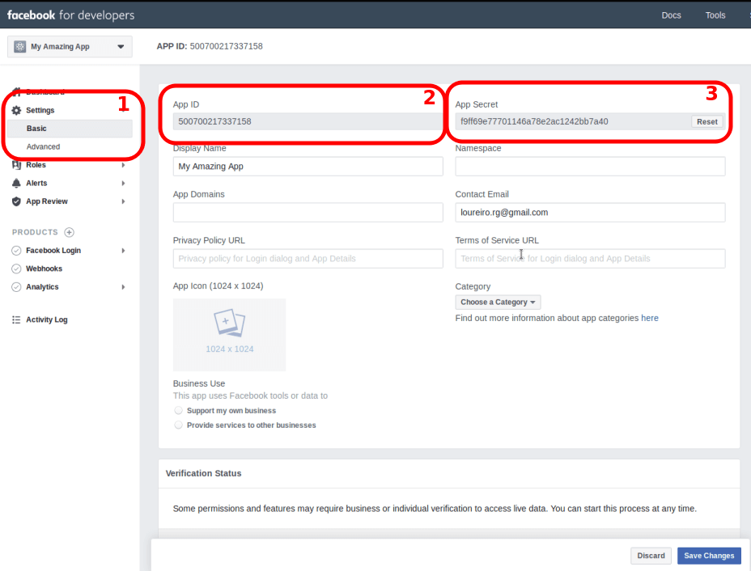
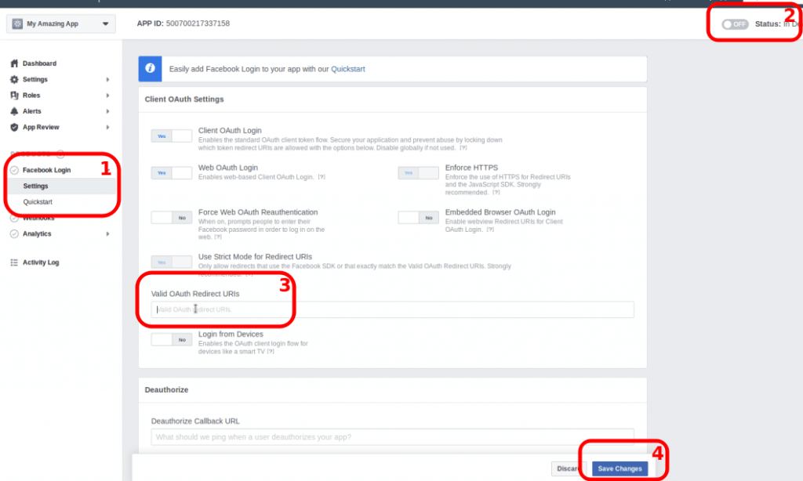

This tutorial shows how to implement a "Continue with Facebook" button using JS and PHP.
<!-- more -->

The button is implemented on JS. PHP is used to process Facebook result.

If you prefer a pure PHP solution, with no JS, see [my other](/2019/06/facebook-sign-up-button-with-js-and-php-tutorial/) tutorial.

## JS vs PHP rendering

This tutorial uses JS to render the button. There are pros/cons compared to a PHP version:

**Cons:**

- The button disappears on FF’s private mode: this happens due to FF’s anti-track feature;
- "Facebook Container" plugin issues: users have to manually allow the button first;

**Pros:**

- Always up-to-date API;
- Easier to set up than pure PHP;
- No CSS needed (it automatically loads its official colors and font);
- API "Breaking-changes" resistant;

::: tip
I personally prefer a pure PHP, no JS, version because it works with anti-trackers, ad-blockers, etc. But feel free to decide which one suits better your needs.
:::

## 0. Create an app on FB’s developer

### Go to

[https://developers.facebook.com/apps](https://developers.facebook.com/apps)

### Create an app





### Get the ID and SECRET



## 1. Install PHP SDK on your project folder

```bash
cd my-project
composer require facebook/graph-sdk
```

## 2. The code

Save this code on a file (ex. `test-fb-js.php`) and open it in your browser.

The code is self-explanatory. But let me know in the comments if you think it is not.

```php
<?php
/**
  * FB auth example:
  *  Login button (JS) with server-side registration code (PHP).
  *  Authenticates on JS, completes the process on PHP
  */

/* The Facebook SDK for JavaScript doesn't have any standalone files that need
   to be downloaded or installed, instead you simply need to include a short
   piece of regular JavaScript in your HTML that will asynchronously load the
   SDK into your pages. The async load means that it does not block loading
   other elements of your page.
*/

/* The following snippet of code will give the basic version of the Facebook
   SDK for JavaScript where the options are set to their most common defaults.
   Insert the following code snippet directly after the opening <body> tag on
   each page you want to use Facebook Analytics. Replace {your-app-id} with the
   App ID and {api-version} with the version of the API you are targeting. The
   current version is v3.3
*/
define('fbAppId', '500700217337158');
define('fbAppSecret', 'f9ff69e77701146a78e2ac1242bb7a40');
define('fbVersion', 'v3.3');
?>
<html>
  <head>
  </head>

<body>
<?php if (!$_REQUEST['accessToken']) { // not logged in on JS ?>
  <script type="text/javascript">
  // Triggered on login / init / any status change
  function onStatusChange(response) {
	/* if has been connected, send accessToken to PHP (by reloading the page) */
	if (response.status == 'connected') {
  	window.location.replace('?accessToken='+response.authResponse.accessToken);
	}
  }

  window.fbAsyncInit = function() {
	FB.init({
  	appId  	: '<?= fbAppId ?>',
  	cookie 	: false, // turn on to send token via cookie (instead of via URL)
  	xfbml  	: true,
  	version	: '<?= fbVersion ?>',
  	status 	: true
	});
	FB.AppEvents.logPageView();

	/* Subscribe to status changes.
   	Called by FB.init due to the "status: true" option */
	FB.Event.subscribe('auth.statusChange', onStatusChange);
  };

  (function(d, s, id){
	var js, fjs = d.getElementsByTagName(s)[0];
	if (d.getElementById(id)) {return;}
	js = d.createElement(s); js.id = id;
	js.src = "https://connect.facebook.net/en_US/sdk.js";
	fjs.parentNode.insertBefore(js, fjs);
  }(document, 'script', 'facebook-jssdk'));
  </script>

  <!-- FB button -->
  <div
	class="fb-login-button"
	data-width=""
	data-size="large"
	data-button-type="continue_with"
	data-auto-logout-link="false"
	data-use-continue-as="false"
	scope="public_profile,email"
  ></div>
  <!-- /FB button -->

<?php
} else { // logged in on JS
  /**
  * PHP SDK
  * Install: composer require facebook/graph-sdk
  */

  // Load library
  require_once __DIR__ . '/vendor/autoload.php';

  // Init FB
  $fb = new \Facebook\Facebook([
	'app_id' => fbAppId,
	'app_secret' => fbAppSecret,
	'default_graph_version' => fbVersion,
	'default_access_token' => $_REQUEST['accessToken'], // optional
  ]);

  // Use the helper classes to get a Facebook\Authentication\AccessToken entity.
  $helper = $fb->getJavaScriptHelper();

  try {
	// Get the \Facebook\GraphNodes\GraphUser object for the current user.
	$response = $fb->get('/me?fields=id,name,email');
	dd($response);
  } catch(\Facebook\Exceptions\FacebookResponseException $e) {
	// When Graph returns an error
	echo 'Graph returned an error: ' . $e->getMessage();
	exit;
  } catch(\Facebook\Exceptions\FacebookSDKException $e) {
	// When validation fails or other local issues
	echo 'Facebook SDK returned an error: ' . $e->getMessage();
	exit;
  }

  $me = $response->getGraphUser();
  // echo 'Logged in as ' . $me->getName();
  dd($me);
}
?>
</body>
</html>
```

## Publishing

After testing, you need to publish your FB app:

