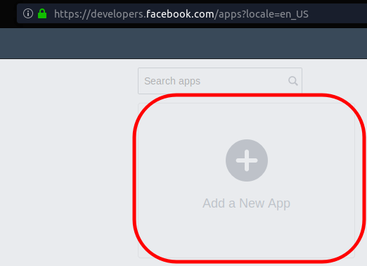
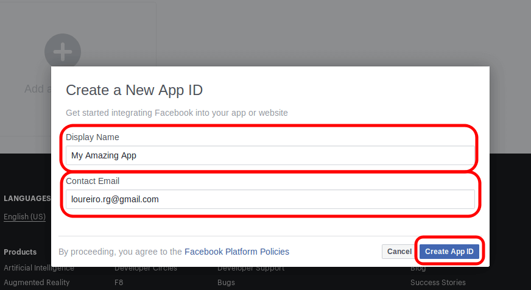
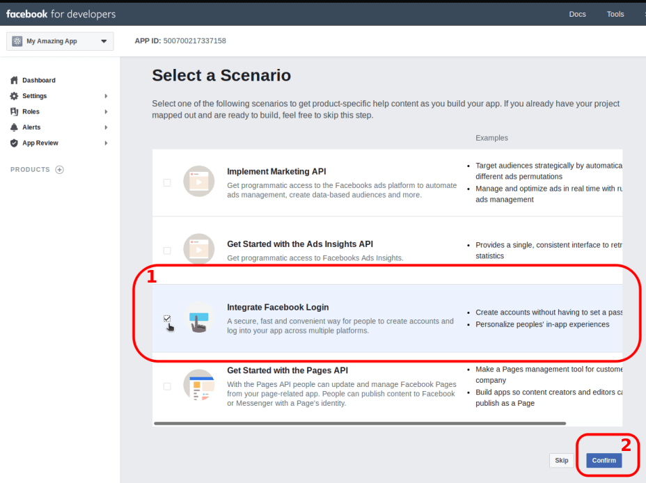
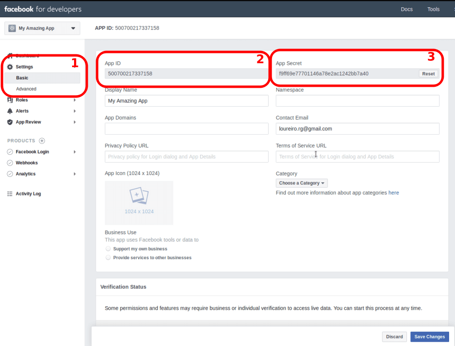
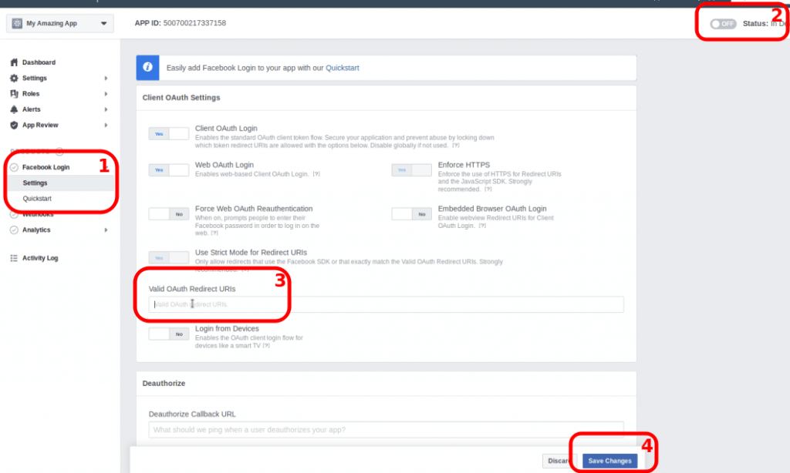

This tutorial shows how to implement a "Continue with Facebook" button with just PHP. No JS required.
<!-- more -->

If you prefer to render the button with JS, see [my other](/2019/06/facebook-sign-up-button-with-js-and-php-tutorial/) tutorial.

## JS vs PHP rendering

This tutorial uses PHP to render the button. There are pros/cons compared to a JS version:

**Cons:**

- More coding;
- Vulnerable to future API "breaking changes"

**Pros:**

- It works on Firefox private mode;
- It works with "Facebook Container" plugin (it shows the button);

## 0. Create an app on FB’s developer

### Go to

[https://developers.facebook.com/apps](https://developers.facebook.com/apps)

### Create an app





### Get the ID and SECRET



## 1. Install PHP SDK on your project folder

```bash
cd my-project
composer require facebook/graph-sdk
```

## 2. The code

Save this code on a file (ex. `test-fb.php`) run it on a server (ex. `php -S localhost:3000`) and open it in your browser.

The code is self-explanatory. But let me know in the comments if you think it is not.

```php
<?php
/**
  * FB auth example - PHP SDK only
  * PHP SDK Install: composer require facebook/graph-sdk
  */
define('fbAppId', '1279821668858940');
define('fbAppSecret', '519da09587a63abd4318caf1fcea9d17');
define('fbVersion', 'v3.3');
define('thisUrl', 'http://localhost:3000/test-fb.php');

/* Load library */
require_once __DIR__ . '/vendor/autoload.php';

/* Sessions */
if (!session_id()) {
  session_start();
}

/* Init FB */
$fb = new \Facebook\Facebook([
  'app_id' => fbAppId,
  'app_secret' => fbAppSecret,
  'default_graph_version' => fbVersion
]);

/* Use the helper classes to get a Facebook\Authentication\AccessToken entity. */
$helper = $fb->getRedirectLoginHelper();

/* Has a token in cache. Check if valid */
if ($_SESSION['accessToken']) {
  $oauth = $fb->getOAuth2Client();
  $meta = $oauth->debugToken($_SESSION['accessToken']);
  $accessToken = $meta->getIsValid() ? $_SESSION['accessToken'] : null;
} else {
  /* Not in cache. Try to get a token based on GET arguments */
  $accessToken = $helper->getAccessToken();
}

/* Save token in cache for the next page load. getAccessToken() can only be used once per authorization */
$_SESSION['accessToken'] = (string) $accessToken;

/* Not signed in: show login button */
if (!$accessToken) {
  /* Generate Link */
  $permissions = ['email']; // Optional permissions
  $loginUrl = $helper->getLoginUrl(thisUrl, $permissions);
  echo '<a href="' . $loginUrl . '">Log in with Facebook!</a>';
}

/* Signed in: show user information */
else {
  /* Set token as default, for all communication */
  $fb->setDefaultAccessToken($accessToken);

  /* Get the \Facebook\GraphNodes\GraphUser object for the current user */
  $response = $fb->get('/me?fields=id,name,email');
  $me = $response->getGraphUser();

  /* Print info */
  echo "Logged in as {$me->getName()} ({$me->getEmail()})<br>";
  var_dump($response);
  var_dump($me);
}
```

## Publishing

After testing, you need to publish your FB app:

