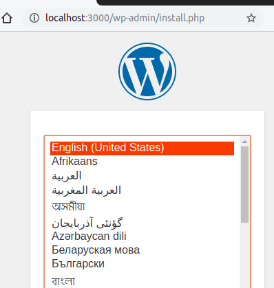
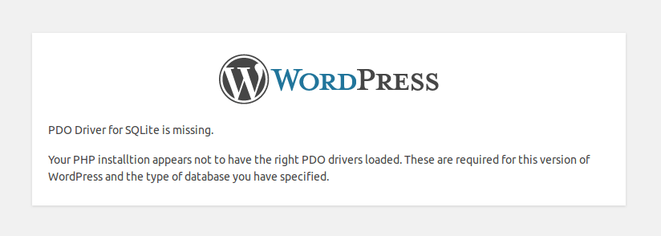

Oficially, WordPress only supports MySQL, but with this plugin created by kjmtsh you can use SQLite instead.
<!-- more -->

The plugin was created a long time ago, but still works like a charm on the current latest WP version (v5.2 – Jun 2019).

This solution is not meant to be used in production for large websites, but it can be an interesting option if you have a small blog with few visitors. An SQLite version works better than MySQL on a server with very limited resources.

::: success
~~By the way, this blog runs on SQLite ;)~~

***UPDATE Nov 2020:** This blog used to run on WordPress and SQLite, but I have migrated it to VuePress.*
:::

::: tip
To migrate an existing site, see instructions at the end.
:::

---

## This tutorial on video (3 min, no sound)

<div class="youtube">
    <iframe width="560" height="315" src="https://www.youtube.com/embed/husGalol2QE" frameborder="0" allow="accelerometer; autoplay; clipboard-write; encrypted-media; gyroscope; picture-in-picture" allowfullscreen></iframe>
</div>

## Step by Step

### 1. Download [WordPress](https://wordpress.org/download/) and [SQLite Integration](https://wordpress.org/plugins/sqlite-integration/) Plugin

```bash
wget https://wordpress.org/latest.tar.gz
wget https://downloads.wordpress.org/plugin/sqlite-integration.1.8.1.zip
ls
    latest.tar.gz  sqlite-integration.1.8.1.zip
```

### 2. Extract files

```bash
tar -xf latest.tar.gz
unzip sqlite-integration.1.8.1.zip
ls
    latest.tar.gz  wordpress  sqlite-integration.1.8.1.zip  sqlite-integration
```

### 3. Remove zip files (optional, for cleanup)

```bash
rm latest.tar.gz
rm sqlite-integration.1.8.1.zip
ls
    wordpress  sqlite-integration
```

### 4. Move plugin to `wp-content/plugins`

```bash
mv sqlite-integration wordpress/wp-content/plugins/
```

### 5. Move `db.php` to `wp-content`

```bash
cd wordpress
mv wp-content/plugins/sqlite-integration/db.php wp-content/
ls wp-content
    db.php  index.php  plugins  themes
```

### 6. Transform `wp-config-sample.php` into `wp-config.php`

```bash
mv wp-config-sample.php wp-config.php
```

### 7. Run the WP installer as usual

Start webserver:

```bash
php -S localhost:3000
    PHP 7.3.6-1 Development Server started at Sun Jun 16 22:29:00 2019
    Listening on http://localhost:3000
    Document root is /home/daniel/wordpress
    Press Ctrl-C to quit.
```

Open the page (`http://localhost:3000/`) and proceed with the installation.


No need to provide database information (the step will be skipped):


---

## Troubleshooting

If you see the "*PDO Driver for SQLite is missing*" error, install the `php-sqlite` package and restart the service:



---

## Migrating an existing website

::: tip
**NO NEED** to convert MySQL to SQLite.
Just use Duplicator (or any other migration plugin).
:::

Install a brand new copy of WordPress with SQLite, then:

- Install [Duplicator](https://wordpress.org/plugins/duplicator/) plugin on both websites (existing and brand new copy instances);
- Do a backup of your existing website using Duplicator;
- Restore the backup on the brand new instance using Duplicator’s "restore";
- Done!
