Let's see how to create a custom admin menu and page for our plugin.
<!-- more -->
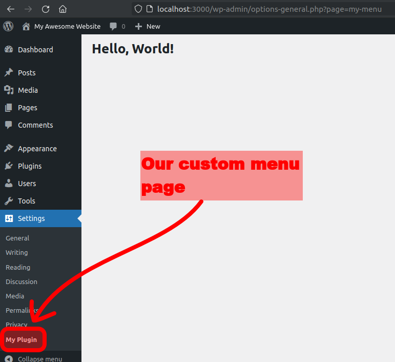

## 1. Adding a menu item

The main thing to do is to call: `add_options_page()`.

Here's the full code:

```php{13}
/** Step 3 (page html). */
function my_menu_html() {
  echo '<h1>Hello, World!</h1>';
}

/** Step 2 (add menu item). */
function my_plugin_menu() {
  $page_title = 'My Plugin Page';
  $menu_title = 'My Plugin';
  $capability = 'manage_options'; // Only users that can manage options can access this menu item.
  $menu_slug  = 'my-menu'; // unique identifier.
  $callback   = 'my_menu_html';
  add_options_page( $page_title, $menu_title, $capability, $menu_slug, $callback );
}

/** Step 1 (action). */
add_action( 'admin_menu', 'my_plugin_menu' );
```

We need to assign this function to the `admin_menu` action (step 1).

The HTML code is rendered by a callback, `my_menu_html()` in the example (step 3).

### 1.1. Understanding the arguments

Let's understand the arguments of `add_options_page()`:

- **Page Title**: The title on the **browser tab**;
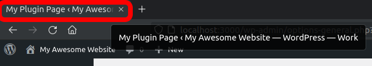
- **Menu Title**: The title on the **sidebar menu**;
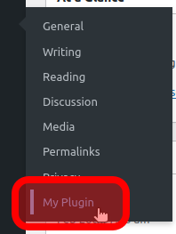
- **Capability**: The **permissions**, who can see and access the page;
- **Menu Slug**: An **unique identifier** for our menu item;

- **Callback**: Renders the **page's HTML**;

### 1.2. Permissions

The `manage_options` capability allows anyone with access to the "Settings" menu to access your page. This means **regular users (not admins) can access your menu**.

If you don't want regular users accessing your menu, you must replace it with a more restrictive permission.

You can find a list of all permissions here:
[https://wordpress.org/support/article/roles-and-capabilities](https://wordpress.org/support/article/roles-and-capabilities)

### 1.3. Other core menus

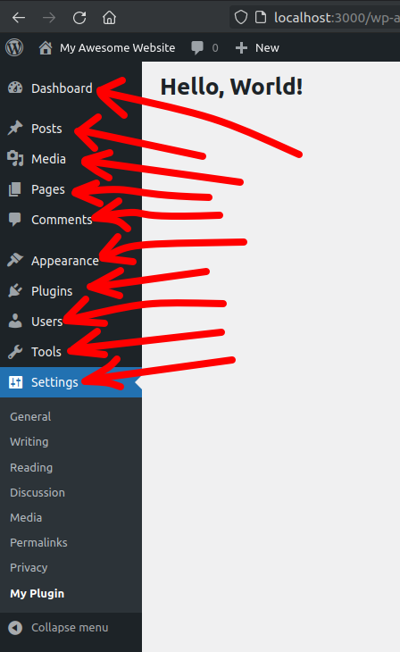

We added our item in the "Settings" menu. To add in other menus use a different `add_*_page()`:

- Dashboard: `add_dashboard_page(...)`
- Posts: `add_posts_page(...)`
- Media: `add_media_page(...)`
- Pages: `add_pages_page(...)`
- Tools: `add_management_page(...)`
- etc

They all have the same syntax as the Settings menu.

Later, we will see how to create a custom parent menu.

## 2. The page HTML

So far we created this simple HTML page:

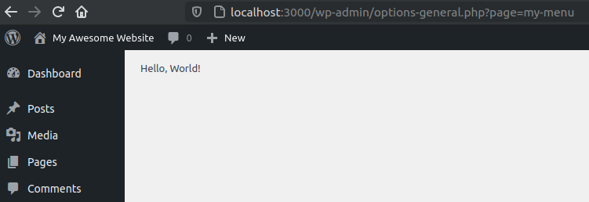

Let's replace it with a full form:

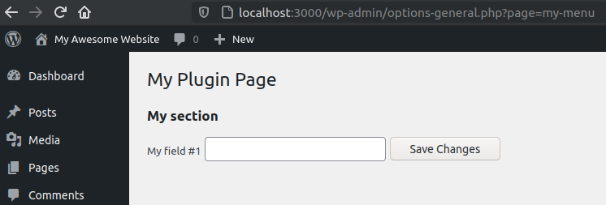

First, let's create a basic form:

```php
<?php
function my_menu_html() { ?>
  <form method="post">
    <input type="text" name="field1" value="" />
    <input type="submit" value="Save Changes" />
  </form>
  <?php
}
```

That's how it looks:

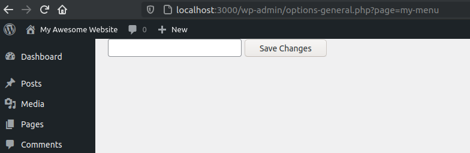

It doesn't look nice, but the form is there.

### Basic elements: Page title, Labels, Sections

#### Page title

Add it as a `<h1>`:

```php{3}
<?php
function my_menu_html() { ?>
  <h1>My Plugin Page</h1>

  <form method="post">
    <input type="text" name="field1" value="" />
    <input type="submit" value="Save Changes" />
  </form>
  <?php
}
```

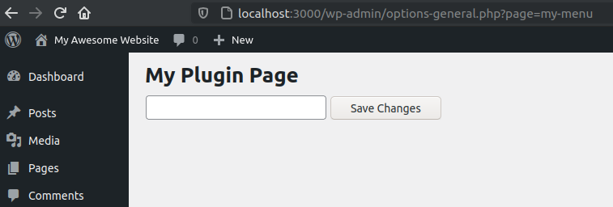

#### Field Labels

Add as `<label>`:

```php{6}
<?php
function my_menu_html() { ?>
  <h1>My Plugin Page</h1>

  <form method="post">
    <label for="field1">My field #1</label>
    <input type="text" name="field1" value="" />

    <input type="submit" value="Save Changes" />
  </form>
  <?php
}
```

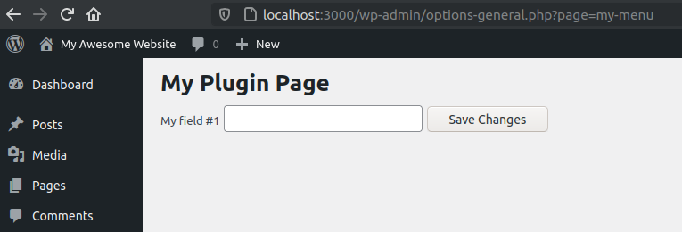

#### Section

For sections, a sub-title for a group of fields, use the `<h2>` tag:

```php{6}
<?php
function my_menu_html() { ?>
  <h1>My Plugin Page</h1>

  <form method="post">
    <h2>My Section</h2>
    <label for="field1">My field #1</label>
    <input type="text" name="field1" value="" />

    <input type="submit" value="Save Changes" />
  </form>
  <?php
}
```

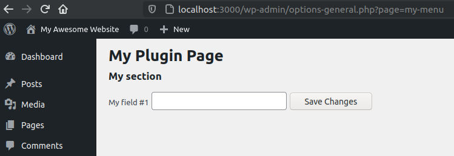

#### Page wrap

Wrap your pages into a `<div class="wrap">`. This will add some default styling for basic elements:

```php{3,13}
<?php
function my_menu_html() { ?>
  <div class="wrap">
    <h1>My Plugin Page</h1>

    <form method="post">
      <h2>My Section</h2>
      <label for="field1">My field #1</label>
      <input type="text" name="field1" value="" />

      <input type="submit" value="Save Changes" />
    </form>
  </div>
  <?php
}
```


Cool stuff! Our page doesn't look exactly like the core settings pages, but it is enough to learn about the mechanics of a settings page. Later we will see how to improve the layout.

### Form Helpers

Let's reduce our code with some core helpers.

**Button:** Use `submit_button()` to print the button:

```php{2}
<form method="post">
  <input type="text" name="field1" value="" />
  <?php submit_button() ?>
</form>
```

This helper outputs this for us:

```html
<input
  type="submit"
  name="submit"
  id="submit"
  class="button button-primary"
  value="Save Changes"
/>
```

**Page title:** Use `get_admin_page_title()` to get the page title:

```php
<h1><?php echo get_admin_page_title() ?></h1>
```

That's better than hardcoding the title and the button.

#### Final HTML

```php{3,7}
<?php
function my_menu_html() { ?>
  <h1><?php echo get_admin_page_title() ?></h1>

  <form method="post">
    <input type="text" name="field1" value="" />
    <?php submit_button() ?>
  </form>
  <?php
}
```

That's how it looks like:

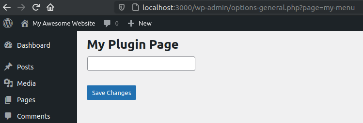

::: tip NOTICE
I removed the layout elements (wrap, label, section) for simplicity sake.
:::

### Submitting

Because our form has no `action` set, the data is sent back to the same page.

Let's show a message when the user clicks on the save button.

```php
<?php
function my_menu_html() {

  // Submit button has been pressed (button name is `submit`).
  $has_submitted = isset( $_POST['submit'] );
  if ( $has_submitted ) {
    echo 'You clicked the "save" button!';
  }

  // Page HTML.
  ?>
  <div class="wrap">
    <h1><?php echo get_admin_page_title() ?></h1>

    <form method="post">
      <input type="text" name="field1" value="" />
      <?php submit_button(); ?>
    </form>
  </div>
  <?php
}
```

Click on the "save" button to test the code.

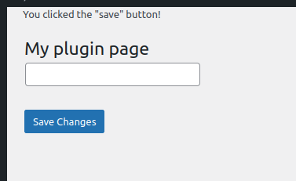

Now, we need a way to save and retrieve the form fields. In the next article, let's see how to do this using the Options API.