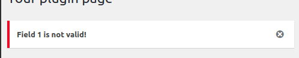
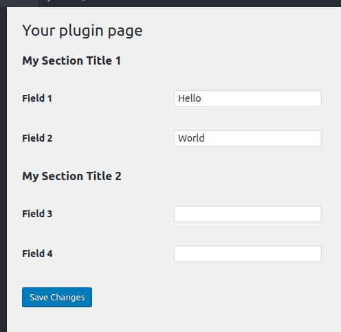
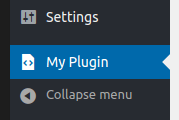

This is the second part of my WordPress Plugin Development tutorial. Here's the [previous](/2019/06/wordpress-plugin-development/) and [next](/2019/07/wordpress-ajax-rest-api/) parts.
<!-- more -->

## 1. Adding a menu item

A menu item is created with `add_options_page()`, called inside an `admin_menu` action.


It’s a 3-step process:

- Listen to the `admin_menu` action;
- Call `add_options_page(...)`;
- Output the HTML page;

```php
// wp-content/plugins/my-plugin/my-plugin.php

/** Our plugin class */
class MyPlugin {
  public function __construct() {
    /** Step 1 (event). */
    add_action( 'admin_menu', [ $this, 'my_plugin_menu' ] );
  }

  /** Step 2 (add item). */
  public function my_plugin_menu() {
    $page_title = 'My Plugin Options';
    $menu_title = 'My Plugin';
    $capability = 'manage_options'; // Only users that can manage options can access this menu item.
    $menu_slug  = 'my-menu'; // unique identifier.
    $callback   = [ $this, 'my_plugin_options' ];
    $hookname   = add_options_page( $page_title, $menu_title, $capability, $menu_slug, $callback );
  }

  /** Step 3 (page html). */
  public function my_plugin_options() {
    echo '<div class="wrap">';
    echo '<p>Here is where the form would go if I actually had options.</p>';
    echo '</div>';
  }
}

new MyPlugin();
```

This adds a menu item in the “Settings” menu. For other menus:

- Dashboard: `add_dashboard_page(...)`
- Posts: `add_posts_page(...)`
- Media: `add_media_page(...)`
- Pages: `add_pages_page(...)`
- etc

They all have the same syntax as the Settings menu.

Now that you know the basics of menu creation, let’s create the settings page.

::: warning
I recommend you to use a more restrictive permission than the generic `manage_options`. You can find a list of all permissions here:
[https://wordpress.org/support/article/roles-and-capabilities](https://wordpress.org/support/article/roles-and-capabilities)
:::

## 2. Admin page (HTML)

So far we created this simple HTML page for our menu on `my_plugin_options()`:


Let’s replace it with a form that saves data on the database:

```php
// my-plugin/my-plugin.php
public function my_plugin_options() { ?>
  <div class="wrap">
    <h2>Your plugin page</h2>
    <form method="post" action="options.php">
      <?php settings_fields( 'my-menu' ); ?>
      <?php do_settings_sections( 'my-menu' ); ?>
      <?php submit_button(); ?>
    </form>
  </div>
  <?php
}
```


### Explanation

- `settings_fields( $option_group )`: Creates some hidden fields


- `do_settings_sections( $option_group )`: Renders all the HTML inputs. We are going to define this next.

- `submit_button()`: Renders the submit button.

### `$option_group`

Each group option is a row on the wp_options table. While is possible to save each setting as a row, this clutters the table. Instead, we group options and save them together in just one row. The `$option_group` value is the id of the row.

You can use more than one option group in your plugin - just try to not use many of them, one per menu item is a good choice.

## Sections

Fields are **visually grouped** in sections. Let's define some:

```php
// my-plugin/my-plugin.php
/** Step 2 (add item). */
public function my_plugin_menu() {
  $page_title = 'My Plugin Options';
  $menu_title = 'My Plugin';
  $capability = 'manage_options'; // Only users that can manage options can access this menu item.
  $menu_slug  = 'my-menu'; // unique identifier.
  $callback   = [ $this, 'my_plugin_options' ];
  $hookname   = add_options_page( $page_title, $menu_title, $capability, $menu_slug, $callback );

  /** Setup fields. */
  add_action( 'load-'.$hookname, [ $this, 'my_plugin_fields' ] );
}

public function my_plugin_fields() {
  add_settings_section( 'my_section_1', 'My Section Title 1', false, 'my-menu' );
  add_settings_section( 'my_section_2', 'My Section Title 2', false, 'my-menu' );
}
```

The result:


The first argument is the section id; the second argument is the title; the third argument is the **callback**; the fourth is the **option group**.

## Fields

Now, let's define some fields for each section:

```php
// my-plugin/my-plugin.php
public function my_plugin_fields() {
  add_settings_section( 'my_section_1', 'My Section Title 1', false, 'my-menu' );
  add_settings_section( 'my_section_2', 'My Section Title 2', false, 'my-menu' );

  add_settings_field( 'field1', 'Field 1', [ $this, 'field_callback1' ], 'my-menu', 'my_section_1' );
  add_settings_field( 'field2', 'Field 2', [ $this, 'field_callback2' ], 'my-menu', 'my_section_2' );
}

public function field_callback1() {
  echo '<input type="text" name="field1" value="" />';
}

public function field_callback2() {
  echo '<input type="text" name="field2" value="" />';
}
```


## Saving

If you click on save, an "**ERROR: options page not found**" will happen:


To fix this, we need to register our fields with `register_setting()`:

```php
// my-plugin/my-plugin.php
public function my_plugin_fields() {
  add_settings_section( 'my_section_1', 'My Section Title 1', false, 'my-menu' );
  add_settings_section( 'my_section_2', 'My Section Title 2', false, 'my-menu' );

  add_settings_field( 'field1', 'Field 1', [ $this, 'field_callback1' ], 'my-menu', 'my_section_1' );
  add_settings_field( 'field2', 'Field 2', [ $this, 'field_callback2' ], 'my-menu', 'my_section_2' );

  register_setting( 'my-menu', 'field1' );
  register_setting( 'my-menu', 'field2' );
}
```

And let's show the success message with `settings_errors()`:

```php
<?php
// my-plugin/my-plugin.php
public function my_plugin_options() { ?>
  <div class="wrap">
    <h2>Your plugin page</h2>
    <?php settings_errors() ?>
    <form method="post" action="options.php">
      <?php settings_fields( 'my-menu' ); ?>
      <?php do_settings_sections( 'my-menu' ); ?>
      <?php submit_button(); ?>
    </form>
  </div>
  <?php
}
```

Now, click to save it again and voila:


## Retrieving data

Data is being saved, but not being showed. Let's fix it with `get_option( $field )`:

```php
// my-plugin/my-plugin.php
public function field_callback1() {
  echo '<input type="text" name="field1" value="' . get_option( 'field1' ) . '" />';
}

public function field_callback2() {
  echo '<input type="text" name="field2" value="' . get_option( 'field2' ) . '" />';
}
```

As result, it now shows the current values:


### Escape the output

It is a good practice to strip invalid or special characters before output. For this, use the `esc_attr( $text )` function.

```php
esc_attr( get_option( 'field1' ) )
```

## 4. Validation and Sanitization

Let's say our first field is an **email** and we want to validate it.

The 3rd argument of `register_setting()` is the sanitization callback. The callback should return the value that will be saved:

```php
// my-plugin/my-plugin.php
register_setting( 'my-menu', 'field1', [ $this, 'validation_callback1' ] );
```

```php
// my-plugin/my-plugin.php
public function validation_callback1( $input ) {
  return sanitize_email( $input );
}
```

Now, let's throw an error message with `add_settings_error( string $setting, string $code, string $message, string $type = 'error' )`:

```php
// my-plugin/my-plugin.php
public function validation_callback1( $input ) {
  /** Sanitize input */
  $sanitized = sanitize_email( $input );

  /** If output is different, input was wrong */
  if ( $sanitized !== $input ) {
    add_settings_error( 'field1', 'your-error-code', 'Field 1 is not valid!' );
  }

  /** Save the sanitized version */
  return $sanitized;
}
```



## 5. Permissions

It is a good practice to check if the user has permissions to access the page. You can use the `is_admin()` or `current_user_can( $capability )` methods for this:

```php
// my-plugin/my-plugin.php
public function my_plugin_fields() {
  /** Check permissions. */
  if ( ! current_user_can( 'manage_options' ) )  {
    return;
  }

  /** ... */
```

::: tip
It's a good idea to use the same permission you used for the menu item (on `add_options_page(...)`).
:::

::: tip
You can find a list of all permissions here:
[https://wordpress.org/support/article/roles-and-capabilities](https://wordpress.org/support/article/roles-and-capabilities)
:::

## 6. DRYing the code

Defining setting fields can be a repetitive task. And it doesn't help that each input requires its own method.

So, let's refactor our example and DRY (don't-repeat-yourself) our code.

First, let's use a generic method for the field rendering:

```php
// my-plugin/my-plugin.php
public function my_plugin_fields() {
  /** Check permissions. */
  if ( ! current_user_can( 'manage_options' ) )  {
    return;
  }

  /** Add sections. */
  add_settings_section( 'my_section_1', 'My Section Title 1', false, 'my-menu' );
  add_settings_section( 'my_section_2', 'My Section Title 2', false, 'my-menu' );

  /** Add fields. */
  $callback = [ $this, 'field_callback' ];
  add_settings_field( 'field1', 'Field 1', $callback, 'my-menu', 'my_section_1' );
  add_settings_field( 'field2', 'Field 2', $callback, 'my-menu', 'my_section_2' );

  /** Allow to save. */
  register_setting( 'my-menu', 'field1' );
  register_setting( 'my-menu', 'field2' );
}

/** Generic field render */
public function field_callback( $arguments ) {
  var_dump( $arguments );
}
```

Result:


The `add_settings_field()` method accepts an extra argument that is sent to the callback:

::: success
**add_settings_field**( $id, $title, $callback, $page, $section, **$args** )
:::

Let's pass in this argument all the information necessary to build the HTML element:

```php
$fields = [
  [ 'type' => 'text', 'name' => 'field1' ],
  [ 'type' => 'text', 'name' => 'field2' ],
];

add_settings_field( 'field1', 'Field 1', $callback, 'my-menu', 'my_section_1', $fields[0] );
add_settings_field( 'field2', 'Field 2', $callback, 'my-menu', 'my_section_2', $fields[1] );
```


Now, let's refactor the `field_callback()` to generate the field with this information:

```php
public function field_callback( $arguments ) {
  echo '<input
          type="' . $arguments['type'] . '"
          name="' . $arguments['name'] . '"
          value="' . esc_attr( get_option( $arguments['name'] ) ) . '"
        />';
}
```


### Final code

Finally, let's structure the sections/fields in an array and automate the process:

```php
<?php
// my-plugin/my-plugin.php
public function my_plugin_fields() {
  /** Check permissions. */
  if ( ! current_user_can( 'manage_options' ) )  {
    return;
  }

  /* Define here your sections and fields. */
  $slug     = 'my-menu';
  $sections = [
    [
      'id'     => 'my_section_1',
      'title'  => 'My Section Title 1',
      'fields' => [
        [ 'type' => 'text', 'name' => 'field1', 'title' => 'Field 1' ],
        [ 'type' => 'text', 'name' => 'field2', 'title' => 'Field 2' ],
      ],
    ],
    [
      'id'     => 'my_section_2',
      'title'  => 'My Section Title 2',
      'fields' => [
        [ 'type' => 'text', 'name' => 'field3', 'title' => 'Field 3' ],
        [ 'type' => 'text', 'name' => 'field4', 'title' => 'Field 4' ],
      ],
    ],
  ];

  /** Call Settings API to generate sections and fields. */
  $callback = [ $this, 'field_callback' ];
  foreach ( $sections as $index => $section ) {
    /** Adds section. */
    add_settings_section( "section_$index", $section['title'], false, $slug );
    foreach ( $section['fields'] as $field ) {
      /** Adds field. */
      add_settings_field( $field['name'], $field['title'], $callback, $slug, "section_$index", $field );

      /** Register field. */
      register_setting( $slug, $field['name'] );
    }
  }
}

public function field_callback( $arguments ) {
  echo '<input
          type="' . $arguments['type'] . '"
          name="' . $arguments['name'] . '"
          value="' . esc_attr( get_option( $arguments['name'] ) ) . '"
        />';
}
```



## 7. Custom Main Menu


For a custom menu, use the `add_menu_page()` method instead:

```php{9}
// my-plugin/my-plugin.php
/** Step 2 (add item). */
public function my_plugin_menu() {
  $page_title = 'My Plugin Options';
  $menu_title = 'My Plugin';
  $capability = 'manage_options'; // which menu.
  $menu_slug  = 'my-menu'; // unique identifier.
  $callback   = [ $this, 'my_plugin_options' ];
  add_menu_page( $page_title, $menu_title, $capability, $menu_slug, $callback );
}
```

This function has two extra optional arguments: **icon** and **position**:

### Custom icon



```php
$icon       = 'dashicons-media-code';
add_menu_page( $page_title, $menu_title, $capability, $menu_slug, $callback, $icon );
```

The complete list of icons:
[https://developer.wordpress.org/resource/dashicons](https://developer.wordpress.org/resource/dashicons)

For a **custom icon**, use: `plugins_url( 'my-plugin/icon.png' )`. You can also pass a **base64-encoded SVG**. Alternatively, pass `'none'` and set your **icon on the CSS**.

### Custom position (ex. between *Tools* and *Settings*)


The last argument, also optional, is the menu position. By default, it will be placed at the bottom, but you can change this.

**Position values:**

- 2 – Dashboard
- 4 – Separator
- 5 – Posts
- 10 – Media
- 15 – Links
- 20 – Pages
- 25 – Comments
- 59 – Separator
- 60 – Appearance
- 65 – Plugins
- 70 – Users
- 75 – Tools
- 80 – Settings
- 99 – Separator

For example, position **76** will place it between *Tools* and *Settings*.

```php
$position   = 76;
add_menu_page( $page_title, $menu_title, $capability, $menu_slug, $callback, $icon, $position );
```

## 8. Sub-menus (for custom main menu only)


To add sub-menus, use the `add_submenu_page( ... )` method.

The **first argument** is the **parent menu slug**. The other arguments are the same as the other methods:

```php
// my-plugin/my-plugin.php
/** menu: */
add_menu_page( $page_title, $menu_title, $capability, $menu_slug, $callback );

/** menu's sub-item: */
$menu_slug2 = 'my-menu2'; // unique identifier.
$callback2  = [ $this, 'my_plugin_options' ];
add_submenu_page( $menu_slug, 'Tab Title', 'Menu Title', $capability, $menu_slug2, $callback2 );
```

Result:


Notice that the **first item** has the **same title** as the menu. That's the default behavior on WordPress.

### Setting a different title for the first sub-menu item


To fix it, add an item with the same slug as the parent menu.

```php
// my-plugin/my-plugin.php
/** First item. */
add_submenu_page( $menu_slug, 'Tab Title 1', 'Menu Title 1', $capability, $menu_slug, $callback );

/** Second item. */
$menu_slug2 = 'my-menu2'; // unique identifier.
$callback2  = [ $this, 'my_plugin_options' ];
add_submenu_page( $menu_slug, 'Tab Title 2', 'Menu Title 2', $capability, $menu_slug2, $callback2 );
```

## 9. Server Communication

Sometimes you need extra buttons that will do some server-side action. For example, let's say you want a "*Hello World*" button that echoes a "*Hello World*" on screen.

You basically have these options:

| Method        | AJAX | NON-AJAX | Front-End or Admin? |
|:-------------:|:----:|:--------:|:-------------------:|
| admin_post_*  | YES  | YES      | Admin only          |
| Ajax API      | YES  | NO       | Both                |
| REST API      | YES  | NO       | Both                |
| Router method | YES  | YES      | Both                |

---

For **non-Ajax**, use the dynamic hook `admin_post_{$plugin_action}`.

For **Ajax**, you have 2 standard options: `Ajax API` and `REST API`. Learn more about them [here](/2019/07/wordpress-ajax-rest-api/). You can also use `admin_post_*` for Ajax, but it is not standard.

Alternatively, as a workaround, you can implement a "**router**" (Ajax and non-Ajax), which basically consists of intercept every single HTTP request and call our custom method if URL and parameters match our route. But save this method for scenarios where you can't use the other solutions (it is not a standard way to communicate with the server).

### 9.1. `admin_post_{$plugin_action}`

Add this code to the constructor:

```php
// my-plugin/my-plugin.php
public function __construct() {
  /** Fired on authenticated POST /wp-admin/admin-post.php?action=myplugin_hello. */
  add_action( 'admin_post_myplugin_hello', [ $this, 'hello_callback' ] );
}
```

This calls `hello_callback()` on an authenticated `POST /wp-admin/admin-post.php?action=myplugin_hello` requests.

::: warning
**Note 1:** In order to avoid conflict with other plugins, add your slug to the action name. In other words, **prefer "myplugin_hello" instead of "hello"**.
:::

::: warning
**Note 2:** This should be implemented in the `__construct()` constructor. It won't work if you implement it on "admin_menu", "load-{$menu}, or any other specific action.
:::

Then, implement the button and its form:

```php
<!-- my-plugin/my-plugin.php -->
<form method="post" action="admin-post.php>
  <input type="hidden" name="action" value="myplugin_hello">
  <?php submit_button( 'Hello World' ); ?>
</form>
```

And the callback:

```php
// my-plugin/my-plugin.php
public function hello_callback() {
  /** my code.. */

  /** Return to the last page. */
  wp_redirect( $_SERVER['HTTP_REFERER'] );
}
```

### 9.2. Adding security - Nonces and permissions

"admin_post" automatically checks if the user is authenticated on the admin dashboard and nothing else. It is recommended to also check for intention (nonce):

```php
<!-- my-plugin/my-plugin.php -->
<form method="post" action="admin-post.php">
  <?php $nonce = wp_create_nonce( '_wpnonce' ); ?>
  <input type="hidden" name="_wpnonce" value="<?php echo esc_attr( $nonce ); ?>">
  <input type="hidden" name="action" value="myplugin_hello">
  <?php submit_button( 'Hello World' ); ?>
</form>
```

```php
// my-plugin/my-plugin.php
public function hello_callback() {
  /** Check nonce. */
  if ( empty( $_REQUEST['_wpnonce'] ) ) {
    return;
  }
  if ( ! wp_verify_nonce( $_REQUEST['_wpnonce'], '_wpnonce' ) ) {
    return;
  }

  /** my code... */
}
```

::: tip
You can use the helper `settings_fields( $action )` to generate the `_wpnonce` input.
:::

**Normal users can also access the admin dashboard**, so you **MUST** check for permissions - that's a critical item:

```php
// my-plugin/my-plugin.php
public function hello_callback() {
  /** Check permissions. */
  if ( ! is_admin() || ! current_user_can( 'manage_options' ) ) {
    return;
  }

  /** Check nonce. */
  if ( empty( $_REQUEST['_wpnonce'] ) ) {
    return;
  }
  if ( ! wp_verify_nonce( $_REQUEST['_wpnonce'], '_wpnonce' ) ) {
    return;
  }
}
```

::: warning
I recommend to use a more restrictive permission than the generic `manage_options`. Check the best permission for you here:
[https://wordpress.org/support/article/roles-and-capabilities](https://wordpress.org/support/article/roles-and-capabilities)
:::

### 9.3. Replacing the "Save" button with your custom one

If you want to have a single button that saves and also does other action, you can follow these instructions.

First, set the constructor (same code as before):

```php
// my-plugin/my-plugin.php
public function __construct() {
  /** Fired on authenticated POST /wp-admin/admin-post.php?action=myplugin_hello. */
  add_action( 'admin_post_myplugin_hello', [ $this, 'hello_callback' ] );
}
```

Adapt the default form: set `admin-post.php` as the form URL, pass the "action" as a hidden input, change the button name (optional):

```php
// my-plugin/my-plugin.php
public function my_plugin_options() { ?>
  <div class="wrap">
    <h2>Your plugin page</h2>
    <form method="post" action="admin-post.php">
      <?php settings_fields( 'my-menu' ); ?>
      <?php do_settings_sections( 'my-menu' ); ?>
      <input type="hidden" name="action" value="myplugin_hello">
      <?php submit_button( 'Save and Print "Hello"'); ?>
    </form>
  </div>
  <?php
}
```

On the callback, you must manually save the inputs:

```php
// my-plugin/my-plugin.php
public function hello_callback() {
  /** Check permissions. */
  if ( ! is_admin() || ! current_user_can( 'manage_options' ) ) {
    return;
  }

  /** Check nonce. */
  if ( empty( $_REQUEST['_wpnonce'] ) ) {
    return;
  }
  if ( ! wp_verify_nonce( $_REQUEST['_wpnonce'], '_wpnonce' ) ) {
    return;
  }

  /** Save options. */
  update_option( 'opt1', wp_unslash( $_REQUEST[ 'opt1' ] ) );
  update_option( 'opt2', wp_unslash( $_REQUEST[ 'opt2' ] ) );
  /** ... */

  /** my code... */

  /** Return to the last page. */
  wp_redirect( $_REQUEST['_wp_http_referer'] );
}
```

## 10.  The Router method (an alternative to "admin_post")

The idea here is to intercept all HTTP requests (by hooking on the `admin_init` action) and filter the ones directed to your endpoint.

In this example, let's create the "*Hello World*" button using a router.

The URL will be `/wp-admin/admin.php?page=my-plugin&action=hello-world`. But it can be anything (ex. "/hello/world", if the installation supports pretty URLs):

First, let's add a callback called on every admin request:

```php
// my-plugin/my-plugin.php
public function __construct() {
  /** Executed on ALL admin requests. */
  add_action( 'admin_init', [ $this, 'router_callback' ] );
}
```

::: tip
You can use this method for non-admin calls, just replace `admin_init` with `init`.
:::

Then, let's filter the requests that are directed to us (on the callback):

```php
// my-plugin/my-plugin.php
/** Filter the requests to our plugin. */
public function router_callback() {
  /** Our requests have "page" AND "action" set up. */
  if ( empty( $_REQUEST['action'] ) || empty( $_REQUEST['page'] ) ) {
    return;
  }

  /** Let's filter the "page" argument. */
  if ( 'my-plugin' !== $_REQUEST['page'] ) {
    return;
  }

  /** THE PROCESSING. */
  if ( 'hello-world' === $_REQUEST['action'] ) {
    echo "Hello World!";
  }
}
```

Now, let's replace the standard "Save" button with our "Hello" button:

```php
<?php
// my-plugin/my-plugin.php
public function my_plugin_options() { ?>
  <div class="wrap">
    <h2>Your plugin page</h2>
    <?php settings_errors() ?>
    <form method="post" action="admin.php?page=my-plugin&action=hello-world">
      <?php settings_fields( 'my-menu' ); ?>
      <?php do_settings_sections( 'my-menu' ); ?>
      <?php submit_button(); ?>
    </form>
  </div>
  <?php
}
```

If you want to save the options, call `update_option( $field, $value )`:

```php
// my-plugin/my-plugin.php
/** Filter the requests to our plugin. */
public function router_callback() {
  /** Our requests have "page" AND "action" set up. */
  if ( empty( $_REQUEST['action'] ) || empty( $_REQUEST['page'] ) ) {
    return;
  }

  /** Let's filter the "page" argument. */
  if ( 'my-plugin' !== $_REQUEST['page'] ) {
    return;
  }

  /** THE PROCESSING. */
  if ( 'hello-world' === $_REQUEST['action'] ) {
    /** Save options. */
    update_option( 'my_field1', $_REQUEST[ 'my_field1' ] );
    update_option( 'my_field2', $_REQUEST[ 'my_field2' ] );

    /** Process it. */
    echo "Hello World!";
  }
}
```

Additionally, you can filter by the HTTP verb (GET, POST, etc) in the callback to avoid conflicts.

You don't need to replace the "Save" button. You can have both. If you decide to keep the save button, just be aware that you can't have nested "\<form\>" tags. In this case, add the other forms next to the main form (not inside). Then, your custom submit button can be inside the main form, outside its own form, but it should have the `form=my-other-form` attribute.

Now, let's add security by checking **permissions** and **nonces**:

```php
// my-plugin/my-plugin.php
/** Filter the requests to our plugin. */
public function router_callback() {
  /** Our requests have "page" AND "action" set up. */
  if ( empty( $_REQUEST['action'] ) || empty( $_REQUEST['page'] ) ) {
    return;
  }

  /** Let's filter the "page" argument. */
  if ( 'my-plugin' !== $_REQUEST['page'] ) {
    return;
  }

  /** Check permissions. */
  if ( ! is_admin() || ! current_user_can( 'manage_options' ) ) {
    return;
  }

  /** Check nonce. */
  if ( empty( $_REQUEST['my_nonce'] ) ) {
    return;
  }

  if ( ! wp_verify_nonce( $_REQUEST['my_nonce'], 'hello-world' ) ) {
    return;
  }

  /** THE PROCESSING. */
  if ( 'hello-world' === $_GET['action'] ) {
    echo "Hello World!";
  }
}
```

Then, generate the nonce (pass it either in the URL or as a hidden input):

```php
<?php $nonce = wp_create_nonce( 'hello-world' ); ?>
<form method="post" action="admin.php?page=my-plugin&action=hello-world&my_nonce=<?= $nonce ?>">
```
