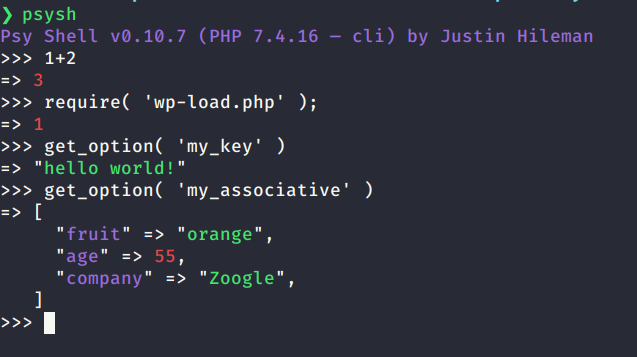
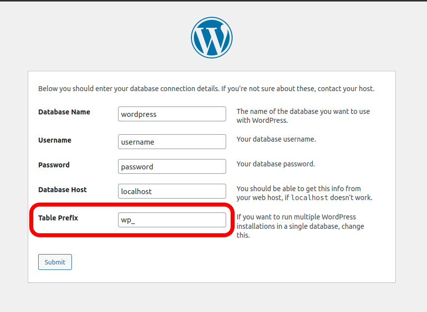

In this article, let's discover the Options API in depth. Let's learn how to use PsySH to check what WordPress does behind the scenes and much more.
<!-- more -->

## The `Options API`

Storing data is a hard task: you have to write SQL, be performant, be concerned with SQL-injection, have to escape your data, serialize it - and unescape, unserialize when getting the data back. It's a lot of work and concerns.

The Options API provides a simple way to save and load data without having to deal with all these headaches. There's no need for serialization, escaping, SQL, etc. You just store and load your variables as they are.

Main functions:

- **Get:** `get_option( $key )`;
- **Set:** `update_option( $key, $value )`;

The `update_option` function stores a value in the database. If `$key` exists, it updates the value. If it doesn't exist, it creates a new key/value.

Two other functions complete the Options API, but they are rarely used:

- **Delete:** `delete_option( $key )`;
- **Set**: `add_option( $key, $value )`;

The `add_option` works like `update_option`, but only works if the key doesn't exist. If the key exists, it doesn't do anything - it doesn't update, nor errors.

## Playing with the interactive shell

PHP has an interactive shell (aka "REPL") embedded. It's a sandbox to play with code, extremely useful when developing. Type `php -a` in your command line to start it.

```bash
php -a
Interactive mode enabled

php > $color = 'blue';
php > echo "My favorite color is $color!";
My favorite color is blue!
```

### PsySH

If you like the interactive shell, I **strongly recommend** you [PsySH](https://psysh.org/). It's prettier and more powerful than the standard PHP shell.

PsySH is well maintained as it is a core part of the popular Laravel framework.



Some of its Good Stuff:

- No need for semicolons `;`
- Has a pretty color scheme;
- No need for echos/var_dumps;
- Better display of complex types (associative arrays, objects, etc);

### WordPress on Interactive mode

To play with WordPress on the interactive shell, load the `wp-load.php` file.

Go to the root folder of your WordPress installation and type:

```bash
# I prefer PsySH, but you can use `php -a` for these examples.
psysh
```

```php
>>> require( 'wp-load.php' )
=> 1
```

Now, you can play with the WordPress APIs:

```php
>>> get_option( 'hello' )
=> false
```

#### Help: I got an error loading `wp-load.php`!

You need to start the interactive shell in the root of your WordPress installation. If you get the following error, it means you started the shell in the wrong folder:

```bash
PHP Warning:  require(wp-load.php): failed to open stream: No such file or directory in php shell code on line 1
PHP Fatal error:  require(): Failed opening required 'wp-load.php' (include_path='.:/usr/share/php') in php shell code on line 1
```

### Playing with the Options API on PsySH

Let's try the Options API functions:

```bash
psysh
```

```php
// Load WordPress.
>>> require( 'wp-load.php' )
=> 1

// Load an inexisting key.
>>> get_option( 'my_key' )
=> false

// Create.
>>> update_option( 'my_key', 'hello world!' )
=> true

// Load saved value.
>>> get_option( 'my_key' )
=> "hello world!"
```

If a key doesn't exist, `get_option` returns `false`. Pass a second optional argument to change this.

```php
>>> get_option( 'my_inexisting_option', null )
=> null
```

Use this to either detect when the key doesn't exist or to set a default value for the option.

`update_option` returns `true` if the key doesn't exist and `false` if it exists.

```php
// True means the key didn't exist (create).
>>> update_option( 'some_key', 'Hello!' )
=> true

// False means the key exists (update).
>>> update_option( 'some_key', 'World?' )
=> false
```

Questions:

- What happens when you try to store an associative array, like `['age' => 30]`, without serializing it?
- What about storing a normal array, like `['hello', 'world']`?
- Could the infamous Bobby Tables cause issues if we don't escape our values?

To answer these questions better, let's see under the hood how Options API is accessing the database.

### Displaying SQL queries on PsySH

To see the queries being executed on the shell, run this command after loading `wp-load.php`:

```php
add_filter( 'query', function ( $sql ) { dump( $sql ); return $sql; } )
```

Full example:

```php
>>> require( 'wp-load.php' )
=> 1

// Enable SQL showing.
>>> add_filter( 'query', function ( $sql ) { dump( $sql ); return $sql; } )
=> true

>>> get_option( 'hello' )
^ "SELECT option_value FROM wp_options WHERE option_name = 'hello' LIMIT 1"
=> false
```

Now that we can see WordPress accessing the database, we can have a clear understanding of its inner working.

#### Load WordPress on PsySH Startup

It's boring and repetitive to type `require` and `add_filter` each time we open PsySH. Luckily, PsySH has a feature to help with this. Just create a `.psysh.php` file, and PsySH will execute it when starting up.

Create `.psysh.php` file at the root of your WordPress project:

```php
<?php
/** .psysh.php **/

// Load WordPress.
require( 'wp-load.php' );

// Display WP queries on the shell.
add_filter( 'query', function ( $sql ) { dump( $sql ); return $sql; } );
```

Now, when we start PsySH, WordPress is already loaded for us:

```bash
❯ psysh
Psy Shell v0.10.7 (PHP 7.4.16 — cli) by Justin Hileman

>>> get_option( 'hello' )
^ "SELECT option_value FROM wp_options WHERE option_name = 'hello' LIMIT 1"
=> false
```

Add to `.psysh.php` any code that you want to be executed when opening a PsySH session.

::: warning
The `.psysh.php` file is not global. It's folder-based. PsySH only executes `.psysh.php` files that are in the same folder.
:::

## Options API Database

The Options API values are stored on the `wp_options` databse table.

Let's check how our `my_key` is stored on the database:

```bash
mysql -u root my_wordpress_db
```

```sql
MariaDB [my_wordpress_db]> SHOW TABLES;
+-----------------------------+
| Tables_in_wordpress_my_book |
+-----------------------------+
| wp_commentmeta              |
| wp_comments                 |
| wp_links                    |
| wp_options                  |
| wp_postmeta                 |
| wp_posts                    |
| wp_term_relationships       |
| wp_term_taxonomy            |
| wp_termmeta                 |
| wp_terms                    |
| wp_usermeta                 |
| wp_users                    |
+-----------------------------+
12 rows in set (0.001 sec)

MariaDB [my_wordpress_db]> SELECT * FROM wp_options ORDER BY option_id DESC LIMIT 1;
+-----------------------------+----------+----------+
| option_id | option_name | option_value | autoload |
+-----------+-------------+--------------+----------+
|       236 | my_key      | hello world! | yes      |
+-----------+-------------+--------------+----------+
1 row in set (0.001 sec)
```

### Help: My tables don't start with `wp_`!

During the installation process, you will be asked to inform a prefix for your tables.


By default, the prefix is `wp_`, but the name will be different if you set a different prefix. For example, if you define a `my_awesome_website` as your prefix, the options table will be `my_awesome_websiteoptions`.

You can programatically get the prefix through the `$wpdb->prefix` global variable:

```bash
psysh
```

```php
>>> global $wpdb;
>>> $wpdb->prefix
=> "wp_"
```

## Complex data

The Options API automatically serializes and unserializes complex data like arrays and associative arrays.

```php
>>> $associative = ['fruit' => 'orange', 'age' => 55, 'company' => 'Zoogle'];
=> [
     "fruit" => "orange",
     "age" => 55,
     "company" => "Zoogle",
   ]

>>> update_option( 'my_associative', $associative );
=> true

>>> get_option( 'my_associative' );
=> [
     "fruit" => "orange",
     "age" => 55,
     "company" => "Zoogle",
   ]
```

We get the same array we saved. No need to serialize/unserialize.

## SQL-Injection

The Options API is immune to SQL-Injection attacks. We don't need to escape a value before storing it.

```php
// The infamous Bobby Tables.
>>> $name = "Robert'); DROP TABLE Students;--";
=> "Robert'); DROP TABLE Students;--"

// Let's save this value on a SQL database.
>>> update_option( 'student_name', $name )
^ "SELECT option_value FROM wp_options WHERE option_name = 'student_name' LIMIT 1"
^ "INSERT INTO `wp_options` (`option_name`, `option_value`, `autoload`) VALUES ('student_name', 'Robert\'); DROP TABLE Students;--', 'yes') ON DUPLICATE KEY UPDATE `option_name` = VALUES(`option_name`), `option_value` = VALUES(`option_value`), `autoload` = VALUES(`autoload`)"
=> false
```

`update_options()` properly escaped the value for us. No need to be concerned about SQL-injection when using the Options API.

Now, let's retrieve the value:

```php
>>> get_option('student_name')
=> "Robert'); DROP TABLE Students;--"
```

Perfect! The result came back untouched. No need to unescape it as well.

### SQL-Injection on the key

The Options API is also immune to malicious data set as the key name:

```php
// The infamous Bobby Tables.
>>> $name = "Robert'); DROP TABLE Students;--";
=> "Robert'); DROP TABLE Students;--"

// Let's save this as the key name.
>>> update_option( $name, 10 )
^ "SELECT option_value FROM wp_options WHERE option_name = 'Robert\'); DROP TABLE Students;--' LIMIT 1"
^ "INSERT INTO `wp_options` (`option_name`, `option_value`, `autoload`) VALUES ('Robert\'); DROP TABLE Students;--', '10', 'yes') ON DUPLICATE KEY UPDATE `option_name` = VALUES(`option_name`), `option_value` = VALUES(`option_value`), `autoload` = VALUES(`autoload`)"
=> true
```

That's awesome. No need to escape anything.

### XSS Attacks

The Options API doesn't prevent XSS Attacks and that's a good thing.

You must always HTML-escape before outputting results unless you want to print HTML.

Use the `esc_attr( $str )` function to HTML-escape:

```php
$age         = get_option( 'age' );
$escaped_age = esc_attr( $age );
echo "<input name='age' value='${escaped_age}' />";
```

### HTML-Escaping before storing?

Do not HTML-escape values before storing them. Store the values as they are, untouched, in their purest form, and only escape them before printing.

The only escape you do before storing values is for SQL-injection or anything related to the storage.

Reasons to not store HTML-escaped values:

- If there's a bug in the escaping function, how would you fix the problem? Update the entire database?
- `echo esc_attr( $str )` is a lot safer than `echo $str`;
- `I <3 you` and `I &lt;3 you` are not the same data. When you need to use the data outside the HTML context, you will have issues;

## Autoloaded Options and Cache

You may have noticed an `autoload` attribute on the database. What does it mean?

The Options API uses cache to speed up things. Let's see it in action:

```php
>>> get_option( 'some-option' )
^ "SELECT option_value FROM wp_options WHERE option_name = 'some-option' LIMIT 1"
=> false

>>> get_option( 'some-option' )
=> false
```

There's no database activity on the second time we read `some-option`. That's the cache system in action. The Options API already knows the value of the option. There's no need to look at the database again.

Even if you update a value, Options API is smart enought to not need to load it from the database:

```php
>>> update_option( 'some-option', 20 )
^ "INSERT INTO `wp_options` (`option_name`, `option_value`, `autoload`) VALUES ('some-option', '20', 'yes')"
=> true

>>> get_option( 'some-option' )
=> 20
```

You don't need to do anything about the cache. It just works out of the box.

Now that we understand how the cache works let's investigate the `autoload` option.

### The `autoload` attribute

When we access a page, WordPress reads many individual options. These options are from WordPress core and also from installed plugins.

This means lots of individual database queries being triggered on each page load. Each `get_option()` will generate a query.

WordPress has a solution for this problem: when it starts up, it fetches all these options in a batch, in one big query. As a rule of thumb, the fewer queries, the better. Getting all results in one big query is more performant than many small individual queries.

The result of this big query is used to load the cache. With this, the first time a `get_option()` is called, it won't query the database.

In practical terms, we replace many small queries with a single big one. We replace many `WHERE option_id = 1` with a `WHERE autoload = 'yes'` executed on `wp-load.php`.

We mark the options to be auto-loaded by setting their `autoload` attribute to `yes` on the database.

On `update_option()`, we have an optional boolean argument to set the autoload. It's the third argument.

Let's check all of this by creating two options - one autoloaded and the other not:

```php
// Tells WordPress to autoload this new option.
>>> update_option( 'my_autoload_true', 10, true )
^ "SELECT option_value FROM wp_options WHERE option_name = 'my_autoload_true' LIMIT 1"
^ "INSERT INTO `wp_options` (`option_name`, `option_value`, `autoload`) VALUES ('my_autoload_true', '10', 'yes') ON DUPLICATE KEY UPDATE `option_name` = VALUES(`option_name`), `option_value` = VALUES(`option_value`), `autoload` = VALUES(`autoload`)"
=> true

// Tells WordPress to NOT autoload this one.
>>> update_option( 'my_autoload_false', 10, false )
^ "SELECT option_value FROM wp_options WHERE option_name = 'my_autoload_false' LIMIT 1"
^ "INSERT INTO `wp_options` (`option_name`, `option_value`, `autoload`) VALUES ('my_autoload_false', '10', 'no') ON DUPLICATE KEY UPDATE `option_name` = VALUES(`option_name`), `option_value` = VALUES(`option_value`), `autoload` = VALUES(`autoload`)"
=> true
```

Now close and re-open PsySH:

```php
>>> get_option( 'my_autoload_true' )
=> "10"

>>> get_option( 'my_autoload_false' )
^ "SELECT option_value FROM wp_options WHERE option_name = 'my_autoload_false' LIMIT 1"
=> "10"
```

As expected, the option set to true was already on the cache, loaded by `wp-load.php`. The option set to false had to be loaded from the database.

::: danger
I recommend always setting autoload to `false` and only set it to `true` when needed on every page (or most pages). Otherwise, you will hinder the performance by loading unnecessary data.
:::

## Filters and Actions

There are filters and actions in all Options API functions. Read their source code to check what is available.

## Naming best practices

Let's say your plugin has an option named `color` that stores your plugin's background color. It all works well until another plugin stores their favorite color in an option also named `color`.

The result will be catastrophic. One plugin will mess with the data of the other.

To prevent naming conflicts, it is a good practice to prepend your names with something unique, like your plugin's name:

```php
update_option( 'my_plugin_color', 'blue' )
```

## Final words

The Options API is mostly used by plugins' settings pages on the admin side. Still, it is powerful enough to be used in different scenarios.

WordPress has other ways to store and retrieve data. Use the ones that fit your needs best.
