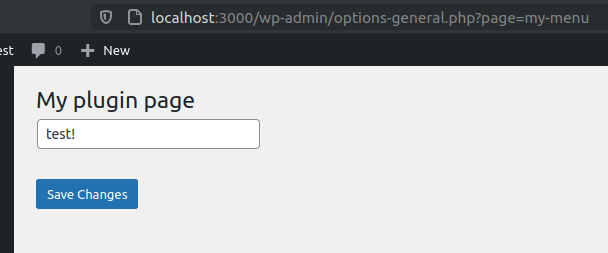

In the last article, we saw how to build a custom admin menu. Let's see how to use the Options API to save our form data.
<!-- more -->

## Summary: Options API

- Store with `update_option( $key, $value )`;
- Load with `get_option( $key )`;

## Using Options API in our form

Thanks to the Options API, we can easily store and load data. Let's use it to save our form:

```php{7,15}
<?php
function my_menu_html() {

  // Submit button has been pressed (button name is `submit`).
  $has_submitted = isset( $_POST['submit'] );
  if ( $has_submitted ) {
    update_option( 'field1', $_POST['field1'] );
  }

  // Page HTML.
  ?>
  <div class="wrap">
    <h1><?php echo get_admin_page_title() ?></h1>
    <form method="post">
      <input type="text" name="field1" value="<?php echo get_option( 'field1' ) ?>" />
      <?php submit_button(); ?>
    </form>
  </div>
  <?php
}
```

**Test it:** Reload the page, type something, and save. Your changes will stay permanent.



## Grouping options for optimization

Let's say we have many options in our page:

```php
<?php
function my_menu_html() {

  // Submit button has been pressed (button name is `submit`).
  $has_submitted = isset( $_POST['submit'] );
  if ( $has_submitted ) {
    update_option( 'field1', $_POST['field1'] );
    update_option( 'field2', $_POST['field2'] );
    update_option( 'field3', $_POST['field3'] );
    update_option( 'field4', $_POST['field4'] );
    update_option( 'field5', $_POST['field5'] );
  }

  // Page HTML.
  ?>
  <div class="wrap">
    <h1><?php echo get_admin_page_title() ?></h1>
    <form method="post">
      <input type="text" name="field1" value="<?php echo get_option( 'field1' ) ?>" />
      <input type="text" name="field2" value="<?php echo get_option( 'field2' ) ?>" />
      <input type="text" name="field3" value="<?php echo get_option( 'field3' ) ?>" />
      <input type="text" name="field4" value="<?php echo get_option( 'field4' ) ?>" />
      <input type="text" name="field5" value="<?php echo get_option( 'field5' ) ?>" />
      <?php submit_button(); ?>
    </form>
  </div>
  <?php
}
```

That works, but the performance isn't optimal. We are triggering five queries to load the page - and five others to update it. Imagine if we have dozens of options. Besides the big amount of queries, that will clutter the database.

A simple solution is to have them all in a single associative array instead of having multiple options.

Let's see this in action on PsySH:

```php
// BAD: Three values stored as individual options.
>>> update_option( 'field1', 'my value 1' )
^ "SHOW FULL COLUMNS FROM `wp_options`"
^ "UPDATE `wp_options` SET `option_value` = 'my value 1' WHERE `option_name` = 'field1'"
=> true
>>> update_option( 'field2', 'another value' )
^ "SELECT option_value FROM wp_options WHERE option_name = 'field2' LIMIT 1"
^ "INSERT INTO `wp_options` (`option_name`, `option_value`, `autoload`) VALUES ('field2', 'another value', 'yes') ON DUPLICATE KEY UPDATE `option_name` = VALUES(`option_name`), `option_value` = VALUES(`option_value`), `autoload` = VALUES(`autoload`)"
=> true
>>> update_option( 'field3', 'the third value' )
^ "SELECT option_value FROM wp_options WHERE option_name = 'field3' LIMIT 1"
^ "INSERT INTO `wp_options` (`option_name`, `option_value`, `autoload`) VALUES ('field3', 'the third value', 'yes') ON DUPLICATE KEY UPDATE `option_name` = VALUES(`option_name`), `option_value` = VALUES(`option_value`), `autoload` = VALUES(`autoload`)"
=> true

// GOOD: Three values stored as one single option.
>>> $my_values = [ 'field1' => 'my value 1', 'field2' => 'another value', 'field3' => 'the third value' ]
=> [
     "field1" => "my value 1",
     "field2" => "another value",
     "field3" => "the third value",
   ]
>>> update_option( 'my_values', $my_values )
^ "SELECT option_value FROM wp_options WHERE option_name = 'my_values' LIMIT 1"
^ "INSERT INTO `wp_options` (`option_name`, `option_value`, `autoload`) VALUES ('my_values', 'a:3:{s:6:\"field1\";s:10:\"my value 1\";s:6:\"field2\";s:13:\"another value\";s:6:\"field3\";s:15:\"the third value\";}', 'yes') ON DUPLICATE KEY UPDATE `option_name` = VALUES(`option_name`), `option_value` = VALUES(`option_value`), `autoload` = VALUES(`autoload`)"
=> true
```

With associative arrays, we always end up having two queries, no matter how many fields we are storing. If we have 10 fields we will have 2 queries. If we have 1000 fields, we will have 2 queries.

With individual options, if we have 10 fields we will have 20 queries. If we have 1000 fields, we will have 2000 queries!

In other words, is `O(2)` vs `O(2n)`. So, always prefer to group your fields into associative arrays, aka an `options group`.

Now, let's refactor our code to store fields as an associative array instead of individual options:

```php
<?php
function my_menu_html() {

  // Submit button has been pressed (button name is `submit`).
  $has_submitted = isset( $_POST['submit'] );
  if ( $has_submitted ) {
    update_option( 'my-menu', $_POST['my-menu'] );
  }

  // All fields in an associative array.
  $option = get_option( 'my-menu' );

  // Page HTML.
  ?>
  <div class="wrap">
    <h1><?php echo get_admin_page_title() ?></h1>
    <form method="post">
      <input type="text" name="my-menu[field1]" value="<?php echo $option['field1'] ?>" />
      <input type="text" name="my-menu[field2]" value="<?php echo $option['field2'] ?>" />
      <input type="text" name="my-menu[field3]" value="<?php echo $option['field3'] ?>" />
      <input type="text" name="my-menu[field4]" value="<?php echo $option['field4'] ?>" />
      <input type="text" name="my-menu[field5]" value="<?php echo $option['field5'] ?>" />
      <?php submit_button(); ?>
    </form>
  </div>
  <?php
}
```

That's way better. Also, grouping options is recommended by the official documents when saving a settings page.

<!-- When we have a group of options stored in an associative array, we have an `option group`. -->

## 5. Security: Permissions and Intention

As any user can access the admin panel, it's a good idea to check if the user has the permissions to access the page.

We did this when we created the menu, but it is a good practice to double-check it when rendering the page's HTML.

You can use the `current_user_can( $capability )` method for this:

```php
function my_menu_html() {
  /** Check permissions. */
  if ( ! current_user_can( 'manage_options' ) )  {
    return;
  }

  /** ... */
```

Use the same permission you used for the menu item (on `add_options_page(...)`).

::: tip
You can find a list of all permissions here:
[https://wordpress.org/support/article/roles-and-capabilities](https://wordpress.org/support/article/roles-and-capabilities)
:::

### Clickjack attacks, intention and nonces

Imagine an attacker sends you an email with a button that says "Click here for a free aPhone".

Of course you will click. Who doesn't want a free aPhone?! However, the button is a direct link to your user management page on WordPress. The link creates a new admin user with the attacker's email address. You try to click on the "Free aPhone" button, but instead, you create an admin user for the attacker.

In this scenario, a permission check won't save you, as you, the victim, have the right permissions.

This type of attack is know as `Clickjacking Attack`. To prevent it, we need to check for the user intention. We need to know if the user intended to perform the action.

Luckily, WordPress provides us with a simple but effective way to deal with this: `nonces`.

A nonce is a random token added to your form that by matching on the action, we guarantee the data came from the form and not from somewhere else.

We generate a nonce with `wp_create_nonce( $action )`:

```php
<?php $nonce = wp_create_nonce( 'my-awesome-form' ); ?>
<input type="hidden" name="my-nonce-field" value="<?php echo $nonce ?>">
```

Or even better, use the helper `wp_nonce_field( $action, $field_name )`:

```php
<?php wp_nonce_field( 'my-awesome-form', 'my-nonce-field' ); ?>
```

Then, check with the permissions:

```php
function my_menu_html() {
  /** Check nonce. */
  if ( empty( $_REQUEST['my-nonce-field'] ) ) {
    return;
  }
  if ( ! wp_verify_nonce( $_REQUEST['my-nonce-field'], 'my-awesome-form' ) ) {
    return;
  }

  /** Check permissions. */
  if ( ! current_user_can( 'manage_options' ) )  {
    return;
  }

  /** ... */
```

The `my-awesome-form` string can be anything you want, as long as you use the same string on both ends (form and validation).

The nonce guarantees your intention, that you reached the action through the form and not by some random link.

### Final code

Instead of `wp_verify_nonce()`, use `check_admin_referer()` when checking nonces on the admin side. It adds extra validations.

```php
function my_menu_html() {
  /** Check nonce. */
  if ( ! check_admin_referer( 'my-awesome-form', 'my-nonce-field' ) ) {
    return;
  }

  /** Check permissions. */
  if ( ! current_user_can( 'manage_options' ) )  {
    return;
  }

  /** ... */
```

---

The page we created so far works good, but there's a lot of manual work involved: we have to deal with nonces, permissions, manually save options, process the `$_POST` parameters.

Luckily, WordPress has a library to wrap all this boring, manual, repetitive stuff and let us focus on what it matters: our plugin's logic. Let's see it in the next article.