In this article, let's discover the Settings API in depth. Let's learn how to use PsySH to check how WordPress works under the hood.
<!-- more -->

## The `Settings API`

The page we created in the previous article works well, but there's a lot of manual work involved: we have to deal with nonces, permissions, manually save options, process the `$_POST` parameters.

Also, our plugin page doesn't look exactly like the core settings pages. It's similar, but something is off.

A core page:
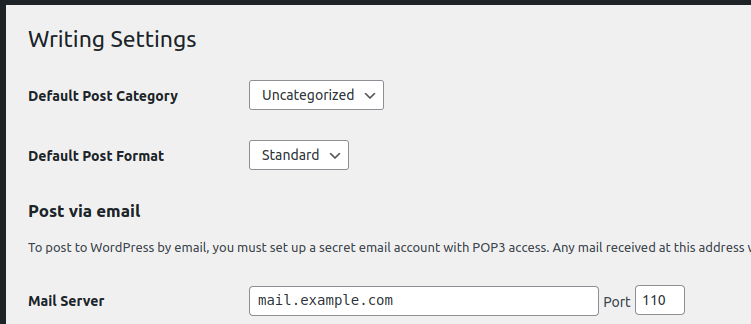

Our page:
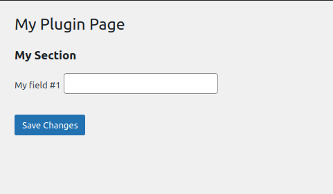

There's no space between the label and the input, labels are not bold, etc. That's because a lot of `div` wrappers and classes are missing in our layout.

We can manually set them, but that's a lot of work. Also, it wouldn't be future-proof: what if WordPress changes its official layout?! We would end up with an outdated look.

Luckily, WordPress has a library to wrap all this boring, manual, repetitive stuff and let us focus on what matters: our plugin's logic.

This library is the `Settings API`.

## We build forms programmatically

So far, we have been building our forms using pure HTML. With the Settings API, we don't work with HTML. We create forms programmatically with PHP functions.

Instead of writing the form contents with HTML, we call a function to render the form. This function calls sub-functions to render the sections, which call sub-sub-functions to render fields.

## Settings API is for Forms

The Settings API is **not used to build a whole page**, just the form contents of a page.

We still have to write HTML code for the page itself. Only the form, which is the core part of a admin page, is built with the Settings API.

## Rendering a Form

One of the most incredible things about the Settings API is that we can access any form from any plugin using this library.

We can create a plugin to extend other plugins' settings pages and add fields and sections to them.

To render a form, use the function `do_settings_sections( $id )`. The `id` is a unique identifier of the form. A good practice is to use the **menu's slug**.

For example, I have the plugin "*Code Snippets*" installed locally. Let's replace our form's contents with their form:

```php{7}
<?php
function my_menu_html() { ?>
  <div class="wrap">
    <h1><?php echo get_admin_page_title() ?></h1>

    <form method="post">
      <?php do_settings_sections( 'code-snippets' ) ?>
      <?php submit_button() ?>
    </form>
  </div>
  <?php
}
```

Reload the page:

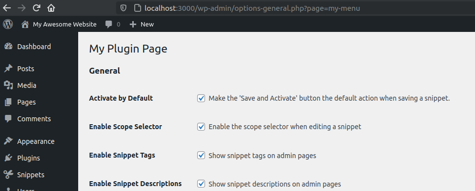

It's our page, but with Code Snippets' form contents on it.

Cool, but how can we create our forms instead of using others'? That's what we are going to learn next: how to create our own fields and sections.

## Fields and Sections

A page made with the Settings API has two elements: `fields` and `sections`.

We worked with them manually before:

- **Field** is a HTML input: `textarea`, `checkbox`, `radio`, `select`, `input`.
- **Section** is a sub-title for a group of fields: `<h2>`.

On the Settings API, each field belongs to a section. If you don't want to display a section, label it blank. But your field must be in a section.

Let's see all this in action with PsySH.

## Loading admin functions on PsySH

```bash
psysh
```

We have WordPress loaded, but not with the admin libraries. The Settings API is an admin library.

Let's load them and also trigger the `admin_init` action, to load plugins:

```php
// Load admin functions.
>>> require ( 'wp-admin/includes/admin.php' )
=> 1

// Trigger `admin_init` to load plugins.
>>> do_action( 'admin_init' )
^ "SELECT option_value FROM wp_options WHERE option_name = '_site_transient_update_core' LIMIT 1"
^ "SELECT option_value FROM wp_options WHERE option_name = '_site_transient_update_plugins' LIMIT 1"
^ "SELECT option_value FROM wp_options WHERE option_name = '_site_transient_update_themes' LIMIT 1"
^ "SELECT * FROM wp_posts WHERE ID = 3 LIMIT 1"
=> null
```

::: tip
Put these two commands in the `.psysh` file to avoid typing them on each PsySH session.
:::

## Sections and Fields

Now that we have PsySH loaded, let's define our first section.

Let's check the current sections loaded on Settings API. They are stored in the global `$wp_settings_sections`:

```php
>>> global $wp_settings_sections

>>> $wp_settings_sections
=> null
```

We have no sections defined yet, and thus no forms.

There's no function to define a form explicitly. We only have functions to define sections and fields. Forms are implicitly defined when we define a section.

If any plugin made with the Settings API were active, it would appear here. I disabled the "Code Snippet" plugin previously used as an example. That's why we don't see it.

Now let's define our first section with `add_settings_section(...)`:

```php
// Add Section
>>> $section_id      = 'my-section'
>>> $section_title   = 'My Section'
>>> $render_callback = false
>>> $page_id         = 'my-menu'
>>> add_settings_section( $section_id, $section_title, $render_callback, $page_id )
=> null
```

The `section_id` is a unique identifier. It can be anything. I usually use the title as if was a variable. It doesn't need to be globally unique. It just needs to be unique within your form. In other words, if another plugin has the same section id, there won't be an issue.

The `render_callback` is used for custom HTML rendering. When `false`, it prints the title as a `<h2>`.

Now that we added the section, let's check the global definitions:

```php
// Sections
>>> $wp_settings_sections
=> [
     "my-menu" => [
       "my-section" => [
         "id" => "my-section",
         "title" => "My Section",
         "callback" => false,
       ],
     ],
   ]
```

We can see the Settings API created a `my-menu` key for our form. Inside of it, we have a list of sections: `my-section`.

Let's render our form:

```php
// Render form
>>> do_settings_sections( 'my-menu' )
<h2>My Section</h2>
=> null
```

Nice! We rendered our first form with the Settings API.

Let's now add a field for our section with `add_settings_field(...)`:

```php
// Add Field
$field_id        = 'field1'
$field_title     = 'My field 1'
$render_callback = false
$page_id         = 'my-menu'
add_settings_field( $field_id, $field_title, $render_callback, $page_id, $section_id )
=> null
```

The `field_id` just needs to be unique within your form. Do not use two fields with the same id, even if they are on different sections. Two forms with the same id are allowed, though.

Let's render our form again:

```html
>>> do_settings_sections( 'my-menu' )
<h2>My Section</h2>
<table class="form-table" role="presentation">
  <tr>
    <th scope="row">My field 1</th>
    <td>
      <warning>PHP Warning:  call_user_func() expects parameter 1 to be a valid callback, no array or string given in /wp-admin/includes/template.php on line 1737</warning>
    </td>
  </tr>
</table>⏎
=> null
```

Hmmm. We got an error here. That's because we need to set a render for fields. There's no standard render as we have for the sections.

Let's set a simple render for the field:

```php
>>> function my_render_input() {
...   echo '<input type="text" />';
... }
=> null
```

And re-add the field:

```php
$render_callback = 'my_render_input'
add_settings_field( $field_id, $field_title, $render_callback, $page_id, $section_id )
```

To make sure we didn't create a second field with the same id, let's check the field definitions with `$wp_settings_fields`:

```php
global $wp_settings_fields

>>> $wp_settings_fields
=> [
     "my-menu" => [
       "my-section" => [
         "field1" => [
           "id" => "field1",
           "title" => "My field 1",
           "callback" => "my_render_input",
           "args" => [],
         ],
       ],
     ],
   ]
```

Great. We didn't duplicate the field, and the Settings API updated the field with our new render. The Settings API is smart enough to update, instead of adding, a field when the id is already there.

Let's render our form:

```html
>>> do_settings_sections( 'my-menu' )
<h2>My Section</h2>
<table class="form-table" role="presentation">
  <tr>
    <th scope="row">My field 1</th>
    <td><input type="text" /></td>
  </tr>
</table>⏎
```

That's perfect, no errors. Let's add a second field:

```php
// Add Field #2
>>> $field_id        = 'field2'
>>> $field_title     = 'My field 2'
>>> add_settings_field( $field_id, $field_title, $render_callback, $page_id, $section_id )
=> null
```

And render it:

```html
>>> do_settings_sections( 'my-menu' )
<h2>My Section</h2>
<table class="form-table" role="presentation">
  <tr>
    <th scope="row">My field 1</th>
    <td><input type="text" /></td>
  </tr>
  <tr>
    <th scope="row">My field 2</th>
    <td><input type="text" /></td>
  </tr>
</table>⏎
```

It's all looking good, but the fields have no `name` attribute. Without it, it is not possible to save data.

### The `name` attribute

We need to set a name attribute to save our fields. But what would be the right name to use? What name the Settings API expects us to put on an input field?

The Settings API is not strict about how we store data. We still need to write all the steps for storing and loading data manually: we need to call the `get_option` to print the input's values, we need to set which `$_POST` arguments will be saved, we need to write code to generate the field name.

We control the whole process. It is not different from what we had done before when we created a full settings page without the Settings API. We can store each field on its own option, which is terrible for performance. Or we can use an associative array to store all our form fields in a single database record, which is what we are going to do.

For this tutorial, let's save our fields in an option named `my-menu-option`. That means our fields will be named `my-menu-option[field1]` and `my-menu-option[field2]`. Usually, I would use just the page id, `my-menu`, with no `-option`. But to clarify that we can use any name we want, let's name it slightly differently.

Let's print our field names using one render for each field:

```php
// Renders
>>> function my_render_input1() {
...   echo '<input type="text" name="my-menu-option[field1]" />';
... }
>>> function my_render_input2() {
...   echo '<input type="text" name="my-menu-option[field2]" />';
... }

// Field 1
>>> $field_id        = 'field1'
>>> $field_title     = 'My field 1'
>>> $render_callback = 'my_render_input1'
>>> add_settings_field( $field_id, $field_title, $render_callback, $page_id, $section_id )
=> null

// Field 2
>>> $field_id        = 'field2'
>>> $field_title     = 'My field 2'
>>> $render_callback = 'my_render_input2'
>>> add_settings_field( $field_id, $field_title, $render_callback, $page_id, $section_id )
=> null
```

Let's render it:

```html
>>> do_settings_sections( 'my-menu' )
<h2>My Section</h2>
<table class="form-table" role="presentation">
  <tr>
    <th scope="row">My field 1</th>
    <td><input type="text" name="my-menu-option[field1]" /></td>
  </tr>
  <tr>
    <th scope="row">My field 2</th>
    <td><input type="text" name="my-menu-option[field2]" /></td>
  </tr>
</table>⏎
```

That works, but what if we have dozens of fields? Should we create a custom render for each of them?

Luckily, there's a better way. We can pass arguments to the render and use them to generate the fields dynamically.

## Rendering fields dynamically

The `add_settings_field()` function accepts an extra argument that is sent to the callback.

Let's use it to pass all the information necessary to build the HTML element:

```php
// Render with arguments.
>>> function my_field_render( $args ) {
...   $option_key = $args[ 'option_key' ];
...   $field_id   = $args[ 'field_id' ];
...   $name       = "{$option_key}[{$field_id}]";
...   echo "<input type='text' name='{$name}' />";
... }

// Field 1
>>> $field_id        = 'field1'
>>> $field_title     = 'My field 1'
>>> $render_callback = 'my_render'
>>> $extra_args      = [ 'field_id' => $field_id, 'option_key' => 'my-menu-option' ];
>>> add_settings_field( $field_id, $field_title, $render_callback, $page_id, $section_id, $extra_args )
=> null

// Field 2
>>> $field_id        = 'field2'
>>> $field_title     = 'My field 2'
>>> $render_callback = 'my_render'
>>> $extra_args      = [ 'field_id' => $field_id, 'option_key' => 'my-menu-option' ];
>>> add_settings_field( $field_id, $field_title, $render_callback, $page_id, $section_id, $extra_args )
=> null
```

Let's check it:

```html
>>> do_settings_sections( 'my-menu' )
<h2>My Section</h2>
<table class="form-table" role="presentation">
  <tr>
    <th scope="row">My field 1</th>
    <td><input type='text' name='my-menu-option[field1]' /></td>
  </tr>
  <tr>
    <th scope="row">My field 2</th>
    <td><input type='text' name='my-menu-option[field2]' /></td>
  </tr>
</table>⏎
```

The form is rendering perfectly.

You can use the arguments to pass the field type (select, textarea, etc), CSS classes and ids, and any other information to make your inputs.

Let's check how this looks on WordPress.

## Rendering on WordPress

First, let's change our form rendering function:

```php{7}
<?php
function my_menu_html() { ?>
  <div class="wrap">
    <h1><?php echo get_admin_page_title() ?></h1>

    <form method="post">
      <?php do_settings_sections( 'my-menu' ) ?>
      <?php submit_button() ?>
    </form>
  </div>
  <?php
}
```

Our Settings API code has to be called during the admin initialization, with the `admin_init` action:

```php
function my_menu_define_form() {
}

add_action( 'admin_init', 'my_menu_define_form' );
```

Let's fill the function with our code:

```php
function my_field_render( $args ) {
  $option_key = $args[ 'option_key' ];
  $field_id   = $args[ 'field_id' ];
  $name       = "{$option_key}[{$field_id}]";
  echo "<input type='text' name='{$name}' />";
}

function my_menu_define_form() {
  // Section
  $section_id      = 'my-section';
  $section_title   = 'My Section';
  $render_callback = false;
  $page_id         = 'my-menu';
  add_settings_section( $section_id, $section_title, $render_callback, $page_id );

  // Field 1
  $field_id        = 'field1';
  $field_title     = 'My field 1';
  $render_callback = 'my_field_render';
  $extra_args      = [ 'field_id' => $field_id, 'option_key' => 'my-menu-option' ];
  add_settings_field( $field_id, $field_title, $render_callback, $page_id, $section_id, $extra_args );

  // Field 2
  $field_id        = 'field2';
  $field_title     = 'My field 2';
  $render_callback = 'my_field_render';
  $extra_args      = [ 'field_id' => $field_id, 'option_key' => 'my-menu-option' ];
  add_settings_field( $field_id, $field_title, $render_callback, $page_id, $section_id, $extra_args );
}

add_action( 'admin_init', 'my_menu_define_form' );
```

Reload the page to see the results:

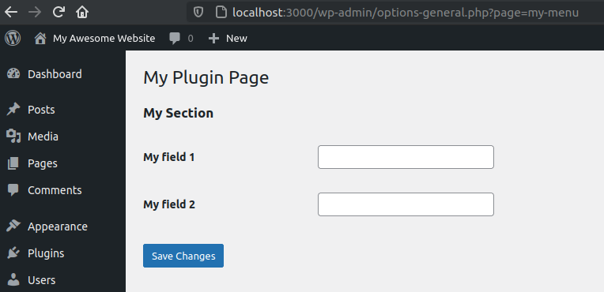

It looks good. But what about saving? Pressing the "Save" button does nothing.

## Storing

The Settings API saves the data for us, but we need to:

- Send the form data to `options.php`;
- Render security fields with `settings_fields( $page_id )`;

Let's check the `settings_fields()` on PsySH:

```html
>>> settings_fields( 'my-menu' )
<input type='hidden' name='option_page' value='my-menu' />
<input type="hidden" name="action" value="update" />
<input type="hidden" id="_wpnonce" name="_wpnonce" value="2f273a7345" />
<input type="hidden" name="_wp_http_referer" value="" />⏎
```

The function is generating a nonce and a referer (used for security purposes). And it is also telling `options.php` our page id and that we are updating a settings page.

Now, let's put all of this in our code:

```php{6,7}
<?php
function my_menu_html() { ?>
  <div class="wrap">
    <h1><?php echo get_admin_page_title() ?></h1>

    <form method="post" action="options.php">
      <?php settings_fields( 'my-menu' ) ?>
      <?php do_settings_sections( 'my-menu' ) ?>
      <?php submit_button() ?>
    </form>
  </div>
  <?php
}
```

Let's check if it works when we press the save button:

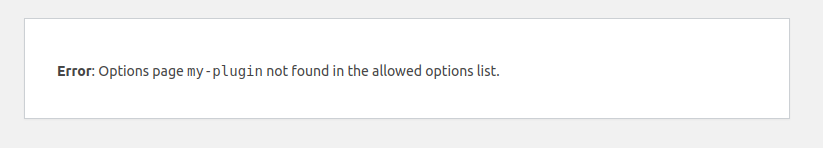

It didn't work. We got this "**Error: Options page my-menu not found in the allowed options list.**".

The Settings API has a mechanism to prevent mass-assignment attacks.

Any registered user has access to the admin panel. Imagine a plugin with a setting page for regular users. In this scenario, an attacker can access the settings page and inject fields on the HTML to overwrite options like `admin_email`, and get full control of the website.

Because of this security feature, our plugin needs to explicitly tell the Settings API which options are allowed to be stored.

We do this with `register_setting( $page_id, $option_key )`:

```php{23-24}
function my_menu_define_form() {
  // Section
  $section_id      = 'my-section';
  $section_title   = 'My Section';
  $render_callback = false;
  $page_id         = 'my-menu';
  add_settings_section( $section_id, $section_title, $render_callback, $page_id );

  // Field 1
  $field_id        = 'field1';
  $field_title     = 'My field 1';
  $render_callback = 'my_field_render';
  $extra_args      = [ 'field_id' => $field_id, 'option_key' => 'my-menu-option' ];
  add_settings_field( $field_id, $field_title, $render_callback, $page_id, $section_id, $extra_args );

  // Field 2
  $field_id        = 'field2';
  $field_title     = 'My field 2';
  $render_callback = 'my_field_render';
  $extra_args      = [ 'field_id' => $field_id, 'option_key' => 'my-menu-option' ];
  add_settings_field( $field_id, $field_title, $render_callback, $page_id, $section_id, $extra_args );

  // Allow option to be saved.
  register_setting( 'my-menu', 'my-menu-option' );
}
```

::: tip
A `setting` is a synonym for `option`, but used in the Settings API context.
In our example, our page's `setting` is `my-menu-option`.
:::

Testing again:

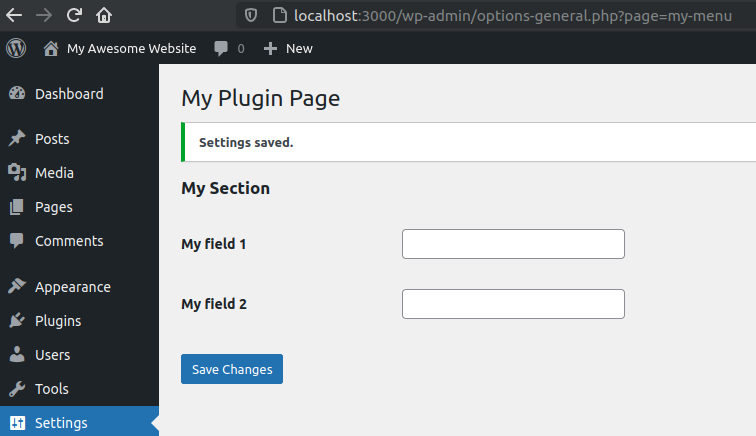

It works, and now we just need to retrieve the saved data.

## Retrieving

Data is being saved, but not being displayed. Let's fix it with `get_option( $option_key )`:

```php
function my_field_render( $args ) {
  $option_key = $args[ 'option_key' ];
  $field_id   = $args[ 'field_id' ];
  $name       = "{$option_key}[{$field_id}]";

  $option     = get_option( $option_key );
  $value      = $option[ $field_id ];

  echo "<input type='text' name='{$name}' value='{$value}' />";
}
```

Even though we call `get_option()` multiple times for the same key, it will only read the database once, thanks to the Options API cache. So, no need to worry about performance.

Let's try to save:

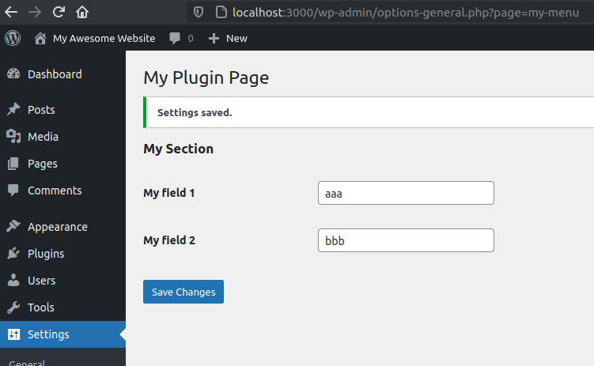

Great. Our settings have been properly saved. Even when you reload the page, the data is still there.

### Escape the output

Always escape inputs before output. For HTML attributes, use the `esc_attr( $text )`:

```php
$value = esc_attr( $option[ $field_id ] );
```

## Input Normalization, Validation, Sanitization, Filtering, and Escaping

The Settings API has a unique mechanism for validations, but first, let's understand its concepts.

Key differences:

- **Input Normalization:** Change the input to have a standard form. Examples: trimming values, typecasting, lowercase a value, etc. Even though it changes the value, the changes have no semantical impact. The data is different, but the information remains the same. `"  John Snow  "` and `"John Snow"` are the same, `"yes"` and `true` are the same, `My@EMail.com` and `my@email.com` are the same, the phone number `(401) 1020-3040` and `40110203040` are the same. This process is also called "**Canonicalization**";
- **Input Validation:** Check if the value is valid. Examples: check if the field is required, check if the email has an invalid format, check if the birth date is in the future, check if age is less than 18, check if the name has just one character;
- **Input Sanitization:** Removes illegal characters and makes risky data safe. Examples: escaping the value `O'Brien` to avoid breaking SQL, escaping strings to avoid SQL injections. There are two main competing sanitization types: filtering and escaping. Use one or the other;

The order should be: `normalization > validation > sanitization`.

### Sanitization types: Filtering vs. Escaping

`Escaping` is when we encode the input, so the characters don't get mistaken as commands. For example, encode `O'Brien` to `O\'Brien` when escaping for SQL. Or encoding `<3` to `&#60;3` for HTML, or `Me & You` to `Me%20%26%20You` for URLs. Escaping can also be called `encoding`.

`Filtering` is to remove illegal characters. For example, `O'Brien` becomes `OBrien`, `<3` becomes `3`, `Me & You` becomes `Me You`.

Always **prefer escaping** for your sanitizations. Do not just remove characters before saving them, adulterating their contents. That's bad practice.

When used for validation, filtering frequently prevents authorized input, like `O'Brien`, where the `'` character is entirely legitimate. When used for sanitization, it saves the wrong data. **Do not rely on filtering** for validations nor sanitizations.

### Settings API

**Sanitization:** A good thing about the Settings API is that we don't need to worry about risky inputs when saving with it. The Settings API uses the Options API, which automatically escapes inputs before saving them, as we have seen before. We still need to escape the value before printing to prevent XSS attacks, but not here, during saving, which is what this section is about.

When **validating inputs**, you need to write code to cancel the whole saving and return an error message when invalid input is detected.

**Input normalization**, like trimming strings and converting `"yes"` to `true`, happens before validation, but they are optional.

### Code

Let's say we have an email input, and we want to validate it.

The 3rd argument of `register_setting()` accepts a callback to check and change the inputs before saving. The callback should return the value that will be saved:

```php
register_setting( 'my-menu', 'my-menu-option', [ 'sanitize_callback' => 'my_validation_callback' ] );
```

```php
function my_validation_callback( $option ) {
  // Strips out illegal characters from email address.
  $option['email'] = sanitize_email( $option['email'] );
  return $option;
}
```

In this example, if the user tries to save `my#@email.com`, it will save it as `my@email.com`. That works, but it is lazy and a wrong way to deal with inputs. That's filtering sanitization.

We shouldn't adulterate the inputs. If there's an illegal email character, we should return an error and not save the input. If there's a risky character, we should encode it, not remove it.

Despite its name, `sanitize_callback` can and should be used for validation and normalization. The trick is to return the original value when invalid. Use `add_settings_error( $setting, $code, $message, $type = 'error' )` to throw errors for invalid inputs:

```php
function my_validation_callback( $option ) {
  /** The original value. */
  $option_name     = 'my-menu-option';
  $original_option = get_option( $option_name );

  /** Normalization. */
  $normalized = [
    'email' => strtolower( trim( $option[ 'email' ] ) )
  ];

  /** Validation. */
  $is_valid_email = is_email( $normalized[ 'email' ] );
  if ( ! $is_valid_email ) {
    add_settings_error( $option_name, 'invalid-email', 'Email is not valid!' );
  }

  /** When has errors, return the original state (do not save). */
  $has_errors = 0 !== count( get_settings_errors( $option_name ) );
  if ( $has_errors ) {
    return $original_option;
  }

  /** Save normalized inputs when there's no errors.  */
  return $normalized;
}
```

To test it, change the `field1` name to `email` and click to save. If you type an invalid email, you will get this error:

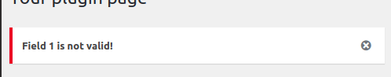

## Displaying Error and Success messages

Our page is in the "Settings" menu:

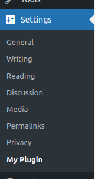

Because of it, success and error messages are displayed automatically:

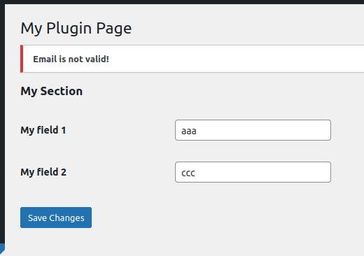

But let's move our menu to the "Tools" menu:

```php{7}
function my_plugin_menu() {
  $page_title = 'My Plugin Page';
  $menu_title = 'My Plugin';
  $capability = 'manage_options'; // Only users that can manage options can access this menu item.
  $menu_slug  = 'my-menu'; // unique identifier.
  $callback   = 'my_menu_html';
  add_management_page( $page_title, $menu_title, $capability, $menu_slug, $callback );
}
```

<!-- /** Step 1 (action). */ -->
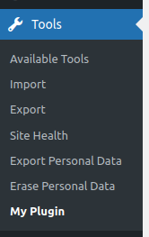

Now, when you click to save, no message is displayed. No success or errors.

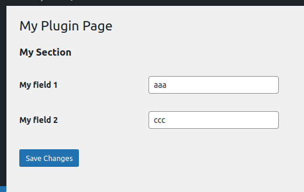

Outside "Settings" menu, we need to manually display the messages with `settings_errors( $page_id )`:

```php{3,4}
<?
function my_menu_html() {
  // show error/success messages
  settings_errors( 'my-menu' );

  ?>
  <div class="wrap">
    <h1><?php echo get_admin_page_title() ?></h1>

    <form method="post" action="options.php">
      <?php settings_fields( 'my-menu' ) ?>
      <?php do_settings_sections( 'my-menu' ) ?>
      <?php submit_button() ?>
    </form>
  </div>
  <?php
}
```

Reload the page and press to save:


The error message works now, but what about the success message? Type a valid email and click to save:


No success message.

To show a success message, we need to call `add_settings_error(...)` and pass `'success'` as the `$type` argument.

You could place this call in the validation callback, after checking that there are no errors:

```php
/** Display success and save normalized inputs.  */
add_settings_error( 'my-menu', 'success', 'Settings Saved', 'updated' );
return $normalized;
```

That will work:

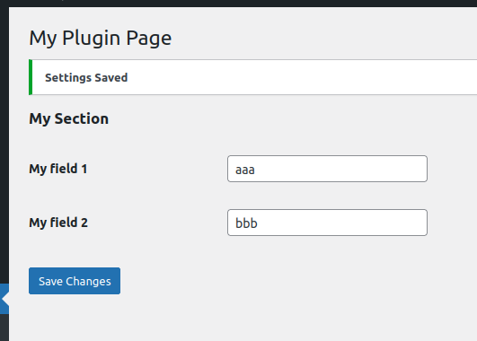

But what if something goes wrong in the `options.php`? For example,  if there's a problem with the database. Or, let's say, an external plugin intercepts the input and throws an error.

In this case, we would incorrectly set the "Success" message (the error happens after the sanitization callback) and it would be displayed to the user.

Because of this, the best place to put this code is just before displaying the messages, in the form:

```php
<?php
function my_menu_html() {
  // Check if data has been properly saved.
  $has_been_saved = isset( $_GET['settings-updated'] );
  if ( $has_been_saved ) {
    add_settings_error( 'my-menu', 'success', 'Settings Saved', 'updated' );
  }

  // Display error/success messages
  settings_errors( 'my-menu' );

  ?>
  <div class="wrap">
    <h1><?php echo get_admin_page_title() ?></h1>

    <form method="post" action="options.php">
      <?php settings_fields( 'my-menu' ) ?>
      <?php do_settings_sections( 'my-menu' ) ?>
      <?php submit_button() ?>
    </form>
  </div>
  <?php
}
```

If `options.php` can successfully save the input and there are no error messages, it sets the `settings-updated` argument into the URL. Use it to detect success:


## Security: Checking for permissions

The Settings API checks for intention (nonces) and performs other security checks for us, thanks to the `settings_field()` function.

WordPress checks if we have permission to open the menu page thanks to the `$capability` argument on `add_*_page()`.

But despite these automatic checks, it is a good practice to double-check the permissions when rendering the page:

```php
function my_menu_html() {
  // Check user capabilities
  if ( ! current_user_can( 'manage_options' ) ) {
    return;
  }

  /** ... */
}
```

Use the same capability defined on `add_*_page()`.

## Full code

Here's the full code we've developed:

```php
<?php
function my_menu_html() {
  // Check user capabilities
  if ( ! current_user_can( 'manage_options' ) ) {
    return;
  }

  // Check if data has been properly saved.
  $has_been_saved = isset( $_GET['settings-updated'] );
  if ( $has_been_saved ) {
    add_settings_error( 'my-menu', 'success', 'Settings Saved', 'updated' );
  }

  // Display error/success messages
  settings_errors( 'my-menu' );

  ?>
  <div class="wrap">

    <!-- Page title. -->
    <h1><?php echo get_admin_page_title() ?></h1>

    <form method="post" action="options.php">

      <!-- Security fields. -->
      <?php settings_fields( 'my-menu' ) ?>

      <!-- Settings API renders the form contents. -->
      <?php do_settings_sections( 'my-menu' ) ?>

      <!-- Submit button. -->
      <?php submit_button() ?>

    </form>

  </div>
  <?php
}

function my_field_render( $args ) {
  $option_key = $args[ 'option_key' ];
  $field_id   = $args[ 'field_id' ];
  $name       = "{$option_key}[{$field_id}]";

  $option     = get_option( $option_key );
  $value      = $option[ $field_id ];

  echo "<input type='text' name='{$name}' value='{$value}' />";
}

function my_validation_callback( $option ) {
  /** The original value. */
  $option_name     = 'my-menu-option';
  $original_option = get_option( $option_name );

  /** Normalization. */
  $normalized = [
    'email' => strtolower( trim( $option[ 'email' ] ) )
  ];

  /** Validation. */
  $is_valid_email = is_email( $normalized[ 'email' ] );
  if ( ! $is_valid_email ) {
    add_settings_error( $option_name, 'invalid-email', 'Email is not valid!' );
  }

  /** When has errors, return the original state (do not save). */
  $has_errors = 0 !== count( get_settings_errors( $option_name ) );
  if ( $has_errors ) {
    return $original_option;
  }

  /** Save normalized inputs when there's no errors.  */
  return $normalized;
}

function my_menu_define_form() {
  // Section
  $section_id      = 'my-section';
  $section_title   = 'My Section';
  $render_callback = false;
  $page_id         = 'my-menu';
  add_settings_section( $section_id, $section_title, $render_callback, $page_id );

  // Field 1
  $field_id        = 'field1';
  $field_title     = 'My field 1';
  $render_callback = 'my_field_render';
  $extra_args      = [ 'field_id' => $field_id, 'option_key' => 'my-menu-option' ];
  add_settings_field( $field_id, $field_title, $render_callback, $page_id, $section_id, $extra_args );

  // Field 2
  $field_id        = 'field2';
  $field_title     = 'My field 2';
  $render_callback = 'my_field_render';
  $extra_args      = [ 'field_id' => $field_id, 'option_key' => 'my-menu-option' ];
  add_settings_field( $field_id, $field_title, $render_callback, $page_id, $section_id, $extra_args );

  // Allow option to be saved.
  register_setting( 'my-menu', 'my-menu-option', [ 'sanitize_callback' => 'my_validation_callback' ] );
}

function my_plugin_menu() {
  $page_title = 'My Plugin Page';
  $menu_title = 'My Plugin';
  $capability = 'manage_options'; // Only users that can manage options can access this menu item.
  $menu_slug  = 'my-menu'; // unique identifier.
  $callback   = 'my_menu_html';
  add_management_page( $page_title, $menu_title, $capability, $menu_slug, $callback );
}

add_action( 'admin_init', 'my_menu_define_form' );
add_action( 'admin_menu', 'my_plugin_menu' );
```

---

And that's it. Now, you know how to create a settings page using the Settings API.

But that was a lot of coding for a simple page. Let's see how to DRY this code in the following article.
