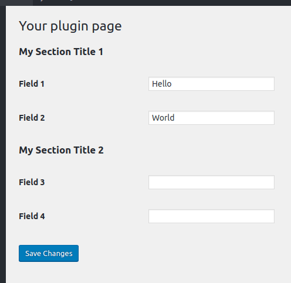

Forms created with the Settings API usually have lots of repetitive code. To improve this, let's see a simple technique to write forms with reduced code,  inspired by WooCommerce.
<!-- more -->

The idea is simple: we put all the form fields in an array. Then, we loop this array and call `add_settings_field()` dynamically.

We can save this code as an external file and re-use it to all our pages, just changing the array input.

## The original code

Here's the current code we developed in the previous article:

```php
<?php
function my_menu_define_form() {
  // Section
  $section_id      = 'my-section';
  $section_title   = 'My Section';
  $render_callback = false;
  $page_id         = 'my-menu';
  add_settings_section( $section_id, $section_title, $render_callback, $page_id );

  // Field 1
  $field_id        = 'field1';
  $field_title     = 'My field 1';
  $render_callback = 'my_field_render';
  $extra_args      = [ 'field_id' => $field_id, 'option_key' => 'my-menu-option' ];
  add_settings_field( $field_id, $field_title, $render_callback, $page_id, $section_id, $extra_args );

  // Field 2
  $field_id        = 'field2';
  $field_title     = 'My field 2';
  $render_callback = 'my_field_render';
  $extra_args      = [ 'field_id' => $field_id, 'option_key' => 'my-menu-option' ];
  add_settings_field( $field_id, $field_title, $render_callback, $page_id, $section_id, $extra_args );

  // Allow option to be saved.
  register_setting( 'my-menu', 'my-menu-option', [ 'sanitize_callback' => 'my_validation_callback' ] );
}
```

## DRYing the code

Let's DRY (Don't Repeat Yourself) this code.

First, put all the fields in an array:

```php
$fields = [
  [ 'type' => 'text', 'id' => 'field1', 'title' => 'My field 1', 'option_key' => 'my-menu-option' ],
  [ 'type' => 'text', 'id' => 'field2', 'title' => 'My field 2', 'option_key' => 'my-menu-option' ],
];

$render_callback = 'my_field_render';
add_settings_field( 'field1', 'Field 1', $render_callback, 'my-menu', 'my-section', $fields[0] );
add_settings_field( 'field2', 'Field 2', $render_callback, 'my-menu', 'my-section', $fields[1] );
```

Test it on the browser. It produces the same result as before.

For dynamic sections, let's refactor what we wrote and have an array of sections. Let's add another section and a few more fields. Put fields as sub-arrays of each section:

```php
<?php
$sections = [
  [
    'id'     => 'my-section-1',
    'title'  => 'My Section Title 1',
    'fields' => [
      [ 'type' => 'text', 'id' => 'field1', 'title' => 'My Field 1' ],
      [ 'type' => 'text', 'id' => 'field2', 'title' => 'My Field 2' ],
    ],
  ],
  [
    'id'     => 'my-section-2',
    'title'  => 'My Section Title 2',
    'fields' => [
      [ 'type' => 'text', 'id' => 'field3', 'title' => 'My Field 3' ],
      [ 'type' => 'text', 'id' => 'field4', 'title' => 'My Field 4' ],
    ],
  ],
];
```

Loop through this array calling Settings API functions dynamically:

```php
<?php
function my_menu_define_form() {
  $page_id             = 'my-menu';
  $option_key          = 'my-menu-option';
  $validation_callback = 'my_validation_callback';

  // Form structure.
  $sections = [
    [
      'id'     => 'my-section-1',
      'title'  => 'My Section Title 1',
      'fields' => [
        [ 'type' => 'text', 'id' => 'field1', 'title' => 'My Field 1' ],
        [ 'type' => 'text', 'id' => 'field2', 'title' => 'My Field 2' ],
      ],
    ],
    [
      'id'     => 'my-section-2',
      'title'  => 'My Section Title 2',
      'fields' => [
        [ 'type' => 'text', 'id' => 'field3', 'title' => 'My Field 3' ],
        [ 'type' => 'text', 'id' => 'field4', 'title' => 'My Field 4' ],
      ],
    ],
  ];

  // Loop sections.
  foreach ( $sections as $index => $section ) {

    // Add Section.
    $section_id      = $section['id'];
    $section_title   = $section['title'];
    $render_callback = false;
    add_settings_section( $section_id, $section_title, $render_callback, $page_id );

    // Loop fields.
    foreach ( $section['fields'] as $field ) {

      // Add field.
      $field_id        = $field['id'];
      $field_title     = $field['title'];
      $render_callback = 'my_field_render';
      $extra_args      = [ 'field_id' => $field_id, 'option_key' => $option_key ];
      add_settings_field( $field_id, $field_title, $render_callback, $page_id, $section_id, $extra_args );
    }
  }

  /** Allow Settings API to save option. */
  register_setting( $page_id, $option_key, [ 'sanitize_callback' => $validation_callback ] );
}
```

Check on the browser:



## Making this code re-usable

Let's move the loop and the render to an external file (`settings-utils.php`):

```php
<?php
// settings-utils.php

function my_field_render( $args ) {
  $option_key = $args[ 'option_key' ];
  $field_id   = $args[ 'field_id' ];
  $type       = $args[ 'type' ];
  $name       = "{$option_key}[{$field_id}]";

  $option     = get_option( $option_key );
  $value      = $option[ $field_id ];

  $is_textarea = 'textarea' === $type;
  if ($is_textarea) {
    echo "<textarea name='{$name}'>{$value}</textarea>";
    return;
  }

  echo "<input type='{$type}' name='{$name}' value='{$value}' />";
}

function define_settings_form($page_id, $option_key, $sections) {
  // Loop sections.
  foreach ( $sections as $index => $section ) {

    // Add Section.
    $section_id      = $section['id'];
    $section_title   = $section['title'];
    $render_callback = false;
    add_settings_section( $section_id, $section_title, $render_callback, $page_id );

    // Loop fields.
    foreach ( $section['fields'] as $field ) {

      // Add field.
      $field_id        = $field['id'];
      $field_title     = $field['title'];
      $render_callback = 'my_field_render';
      $extra_args      = [ 'field_id' => $field_id, 'option_key' => $option_key ];
      add_settings_field( $field_id, $field_title, $render_callback, $page_id, $section_id, $extra_args );
    }
  }

  /** Allow Settings API to save option. */
  register_setting( $page_id, $option_key, [ 'sanitize_callback' => $validation_callback ] );
}
```

Notice I added a textarea support to `my_field_render()`. Add other types that you need for your forms. Examples: select, radio, a custom element.

You can also add dynamic attributes like CSS classes and any additional information to make your inputs.

Now, you can easily create forms by just defining an array:

```php
<?php
required_once "settings-utils.php";

function my_menu_define_form() {
  $page_id    = 'my-menu';
  $option_key = 'my-menu-option';

  // Form structure.
  $sections = [
    [
      'id'     => 'my-section-1',
      'title'  => 'My Section Title 1',
      'fields' => [
        [ 'type' => 'text', 'id' => 'field1', 'title' => 'My Field 1' ],
        [ 'type' => 'text', 'id' => 'field2', 'title' => 'My Field 2' ],
      ],
    ],
    [
      'id'     => 'my-section-2',
      'title'  => 'My Section Title 2',
      'fields' => [
        [ 'type' => 'text', 'id' => 'field3', 'title' => 'My Field 3' ],
        [ 'type' => 'text', 'id' => 'field4', 'title' => 'My Field 4' ],
      ],
    ],
  ];

  define_settings_form($page_id, $option_key, $sections);
}
```

This code is way smaller and simpler to read than before DRYing it.
