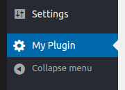
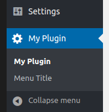
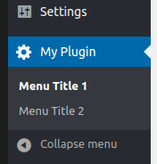

Previously, we learned how to add an item to the core WordPress menus. Now, let's find out how to create a custom parent menu.
<!-- more -->



Before, we used `add_options_page()` to create a menu item under the `Settings` menu. For the other core menus, we used different `add_*_page()` functions.

For a custom menu, use the `add_menu_page()` function:

```php{8}
/** Step 2 (add item). */
function my_plugin_menu() {
  $page_title = 'My Plugin Options';
  $menu_title = 'My Plugin';
  $capability = 'manage_options'; // permissions.
  $menu_slug  = 'my-menu'; // unique identifier.
  $callback   = 'my_menu_html';
  add_menu_page( $page_title, $menu_title, $capability, $menu_slug, $callback );
}
```

This function has two extra optional arguments: **icon** and **position**:

### Custom icon


```php
$icon = 'dashicons-media-code';
add_menu_page( $page_title, $menu_title, $capability, $menu_slug, $callback, $icon );
```

The complete list of icons:
[https://developer.wordpress.org/resource/dashicons](https://developer.wordpress.org/resource/dashicons)

For a **custom icon**, use: `plugins_url( 'my-plugin/icon.png' )`. You can also pass a **base64-encoded SVG**. Alternatively, pass `'none'` and set your **icon on the CSS**.

### Custom position (ex. between *Tools* and *Settings*)


The last argument, also optional, is the menu position. By default, WordPress will place the menu at the bottom, but you can change this.

**Position values:**

- 2 – Dashboard
- 4 – Separator
- 5 – Posts
- 10 – Media
- 15 – Links
- 20 – Pages
- 25 – Comments
- 59 – Separator
- 60 – Appearance
- 65 – Plugins
- 70 – Users
- 75 – Tools
- 80 – Settings
- 99 – Separator

For example, position **76** will place it between *Tools* and *Settings*.

```php
$position   = 76;
add_menu_page( $page_title, $menu_title, $capability, $menu_slug, $callback, $icon, $position );
```

## Sub-menus



To add sub-menus, use the `add_submenu_page( ... )` method.

The **first argument** is the **parent menu slug**. The other arguments are the same as the other methods:

```php
/** menu: */
add_menu_page( $page_title, $menu_title, $capability, $menu_slug, $callback );

/** menu's sub-item: */
$menu_slug2 = 'my-menu2'; // unique identifier.
$callback2  = 'my_menu_html';
add_submenu_page( $menu_slug, 'Tab Title', 'Menu Title', $capability, $menu_slug2, $callback2 );
```

Result:


Notice that the **first item** has the **same title** as the menu. That's the default behavior on WordPress.

### Different title for the first sub-menu item



To fix it, add an item with the same slug as the parent menu.

```php
/** First item. */
add_submenu_page( $menu_slug, 'Tab Title 1', 'Menu Title 1', $capability, $menu_slug, $callback );

/** Second item. */
$menu_slug2 = 'my-menu2'; // unique identifier.
$callback2  = 'my_menu_html';
add_submenu_page( $menu_slug, 'Tab Title 2', 'Menu Title 2', $capability, $menu_slug2, $callback2 );
```
