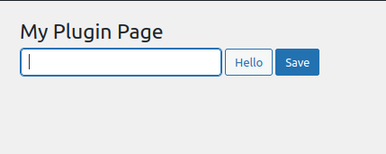

Admin pages have a standard "Save" button. But what if you need a second button? Let's create a "*Hello*" button that echoes a "*World!*" on screen.
<!-- more -->

## 1. The page

Here's the code we learned before:

```php
<?php
function my_menu_html() {

  // Submit button has been pressed (button name is `submit`).
  $has_submitted = isset( $_POST['submit'] );
  if ( $has_submitted ) {
    update_option( 'field1', $_POST['field1'] );
  }

  // Page HTML.
  ?>
  <div class="wrap">
    <h1><?php echo get_admin_page_title() ?></h1>
    <form method="post">
      <input type="text" name="field1" value="<?php echo get_option( 'field1' ) ?>" />
      <?php submit_button(); ?>
    </form>
  </div>
  <?php
}
```

Which prints:


Because there's no `action` defined, the form is submitted back to the same page.

We are not using the Settings API here for simplicity sake. We'll see later how to do the same with the Settings API.

## 2. The "Hello" button

Let's add a second button, the "Hello" button:

```php{4-8,22}
<?php
function my_menu_html() {

  // "Hello" button has been pressed.
  $has_pressed_hello = isset( $_POST['submit-hello'] );
  if ( $has_pressed_hello ) {
    echo "<p style='background-color: red;'>World!</p>";
  }

  // Submit button has been pressed (button name is `submit`).
  $has_submitted = isset( $_POST['submit'] );
  if ( $has_submitted ) {
    update_option( 'field1', $_POST['field1'] );
  }

  // Page HTML.
  ?>
  <div class="wrap">
    <h1><?php echo get_admin_page_title() ?></h1>
    <form method="post">
      <input type="text" name="field1" value="<?php echo get_option( 'field1' ) ?>" />
      <?php submit_button('Hello', 'secondary', 'submit-hello' ); ?>
      <?php submit_button(); ?>
    </form>
  </div>
  <?php
}
```

Which prints:


::: tip
We are not using the default arguments on `submit_button` for our "Hello" button.

See the full arguments reference here:
[https://developer.wordpress.org/reference/functions/submit_button/](https://developer.wordpress.org/reference/functions/submit_button/)
:::

Let's press the "Hello" button:


It works, but the layout is off. We see that each button is on a different line.

### 2.1. Fixing the style

Each button is on a different line because by default, `submit_button` wraps the input into a `<p>` element. Luckly, the **fourth argument** is a boolean to enable/disable this wrapping:

```php{5,6}
<div class="wrap">
  <h1><?php echo get_admin_page_title() ?></h1>
  <form method="post">
    <input type="text" name="field1" value="<?php echo get_option( 'field1' ) ?>" />
    <?php submit_button('Hello', 'secondary', 'submit-hello', false ); ?>
    <?php submit_button('Save', 'primary', 'submit', false ); ?>
  </form>
</div>
```

Which prints:


That's better, the buttons are now side by side. But it is still off. The buttons are on the same line as the input.

Let's fix this by wrapping the buttons on a div:

```php{6-10}
<div class="wrap">
  <h1><?php echo get_admin_page_title() ?></h1>
  <form method="post">
    <input type="text" name="field1" value="<?php echo get_option( 'field1' ) ?>" />

    <!-- Buttons. -->
    <div style="margin-top: 32px;">
        <?php submit_button('Hello', 'secondary', 'submit-hello', false ); ?>
        <?php submit_button('Save', 'primary', 'submit', false ); ?>
    </div>
  </form>
</div>
```

Which prints:


That's perfect, but how to add a second button with the Settings API?

## 3. Settings API

Let's see how we built the form with the Settings API:

```php
<?php
function my_menu_html() {

  // Check if was properly saved.
  $has_been_saved = isset( $_GET['settings-updated'] );
  if ( $has_been_saved ) {
    add_settings_error( 'my-plugin', 'success', 'Settings Saved', 'updated' );
  }

  // show error/update messages
  settings_errors( 'my-plugin' );

  ?>
  <div class="wrap">
    <h1><?php echo get_admin_page_title() ?></h1>

    <form method="post" action="options.php">
      <?php settings_fields( 'my-plugin' ) ?>
      <?php do_settings_sections( 'my-plugin' ) ?>
      <?php submit_button() ?>
    </form>
  </div>
  <?php
}
```

Which prints:


With the Settings API, we don't write code to detect the submit button nor to manually save the data.

The Settings API automatically handles the submission process for us.

So, while we can add the "Hello" button, where do we put the `echo 'World!'` code?

### 3.1. "Hello" button with Settings API

We should do the same thing we did before. We submit the "Hello" button to the same page we are and we handle the submission.

We need a second form, outside `options.php` (Settings API) for this.

```php{4-8,29-32}
<?php
function my_menu_html() {

  // "Hello" button has been pressed.
  $has_pressed_hello = isset( $_POST['submit-hello'] );
  if ( $has_pressed_hello ) {
    echo "<p style='background-color: red;'>World!</p>";
  }

  // Check if was properly saved.
  $has_been_saved = isset( $_GET['settings-updated'] );
  if ( $has_been_saved ) {
    add_settings_error( 'my-plugin', 'success', 'Settings Saved', 'updated' );
  }

  // show error/update messages
  settings_errors( 'my-plugin' );

  ?>
  <div class="wrap">
    <h1><?php echo get_admin_page_title() ?></h1>

    <form method="post" action="options.php">
      <?php settings_fields( 'my-plugin' ) ?>
      <?php do_settings_sections( 'my-plugin' ) ?>
      <?php submit_button('Save', 'primary', 'submit', false ); ?>
    </form>

    <!-- "Hello" button. -->
    <form method="post">
      <?php submit_button('Hello', 'secondary', 'submit-hello', false ); ?>
    </form>
  </div>
  <?php
}
```

Which prints:


When pressed:


Everything works well, but the style is off. How do we fix it?

### 3.2. Fixing the style

The style is off because the buttons are not side by side on the HTML code.

To fix this, we move the buttons code out of their parent's forms. As a result, they are side by side on the code (like we did before):

```php{14-18}
<div class="wrap">
  <h1><?php echo get_admin_page_title() ?></h1>

  <!-- Main form. -->
  <form method="post" action="options.php">
    <?php settings_fields( 'my-plugin' ) ?>
    <?php do_settings_sections( 'my-plugin' ) ?>
  </form>

  <!-- "Hello" form. -->
  <form method="post">
  </form>

  <!-- Buttons. -->
  <div style="margin-top: 32px;">
    <?php submit_button('Hello', 'secondary', 'submit-hello', false ); ?>
    <?php submit_button('Save', 'primary', 'submit', false ); ?>
  </div>
</div>
```

Which prints:


This is visually correct, but the buttons don't work anymore when pressed.

That's because HTML doesn't know which button belongs to which form. Let's fix this.

### 3.2. Submit buttons outside their forms

When the submit buttons are outside their forms, we need to explicitly tell the browser which form the button is assigned to.

We do this with the button's `form` property, which should point to the form's `id`.

```php{5,11,16,17}
<div class="wrap">
  <h1><?php echo get_admin_page_title() ?></h1>

  <!-- Main form. -->
  <form id="form-main" method="post" action="options.php">
    <?php settings_fields( 'my-plugin' ) ?>
    <?php do_settings_sections( 'my-plugin' ) ?>
  </form>

  <!-- "Hello" form. -->
  <form id="form-hello" method="post">
  </form>

  <!-- Buttons. -->
  <div style="margin-top: 32px;">
    <?php submit_button('Hello', 'secondary', 'submit-hello', false, [ 'form' => 'form-hello' ] ); ?>
    <?php submit_button('Save', 'primary', 'submit', false , [ 'form' => 'form-main' ]); ?>
  </div>
</div>
```

And now everything works well:


---

This all works good, but there's a more flexible alternative: the `admin_post` action.

With this action we can create custom HTTP endpoints to process custom code. The endpoint can even be accessed outside our page - either by other plugins or on the front-end.

Let's see how in the next article.
