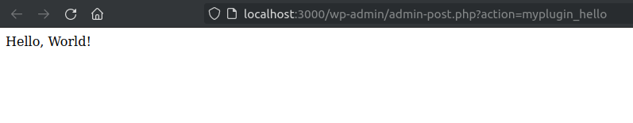

So far, we wrote code triggered by specific actions, ex.: opening an admin menu page. But how to execute code by calling an URL? Let's say we want an endpoint that executes a "Hello, World!" and nothing else. How to achieve this?

WordPress has a generic HTTP request handler for these cases, the `admin_post` action. Let's see it in action by executing an "Hello, World!".
<!-- more -->

## 1. The `admin_post` action

The `admin_post_{$plugin_action}` dynamic action is triggered when we call the URL:
`/wp-admin/admin-post.php?action={$plugin_action}`

### 1.1. Hello, World!

Let's show a `Hello, World!` when we call the URL `/wp-admin/admin-post.php?action=myplugin_hello`.

```php
/** Fired on authenticated GET,POST /wp-admin/admin-post.php?action=myplugin_hello. */
add_action( 'admin_post_myplugin_hello', 'hello_callback' );

function hello_callback() {
  echo "Hello, World!";
}
```

Now, call the URL on your browser:


The call can be either a POST or a GET, but must be from an authenticated user.

::: warning
To avoid conflict with other plugins, add your slug to the action name. In other words, **prefer "myplugin_hello" instead of "hello"**.
:::

## 1.2. `admin_post_nopriv`

## 1.3. Using to perform tasks

## 1.4. Using for extra buttons

Let's refactor our "Hello" button to use `admin_post`.

Our previous code is:

```php
<?php
function my_menu_html() {

  // "Hello" button has been pressed.
  $has_pressed_hello = isset( $_POST['submit-hello'] );
  if ( $has_pressed_hello ) {
    echo "<p style='background-color: red;'>World!</p>";
  }

  // Check if was properly saved.
  $has_been_saved = isset( $_GET['settings-updated'] );
  if ( $has_been_saved ) {
    add_settings_error( 'my-plugin', 'success', 'Settings Saved', 'updated' );
  }

  // show error/update messages
  settings_errors( 'my-plugin' );

  ?>
  <div class="wrap">
    <h1><?php echo get_admin_page_title() ?></h1>

    <!-- Main form. -->
    <form id="form-main" method="post" action="options.php">
      <?php settings_fields( 'my-plugin' ) ?>
      <?php do_settings_sections( 'my-plugin' ) ?>
    </form>

    <!-- "Hello" form. -->
    <form id="form-hello" method="post">
    </form>

    <!-- Buttons. -->
    <div style="margin-top: 32px;">
      <?php submit_button('Hello', 'secondary', 'submit-hello', false, [ 'form' => 'form-hello' ] ); ?>
      <?php submit_button('Save', 'primary', 'submit', false , [ 'form' => 'form-main' ]); ?>
    </div>
  </div>
  <?php
}
```

Instead of using the technique of sending data to the self page, let's send data to our custom URL.

```php
<?php
/** Fired on authenticated GET,POST /wp-admin/admin-post.php?action=myplugin_hello. */
add_action( 'admin_post_myplugin_hello', 'hello_callback' );

function hello_callback() {
  add_settings_error( 'my-plugin', 'info-hello', 'Hello, World!', 'info' );

  /** Return to the last page. */
  wp_redirect( $_SERVER['HTTP_REFERER'] );
}

function my_menu_html() {

  // Check if was properly saved.
  $has_been_saved = isset( $_GET['settings-updated'] );
  if ( $has_been_saved ) {
    add_settings_error( 'my-plugin', 'success', 'Settings Saved', 'updated' );
  }

  // show error/update messages
  settings_errors( 'my-plugin' );

  ?>
  <div class="wrap">
    <h1><?php echo get_admin_page_title() ?></h1>

    <!-- Main form. -->
    <form id="form-main" method="post" action="options.php">
      <?php settings_fields( 'my-plugin' ) ?>
      <?php do_settings_sections( 'my-plugin' ) ?>
    </form>

    <!-- "Hello" form. -->
    <form id="form-hello" method="post" action="admin-post.php">
      <input type="hidden" name="action" value="myplugin_hello">
    </form>

    <!-- Buttons. -->
    <div style="margin-top: 32px;">
      <?php submit_button('Hello', 'secondary', 'submit-hello', false, [ 'form' => 'form-hello' ] ); ?>
      <?php submit_button('Save', 'primary', 'submit', false , [ 'form' => 'form-main' ]); ?>
    </div>
  </div>
  <?php
}
```

## 1.5. Using it for AJAX

## 1.6. Using it to create a portal

---

```php
<!-- my-plugin/my-plugin.php -->
<form method="post" action="admin-post.php">
  <input type="hidden" name="action" value="myplugin_hello">
  <?php submit_button( 'Hello World' ); ?>
</form>
```

And the callback:

```php
// my-plugin/my-plugin.php
public function hello_callback() {
  /** my code.. */

  /** Return to the last page. */
  wp_redirect( $_SERVER['HTTP_REFERER'] );
}
```

### Adding security - Nonces, and permissions

"admin_post" automatically checks if the user is authenticated on the admin dashboard and nothing else. It is recommended to also check for intention (nonce):

```php
<!-- my-plugin/my-plugin.php -->
<form method="post" action="admin-post.php">
  <?php $nonce = wp_create_nonce( '_wpnonce' ); ?>
  <input type="hidden" name="_wpnonce" value="<?php echo esc_attr( $nonce ); ?>">
  <input type="hidden" name="action" value="myplugin_hello">
  <?php submit_button( 'Hello World' ); ?>
</form>
```

```php
// my-plugin/my-plugin.php
public function hello_callback() {
  /** Check nonce. */
  if ( empty( $_REQUEST['_wpnonce'] ) ) {
    return;
  }
  if ( ! wp_verify_nonce( $_REQUEST['_wpnonce'], '_wpnonce' ) ) {
    return;
  }

  /** my code... */
}
```

::: tip
You can use the helper `settings_fields( $action )` to generate the `_wpnonce` input.
:::

**Normal users can also access the admin dashboard**, so you **MUST** check for permissions - that's a critical item:

```php
// my-plugin/my-plugin.php
public function hello_callback() {
  /** Check permissions. */
  if ( ! is_admin() || ! current_user_can( 'manage_options' ) ) {
    return;
  }

  /** Check nonce. */
  if ( empty( $_REQUEST['_wpnonce'] ) ) {
    return;
  }
  if ( ! wp_verify_nonce( $_REQUEST['_wpnonce'], '_wpnonce' ) ) {
    return;
  }
}
```

::: warning
I recommend using more restrictive permission than the generic `manage_options`. Check the best permission for you here:
[https://wordpress.org/support/article/roles-and-capabilities](https://wordpress.org/support/article/roles-and-capabilities)
:::

### 9.3. Replacing the "Save" button with your custom one

You can follow these instructions if you want a single button that saves and does other actions.

First, set the constructor (same code as before):

```php
// my-plugin/my-plugin.php
public function __construct() {
  /** Fired on authenticated POST /wp-admin/admin-post.php?action=myplugin_hello. */
  add_action( 'admin_post_myplugin_hello', [ $this, 'hello_callback' ] );
}
```

Adapt the default form: set `admin-post.php` as the form URL, pass the "action" as a hidden input, change the button name (optional):

```php
// my-plugin/my-plugin.php
public function my_plugin_options() { ?>
  <div class="wrap">
    <h2>Your plugin page</h2>
    <form method="post" action="admin-post.php">
      <?php settings_fields( 'my-menu' ); ?>
      <?php do_settings_sections( 'my-menu' ); ?>
      <input type="hidden" name="action" value="myplugin_hello">
      <?php submit_button( 'Save and Print "Hello"'); ?>
    </form>
  </div>
  <?php
}
```

On the callback, you must manually save the inputs:

```php
// my-plugin/my-plugin.php
public function hello_callback() {
  /** Check permissions. */
  if ( ! is_admin() || ! current_user_can( 'manage_options' ) ) {
    return;
  }

  /** Check nonce. */
  if ( empty( $_REQUEST['_wpnonce'] ) ) {
    return;
  }
  if ( ! wp_verify_nonce( $_REQUEST['_wpnonce'], '_wpnonce' ) ) {
    return;
  }

  /** Save options. */
  update_option( 'opt1', wp_unslash( $_REQUEST[ 'opt1' ] ) );
  update_option( 'opt2', wp_unslash( $_REQUEST[ 'opt2' ] ) );
  /** ... */

  /** my code... */

  /** Return to the last page. */
  wp_redirect( $_REQUEST['_wp_http_referer'] );
}
```

## 10.  The Router method (an alternative to "admin_post")

The idea here is to intercept all HTTP requests (by hooking on the `admin_init` action) and filter the ones directed to your endpoint.

In this example, let's create the "*Hello World*" button using a router.

The URL will be `/wp-admin/admin.php?page=my-plugin&action=hello-world`. But it can be anything (ex. "/hello/world", if the installation supports pretty URLs):

First, let's add a callback called on every admin request:

```php
// my-plugin/my-plugin.php
public function __construct() {
  /** Executed on ALL admin requests. */
  add_action( 'admin_init', [ $this, 'router_callback' ] );
}
```

::: tip
You can use this method for non-admin calls, just replace `admin_init` with `init`.
:::

Then, let's filter the requests that are directed to us (on the callback):

```php
// my-plugin/my-plugin.php
/** Filter the requests to our plugin. */
public function router_callback() {
  /** Our requests have "page" AND "action" set up. */
  if ( empty( $_REQUEST['action'] ) || empty( $_REQUEST['page'] ) ) {
    return;
  }

  /** Let's filter the "page" argument. */
  if ( 'my-plugin' !== $_REQUEST['page'] ) {
    return;
  }

  /** THE PROCESSING. */
  if ( 'hello-world' === $_REQUEST['action'] ) {
    echo "Hello World!";
  }
}
```

Now, let's replace the standard "Save" button with our "Hello" button:

```php
<?php
public function my_plugin_options() { ?>
  <div class="wrap">
    <h2>Your plugin page</h2>
    <?php settings_errors() ?>
    <form method="post" action="admin.php?page=my-plugin&action=hello-world">
      <?php settings_fields( 'my-menu' ); ?>
      <?php do_settings_sections( 'my-menu' ); ?>
      <?php submit_button(); ?>
    </form>
  </div>
  <?php
}
```

If you want to save the options, call `update_option( $field, $value )`:

```php
/** Filter the requests to our plugin. */
public function router_callback() {
  /** Our requests have "page" AND "action" set up. */
  if ( empty( $_REQUEST['action'] ) || empty( $_REQUEST['page'] ) ) {
    return;
  }

  /** Let's filter the "page" argument. */
  if ( 'my-plugin' !== $_REQUEST['page'] ) {
    return;
  }

  /** THE PROCESSING. */
  if ( 'hello-world' === $_REQUEST['action'] ) {
    /** Save options. */
    update_option( 'my_field1', $_REQUEST[ 'my_field1' ] );
    update_option( 'my_field2', $_REQUEST[ 'my_field2' ] );

    /** Process it. */
    echo "Hello World!";
  }
}
```

Additionally, you can filter by the HTTP verb (GET, POST, etc.) in the callback to avoid conflicts.

You don't need to replace the "Save" button. You can have both. If you decide to keep the save button, be aware that you can't have nested "\<form\>" tags. In this case, add the other forms next to the main form (not inside). Then, your custom submits button can be inside the main form, outside its form, but it should have the `form=my-other-form` attribute.

Now, let's add security by checking **permissions** and **nonces**:

```php
/** Filter the requests to our plugin. */
public function router_callback() {
  /** Our requests have "page" AND "action" set up. */
  if ( empty( $_REQUEST['action'] ) || empty( $_REQUEST['page'] ) ) {
    return;
  }

  /** Let's filter the "page" argument. */
  if ( 'my-plugin' !== $_REQUEST['page'] ) {
    return;
  }

  /** Check permissions. */
  if ( ! is_admin() || ! current_user_can( 'manage_options' ) ) {
    return;
  }

  /** Check nonce. */
  if ( empty( $_REQUEST['my_nonce'] ) ) {
    return;
  }

  if ( ! wp_verify_nonce( $_REQUEST['my_nonce'], 'hello-world' ) ) {
    return;
  }

  /** THE PROCESSING. */
  if ( 'hello-world' === $_GET['action'] ) {
    echo "Hello World!";
  }
}
```

Then, generate the nonce (pass it either in the URL or as a hidden input):

```php
<?php $nonce = wp_create_nonce( 'hello-world' ); ?>
<form method="post" action="admin.php?page=my-plugin&action=hello-world&my_nonce=<?= $nonce ?>">
```
