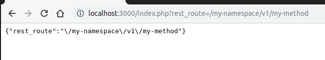
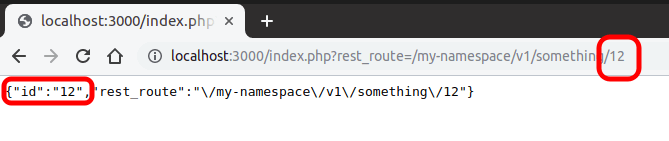

This is the 3rd part of my WordPress Plugin Development tutorial. Check also the [first](/2019/06/wordpress-plugin-development/) and [second](/2019/06/wordpress-create-menu/) parts.
<!-- more -->

There are two APIs to implement Ajax in WordPress: `Ajax API` or `REST API`. A third option is to intercept all requests (by using the `init` callback), check if directed to our endpoint, return some content and exit.

- The `Ajax API` was the only option for many years. It consists of sending a POST request to `/wp-admin/admin-ajax.php`. The "admin" in the URL is misleading as it can be used either in the admin or in the front-end.

- The `REST API` is more recent. It was launched on version 4.4 and it can be considered a more modern approach for Ajax requests. It also allows for custom endpoints.

Some people consider the REST API more complex and difficult to understand than the Ajax API, but it is up to you to choose one over the other. In the end, they both do the same things.

---

## 1. Ajax API

To implement your Ajax method, use `wp_ajax_*` (for authenticated access) or `wp_ajax_nopriv_*` (for unauthenticated access):

```php
// my-plugin/my-plugin.php

/** Ajax route. */
add_action( 'wp_ajax_my_action', 'my_action_callback' );
add_action( 'wp_ajax_nopriv_my_action', 'my_action_callback' );

/** Ajax callback. */
function my_action_callback() {
  /** Dump $_REQUEST as JSON. */
  echo json_encode( $_REQUEST );
  wp_die();
}
```

Go to the blog main page (ex. `http://localhost:3000/`), open the browser console (Ctrl+F12) and execute this:

```js
/** Ajax call. */
fetch('/wp-admin/admin-ajax.php', {
  method: 'POST',
  headers: { 'Content-Type': 'application/x-www-form-urlencoded' },
  body: 'action=my_action'
})
.then( response => response.json() )
.then( json => console.log(json) )
.catch( error => console.error( 'error:', error ) );
```

It will return the dump of the arguments we sent:

```js
Object { action: "my_action" }
```

::: success
Done!
:::

---

In the PHP code, notice that we assigned the same callback for both authenticated and unauthenticated access. This guarantees that we will always answer to the given action.

If you want to do the same (use the same callback for both states), use a `is_user_logged_in()` in the callback to differentiate these states. Alternatively, you can set two callbacks, one for each state.

If you don't need to respond to unauthenticated users, you can set the "wp_ajax_*" action only.

---

## [SECURITY] Check permissions

- **NEVER** allow sensitive actions to be executed by unauthenticated users (`wp_ajax_nopriv` with no permission checking).
- **ALWAYS** check if the user has permissions (ex. `is_admin()` or `current_user_can()`) for authenticated actions.

## [SECURITY] Sanitization

With few exceptions, you should **ALWAYS sanitize the inputs** before using them:

```php
// my-plugin/my-plugin.php
$action = sanitize_text_field($_REQUEST['action']);
```

The `sanitize_*` functions list:

- `sanitize_email()`
- `sanitize_file_name()`
- `sanitize_html_class()`
- `sanitize_key()`
- `sanitize_meta()`
- `sanitize_mime_type()`
- `sanitize_option()`
- `sanitize_sql_orderby()`
- `sanitize_text_field()`
- `sanitize_textarea_field()`
- `sanitize_title()`
- `sanitize_title_for_query()`
- `sanitize_title_with_dashes()`
- `sanitize_user()`

You can also use PHP's core helpers like `intval( $value )` or create your own custom satinization method.

## [SECURITY] Nonces – To use them or not?

Nonces prevent hackers from tricking you into clicking on a link that does a destructive action. If you are logged in as an admin user, a permission checking won't help you if you are tricked to click on a email with a link that deletes all your blog posts.

There are two methods to work with nonces: `wp_create_nonce()` and `check_ajax_referer( $nonce )`. The first method creates a random string to be sent by the Ajax call. The second method verifies if the hash is valid.

::: success
Personally, **I don't think it is necessary to use nonces with the Ajax API**. Clicking on links won't cause any harm as they generate a GET request and Ajax API requires a POST. Even if you enter in a shady website that does a POST call to your website (through JS), the CORS protection of your browser will block the request. But that's my opinion. Use your best judgment to decide.
:::

## 2. REST API

Let's create an AJAX method: `GET /my-namespace/v1/something`:

```php
// my-plugin/my-plugin.php
public function my_method_callback( $request ) {
  /** The return is automatically converted to JSON. */
  return $request->get_params();
}

/** Routes should be created in the "rest_api_init" action. */
add_action( 'rest_api_init', function() {
  register_rest_route( 'my-namespace/v1', '/something', [
    'methods'  => 'GET',
    'callback' => [ $this, 'my_method_callback' ]
  ] );
} );
```

Now open it in your browser:

`http://localhost:3000/index.php?rest_route=/my-namespace/v1/something` (change "*localhost:3000*" to your actual host)



::: success
Done!
:::

---

The format is: `{namespace}/{version}/{resource}`. For example, the core WP "users" endpoint is: `wp/v2/users`.

::: danger
**NEVER** add methods to the wp namespace. Ex. `wp/1/my-endpoint`. The `wp` namespace is reserved for the WordPress core.
:::

### 2.1. Pretty URLs

If your website has pretty permalinks support, then you can call the route directly. Just add a `/wp-json` prefix:

`http://localhost:3000/wp-json/my-namespace/v1/my-method`

Use `rest_url( $path )` whenever you need to print the URL. This method detects if the installation supports pretty URLs and writes the correct URL:

```php
// my-plugin/my-plugin.php
$url = rest_url( 'my-namespace/v1/something' );
```

The `$url` will be:

- **No pretty URL:** `http://localhost:3000/index.php?rest_route=/my-namespace/v1/something`
- **With pretty URL:** `http://localhost:3000/wp-json/my-namespace/v1/something`

### 2.2. RESTful structure

**RESTful** means to have a resource (ex. "/users") and allow CRUD operations (create, read, update, delete) on it.

The URL is the same for all CRUD operations. Which operation will be executed depends on the HTTP verb (GET, POST, etc):

- **Index** (get all items): `GET /users`
- **Create** an item: `POST /users`
- **Read** an item: `GET /users/:id`
- **Update** an item: `PATCH /users/:id` or `PUT /users/:id` or `POST /users/:id`
- **Delete** an item: `DELETE /users/:id`

::: tip
**POST or PUT?** There's an intense debate of which verb should be used to create an item. Some prefer POST, some prefer PUT. WordPress constants imply that you should use POST to create items, so that's my preference.
:::

## Defining multiple actions

Let's say you want to add a POST operation to your "/something":

```php
// my-plugin/my-plugin.php
register_rest_route(
  'my-namespace/v1',
  '/something',
  [
    [
      'methods'  => 'GET',
      'callback' => [ $this, 'my_method_callback' ],
    ],
    [
      'methods'  => 'POST',
      'callback' => [ $this, 'my_method2_callback' ],
    ],
  ]
);
```

In other words, just pass your methods in an array.

### 2.3. Verb Constants

Instead of POST/GET/etc, use the API constants:

```php
// my-plugin/my-plugin.php
register_rest_route( 'my-namespace/v1', '/something', [
  'methods'  => WP_REST_Server::READABLE, // "READABLE" == "GET"
  'callback' => [ $this, 'my_method_callback' ]
] );
```

**List of constants:**

- `READABLE` (GET)
- `CREATABLE` (POST)
- `EDITABLE` (PUT, PATCH)
- `DELETABLE` (DELETE)

### 2.4. Success

Alternatively, you can return a `WP_REST_Response` object. This allows you to customize the headers and other things in the response:

```php
/** HTTP code 200 means "Success". */
return new WP_REST_Response( [ 'some', 'result' ], 200 );
```

### 2.5. Error

```php
/** HTTP code 404 means "Not found". */
return new WP_Error( 'my_err_code', 'My err message', [ 'status' => 404 ] );
```

Or, with a different syntax:

```php
$error = new WP_Error();
$error->add( 'my_err_code', 'My err message', [ 'status' => 404 ] );
return $error;
```

### 2.6. [SECURITY] Restricting access to the endpoint

Use `permission_callback` to validate a request:

```php
register_rest_route( 'my-namespace/v1', '/something', [
  'methods'  => WP_REST_Server::READABLE, // "READABLE" == "GET"
  'callback' => [ $this, 'my_method_callback' ],
  'permission_callback' => function ( $request ) {
    return current_user_can( 'edit_posts' );
  }
] );
```

### 2.7. Arguments (parameters)

For an id, use the regex `(?P<id>\d+)`:

```php
register_rest_route( 'my-namespace/v1', '/something/(?P<id>\d+)', [
  'methods'  => 'GET',
  'callback' => [ $this, 'my_method_callback' ]
] );
```



Adapt the `<id>` to whatever your parameter is called. Also, change the `\d+` if you accept non-numeric values.

### 2.8. [SECURITY] Validation and Sanitization

Use `args` to configure your arguments settings. You don't need to define them all, just the ones you need custom settings (validation, sanitization, etc):

```php
'args' => [
  'id' => [
    /** Return true or false. */
    'validate_callback' => function( $value, $request, $param ) {
      return $value >= 1900;
    },

    /** Sanitization allows you to clean the parameters. It happens AFTER validation. */
    'sanitize_callback' => function( $value, $request, $param ) {
      return intval( $value );
    }
  ],
]
```

You can use the `sanitize_*()` helpers, PHP's core helpers (ex. `intval()`) or any other methods you like.

#### Alternative method – Sanitize inputs in your Callback

A simpler solution is to validate and sanitize the inputs in your callback, not in `args`:

```php
// my-plugin/my-plugin.php
public function my_method_callback( $request ) {
  $parameters = $request->get_params();
  $username   = sanitize_text_field($parameters['username']);
  /** ... */
}
```

::: tip
I prefer the first method (sanitization in args) because that's how WP wants us to do it. But feel free to decide which one you prefer the most.
:::

### 2.9. [SECURITY] Nonces

I recommend using Nonces to protect your REST API, especially for the **GET methods** that do destructive actions. Although it's a **bad practice** to implement destructive actions on the GET verb ("*destructive actions*" means any action that changes the state, like creating a new user).

There are two methods to work with nonces: `wp_create_nonce()` and `check_ajax_referer( $nonce )`. The first method creates a random string to be sent by the Ajax call. The second method verifies if the hash is valid.

## 3. `WP_REST_Controller`

Starting on WordPress version **4.7**, you can define your REST API by creating a class inherited from the `WP_REST_Controller` class. Then, implement a `register_routes()` public method that will define your routes:

```php
// my-plugin/my-plugin.php
class MyRestRouter extends WP_REST_Controller {
  public function register_routes() {
    register_rest_route( 'my-namespace/v1', '/something', [
      'methods'  => WP_REST_Server::READABLE, // "READABLE" == "GET"
      'callback' => [ $this, 'my_method_callback' ]
    ] );
  }
}
```

::: tip
Notice that you don't need the `rest_api_init` action.
:::
