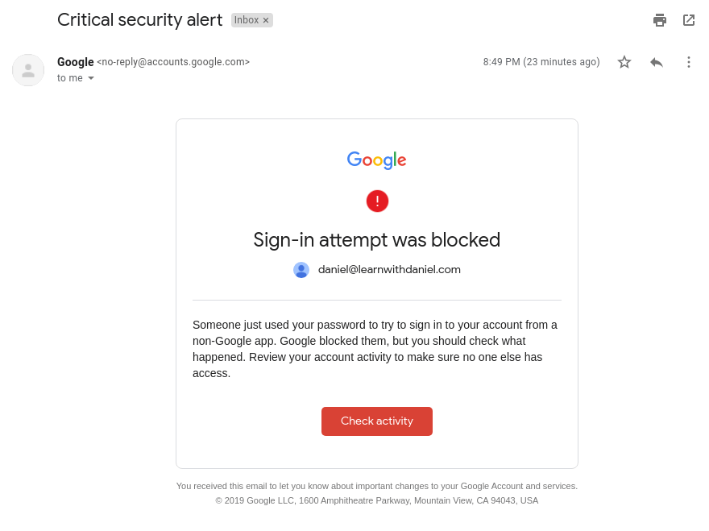
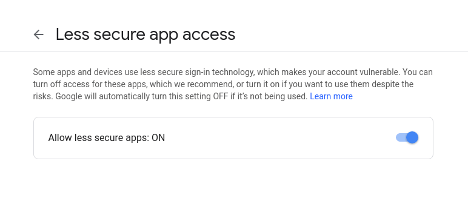

Let's create a Gmail email client using PHP's native IMAP library.
<!-- more -->

For this, you need the `php-imap` installed.

Despite the name, the IMAP library works with POP3 too.

---

## Basic code

```php
// gmail-client.php

/** Connect to GMail. */
$username = 'daniel@gmail.com';
$password = '34LWD12';
$str_conn = '{imap.gmail.com:993/ssl/novalidate-cert}INBOX';
$conn     = imap_open($str_conn, $username, $password);

/** Retrieve and display all messages. */
$msgs = imap_fetch_overview($conn, '1:*');
print_r($msgs);
```

## Return Example

```php
Array
(
  [0] => stdClass Object
    (
        [subject] => Test
        [from] => John Snow <john@snow.com>
        [to] => Daniel Loureiro <daniel@learnwithdaniel.com>
        [date] => Fri, 12 Jul 2019 13:04:12 -0400
        [message_id] => <CABgjj39-BMb_NPaCPmh+ds7zsOzTCrJfRotaB4CZ1Yuv=mLxkA@mail.gmail.com>
        [size] => 4691
        [uid] => 3
        [msgno] => 1
        [recent] => 0
        [flagged] => 0
        [answered] => 1
        [deleted] => 0
        [seen] => 1
        [draft] => 0
        [udate] => 1562951089
    )
)
```

::: success
That's it!
:::

---

## POP3

The previous example connects through IMAP. If you prefer POP3, use this:

```php
$str_conn = '{pop.gmail.com:995/pop3/ssl/novalidate-cert}INBOX';
```

---

### Credentials

- **Username:** Your email.
Ex: "*daniel@gmail.com*". It can have a **custom domain**, like "*daniel@learwithdaniel.com*".
- **Password:** Your account password.
For 2-step verification accounts, you can use an "***app password***". These are extra passwords to access your account. With them, you don't need to share your actual password with your apps. For each app, you create a new "app password". This is only available if "2-step" is enabled.

### `msgno`

Each message has a `msgno`, which is a sequential number. The very first message is `1`. This number is unique for your mailbox. Even if you delete a message, its `msgno` won't be reused.

The `msgno` is used in many commands.

---

## Troubleshooting

If you get an "invalid credentials" error, you may have to enable the "Allow Less Secure Apps" option: [https://myaccount.google.com/lesssecureapps](https://myaccount.google.com/lesssecureapps)

1. If you get this email, you need to click on it and authorize access:


2. Then, enable "Less Secure Apps" (or just use an "app password"):


---

## Retrieving emails

As we saw previously, that's how we get the messages:

```php
// gmail-client.php
$msgs = imap_fetch_overview($conn, $range);
```

`$range` format is: `{msgno_from}:{msgno_to}`. The `msgno_from` and `msgno_to` are included in the response.

**Range examples:**

- **All messages:** '1:*'
- **Just message #3:** '3'
- **Message #3 and beyond (3,4,5,…):** '3:*';

Use the range argument to create savepoints, i.e. if you want to download **only the new messages** and not the whole inbox each time your app syncs with Gmail. To create savepoints, download all messages (`1:*`) on the first time and save the last message number ("msgno"), ex. `5`. Next time, you check from that message and beyond (`6:*`).

## Display Name (From/To)

The "From" and "To" fields support a display name in addition to the email address:

- **Email address only:** `john@snow.com`
- **Email address with Display name:** `John Snow <john@snow.com>`

## Closing the connection

You should close the email connection after using it, which is usually at the end of your script.

If you forget to close, PHP will automatically close it for you when the script ends, but it is a good idea to explicitly close it with:

```php
imap_close($conn);
```

## Errors

To get an array with past errors, use:

```php
$errors = imap_errors();
```

Return example:

```php
[0 => '[TRYCREATE] No folder {imap.gmail.com} (Failure)']
```

To get only the last error, use `imap_last_error()`.

::: warning
If you don't retrieve errors by calling these functions, then all errors and warnings will be thrown when the connection gets closed.
:::

## Replying to an email

Each message has a `message_id`, which is a universal unique identifier. Do not confuse with `msgno`, which is a local id, valid only for your inbox.

To reply to messages, you need to set 2 things:

- **Headers:** Send the `message_id` of the message you are replying to in two header items: `In-Reply-To` and `References`;
- **Subject:** The subject should be postfixed with the same subject as the original message. Example of valid reply subjects: `{$subject}` or `Re: {$subject}` or `Reply to {$subject}`. It actually doesn't matter if you prefix with something (like "Re:") or not, the only rule is that you need to end the subject with the original copy;

## Example of a replied message

If you are curious of how a replied message looks like when retrieving it:

```php{3,8,9}
[1] => stdClass Object
(
    [subject] => Re: Test
    [from] => john@snow.com
    [to] => Daniel Loureiro <daniel@learnwithdaniel.com>
    [date] => Fri, 12 Jul 2019 13:04:12 -0400
    [message_id] => <A0C26432-DD82-411A-AD61-2FB12E65C4D1@learnwithdaniel.com>
    [references] => <CABgjj39-BMb_NPaCPmh+ds7zsOzTCrJfRotaB4CZ1Yuv=mLxkA@mail.gmail.com>
    [in_reply_to] => <CABgjj39-BMb_NPaCPmh+ds7zsOzTCrJfRotaB4CZ1Yuv=mLxkA@mail.gmail.com>
    [size] => 4691
    [uid] => 3
    [msgno] => 2
    [recent] => 0
    [flagged] => 0
    [answered] => 1
    [deleted] => 0
    [seen] => 1
    [draft] => 0
    [udate] => 1562951089
)
```

Notice `subject`, `references` and the `in_reply_to` fields.

## Which email address you should reply to?

You can reply to the email address specified in the "From" field, but if the sender has set a "reply-to", your message will go the **wrong place**.

To reply properly, you should get the headers with `imap_headerinfo($hnd, $msgno)` and use the `reply_toaddress` property (a string). Alternatively, you can use the `reply_to` property, which returns the email parsed as domain, account and display_name.

It is safe to always use the "reply_toaddress" property (or the "reply_to") even if the sender hasn't set a reply-to. In these cases, "reply_toaddress" will return the same value as "from".

```php
$headers = imap_headerinfo($hnd, $msgno);
$reply_addr = $headers->reply_toaddress;
```
