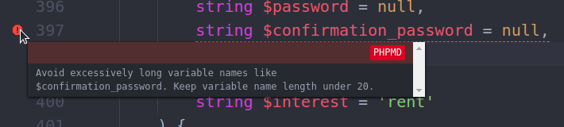
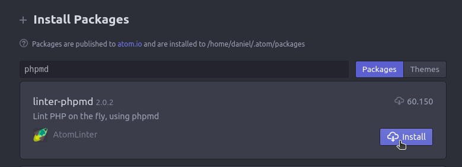

**PHP Mess Detector** aka [PHPMD](https://phpmd.org/) is a tool to help you write cleaner code. It warns you about overcomplicated code, Spaghetti code, unused code, bugs, and more.
<!-- more -->

PHPMD warns you in realtime, while you code:


In my opinion, PHPMD and PHPCS are the most important tools for professional PHP development. If you are curious about PHPCS, check my PHPCS+Atom tutorial [here](/2019/06/atom-phpcs-ubuntu/).

## 1. Install PHPMD (PHP Mess Detector)

Check if *phpmd* is installed:

```bash
phpmd -i
    Command 'phpmd' not found, but can be installed with: sudo apt install phpmd
```

Install it (if not installed):

```bash
sudo apt install phpmd
```

## 2. On Atom, install `linter-phpmd` package

On Atom, install package `linter-phpmd` by AtomLinter:
`Ctrl+Shift+P` > `Install Packages and Themes` > `linter-phpmd`



Close and reopen Atom if needed.

## 3. Set a configuration file for your project

Add this file, `phpmd.xml.dist` to the root of your project. It enables all rules, except the "controversial" ruleset:

```xml
<!-- phpmd.xml.dist -->
<?xml version="1.0" encoding="UTF-8"?>
<ruleset name="phpmd-no-controversial"
    xmlns="http://pmd.sf.net/ruleset/1.0.0"
    xmlns:xsi="http://www.w3.org/2001/XMLSchema-instance"
    xsi:schemaLocation="http://pmd.sf.net/ruleset/1.0.0 http://pmd.sf.net/ruleset_xml_schema.xsd"
    xsi:noNamespaceSchemaLocation="http://pmd.sf.net/ruleset_xml_schema.xsd">
  <description>
    Enable all rulesets, except Controversial ("camelCase" rules).
    Required for WordPress development.
  </description>

  <rule ref="rulesets/codesize.xml"/>
  <rule ref="rulesets/design.xml"/>
  <rule ref="rulesets/naming.xml"/>
  <rule ref="rulesets/unusedcode.xml"/>
  <rule ref="rulesets/cleancode.xml"/>
</ruleset>
```

### Disable the controversial rules!

The so-called "controversial" ruleset, unlike the others, is **not related to mess prevention** at all. It is just a very **opinionated coding style**. It enforces the use of **camelCase** notation. Not surprisingly, the name of the ruleset is actually "controversial ruleset". I really don’t know why this was added to PHPMD and I strongly recommend you to **disable it, even if you like camelCase** (use PHPCS instead).

::: warning
For **WordPress development**, it is **MANDATORY to disable** the controversial ruleset, as camelCase goes against WP coding style.
:::

::: tip
The PHPMD config file can alternatively be named as `phpmd.xml` or `phpmd.ruleset.xml`.
:::

---

## Suppressing specific warnings

Just add `@SuppressWarnings(RULE)` as a comment before your class/method/command:

```php
/**
 * Just a class.
 *
 * @SuppressWarnings(PHPMD.LongVariable)
 * @SuppressWarnings(PHPMD.UnusedLocalVariable)
 */
class Bar {
    function foo() {
        $baz = 23;
    }
}
```

Examples:

- To disable **ALL** rules: `@SuppressWarnings(PHPMD)`
- To disable rules containing the word "unused": `@SuppressWarnings("unused")`

## Suppressing warnings for the whole project

### 1. Exceptions

Let’s say you agree that variables need to have more than 2 characters (“ShortVariable” ruleset), but you would like to add exceptions for `$wp` and `$id`, common in the WP development:

```xml
<!-- phpmd.dist.xml -->
<?xml version="1.0" encoding="UTF-8"?>
<ruleset name="phpmd-no-controversial"
    xmlns="http://pmd.sf.net/ruleset/1.0.0"
    xmlns:xsi="http://www.w3.org/2001/XMLSchema-instance"
    xsi:schemaLocation="http://pmd.sf.net/ruleset/1.0.0 http://pmd.sf.net/ruleset_xml_schema.xsd"
    xsi:noNamespaceSchemaLocation="http://pmd.sf.net/ruleset_xml_schema.xsd">
  <description>WordPress development rules.</description>

  <rule ref="rulesets/naming.xml/ShortVariable">
    <properties>
      <!-- common in WP -->
      <property name="exceptions" value="id,wp" />
    </properties>
  </rule>

  <rule ref="rulesets/codesize.xml"/>
  <rule ref="rulesets/design.xml"/>
  <rule ref="rulesets/naming.xml"/>
  <rule ref="rulesets/unusedcode.xml"/>
</ruleset>
```

### 2. Removing a rule

Let’s remove the `ExitExpression` rule from the `Design` ruleset.

```xml
<!-- phpmd.dist.xml -->
<rule ref="rulesets/design.xml">
  <!-- normal in WP for redirects, etc -->
  <exclude name="ExitExpression" />
</rule>
```

### 3. Removing an entire ruleset

Let’s say you have ALL rules enabled in your `phpmd.xml.dist` file:

```xml
<!-- phpmd.dist.xml -->
<rule ref="rulesets/codesize.xml"/>
<rule ref="rulesets/design.xml"/>
<rule ref="rulesets/naming.xml"/>
<rule ref="rulesets/unusedcode.xml"/>
```

To remove the `Naming` ruleset, just delete its line:

```xml
<!-- phpmd.dist.xml -->
<rule ref="rulesets/codesize.xml"/>
<rule ref="rulesets/design.xml"/>
<rule ref="rulesets/unusedcode.xml"/>
```
