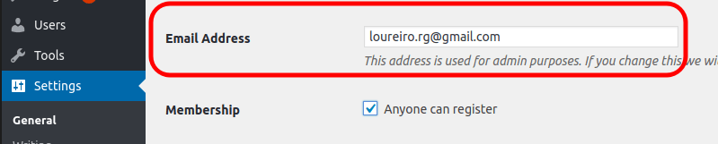

When a new user signs up to your WordPress site, an email notification is sent to the “admin address” specified on `Settings > General > Email Address`:
<!-- more -->



This email address is used for ALL notifications, and unfortunately, you can’t set a different email just for the “New User Registration”.

Luckily, there is a way to fine-tune the “new user registration” notifications and send them to a different email address other than the “admin email address”.

Open your theme’s `functions.php` (Appearance > Theme Editor > Theme Functions):

```php
// functions.php

/** "New user" email to john@snow.com instead of admin. */
add_filter( 'wp_new_user_notification_email_admin', 'my_wp_new_user_notification_email_admin', 10, 3 );
function my_wp_new_user_notification_email_admin( $notification, $user, $blogname ) {
    $notification['to'] = 'john@snow.com';
    return $notification;
}
```

::: success
That’s it!
:::

In the example, we changed the email address to “**john@snow.com**“, by using the `wp_new_user_notification_email_admin` filter.

There are 4 variables you can use: `to`, `subject`, `message`, `headers`.

Let’s use the `headers` to send the notification to “john@snow.com” as a CC and keep the admin email as the recipient:

```php
/** "New user" email to john@snow.com instead of admin. */
add_filter( 'wp_new_user_notification_email_admin', 'my_wp_new_user_notification_email_admin', 10, 3 );
function my_wp_new_user_notification_email_admin( $notification, $user, $blogname ) {
    $notification['headers'] = "From: My Blog <my@blog.com> \n\r cc: John Snow <john@snow.com>"
    return $notification;
}
```

## WordPress 4.8 and before

This solution only works for WordPress 4.9+. For older versions, the filter `wp_new_user_notification_email_admin` doesn’t exist, but you can redeclare the WP core function `wp_new_user_notification()` as it is a pluggable function.

---

## `WP_REST_User` plugin

If you use the *“WP_REST_User”* plugin to create users via Ajax/REST, be aware that it doesn’t trigger a `wp_new_user_notification()` by default. So, you will need to add this:

```php
/* Called on sign up via WP_REST_User plugin. */
add_action('wp_rest_user_user_register', 'my_wp_rest_user_register');
function my_wp_rest_user_register( $user ) {
    /** Send "New user registration" email to admin. */
    wp_send_new_user_notifications( $user->ID, 'admin' );
}
```

Change `admin` to `both` if you want to send a notification to the user too.

The user notification is different than the admin. You can fine-tune the user notification using the filter `wp_new_user_notification_email` (same 3 arguments on function and same 4 customizable fields).
