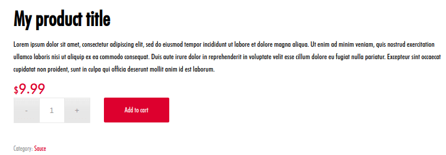

Unfortunately, it is difficult to change a WooCommerce page as their HTML code is rendered programmatically.
<!-- more -->

It is not as simple as opening an HTML file and editing it. Instead, the HTML code of a single WooCommerce page is scattered in dozen of files and they are mostly commands that call sub-templates. As if it wasn’t difficult enough, they implement these commands in a “hook” way, which makes WooCommerce layout changes a laborious task.

If you want to change the contents of a WooCommerce page, you need to work with hooks. You can also work with templates, but they are very limited on what can be changed.

But don’t worry, I will show here how to change the HTML of the **product page** using both templates and hooks. You can use this knowledge to change any other WooCommerce page.

::: tip
The easier way to change a WooCommerce page is by CSS. This solution can even remove elements with a `display: none;` and add others with `:before` and `:after`. But of course, it can’t change the HTML structure, which is the goal of this article.
:::

## 1. Templates

Don’t expect to have some *“product-page.php”* file with the whole HTML code for the page, because there’s no such thing.

All pages are rendered **programmatically** in WooCommerce. Template files are just a **set of commands** like “print_sidebar(); print_title() print_price();” and **not actual HTML code**.

These commands are implemented in a hook way. Something like: “do_action(‘print_sidebar’); do_action(‘print_title’);“.

The full “Product page” file (`content-single-product.php`):

```php
<?php
// content-single-product.php
global $product;

$the_id = the_ID();
$product_class = wc_product_class( '', $product );

do_action( 'woocommerce_before_single_product' );
echo "<div id='product-$the_id' $product_class>";
    do_action( 'woocommerce_before_single_product_summary' );
    echo '<div class="summary entry-summary">';
        do_action( 'woocommerce_single_product_summary' );
    echo '</div>';
    do_action( 'woocommerce_after_single_product_summary' );
echo '</div>';
do_action( 'woocommerce_after_single_product' );
```

Whenever the product page is accessed, WooCommerce loads the actions (`wc-template-hooks.php`) and then it loads the template file (`content-single-product.php`).

Actions are defined on the `wc-template-hooks.php` file. This file is called on ALL WooCommerce pages, not just on the product page and it is just a collection of `add_filter()` and `add_action()` commands:

```php
<?php
/**
 * WooCommerce Template Hooks
 *
 * Action/filter hooks used for WooCommerce functions/templates.
 *
 * @package WooCommerce/Templates
 * @version 2.1.0
 */

defined( 'ABSPATH' ) || exit;

add_filter( 'body_class', 'wc_body_class' );
add_filter( 'post_class', 'wc_product_post_class', 20, 3 );

/**
 * WP Header.
 *
 * @see wc_generator_tag()
 */
add_filter( 'get_the_generator_html', 'wc_generator_tag', 10, 2 );
add_filter( 'get_the_generator_xhtml', 'wc_generator_tag', 10, 2 );

/* ... AND MORE... */
```

### 1.1. Changing the template files

The template files are all located at the `plugins/woocommerce/templates` folder:


::: danger
You **SHOULD NOT** change any of these files directly. Instead, copy the file to `wp-contents/themes/{yourtheme}/woocommerce/` and change the copy.
:::

For example, let's say you want to edit `single-product/price.php`: copy this file to `wp-contents/themes/{yourtheme}/woocommerce/single-product/price.php` and edit the copy.

::: tip
There are few cases you may want to change a template file. You can do it if want to change a DOM element from `<p>` to `<span>`, for example. But in most cases, you will want to manipulate the actions and filters in order to change the page HTML.
:::

## 2. Hooks

If you look again at the `content-single-product.php` file, you will notice it calls five `do_action()`. By default, these actions are defined on the `wc-template-hooks.php` called on all WC pages.

The `wc-template-hooks.php` file sets the hooks for ALL WooCommerce pages. Let's look at the five actions used in our "product page" template:

```php
/**
 * Sale flashes.
 */
add_action( 'woocommerce_before_single_product_summary', 'woocommerce_show_product_sale_flash', 10 );

/**
 * Before Single Products Summary Div.
 */
add_action( 'woocommerce_before_single_product_summary', 'woocommerce_show_product_images', 20 );

/**
 * After Single Products Summary Div.
 */
add_action( 'woocommerce_after_single_product_summary', 'woocommerce_output_product_data_tabs', 10 );
add_action( 'woocommerce_after_single_product_summary', 'woocommerce_upsell_display', 15 );
add_action( 'woocommerce_after_single_product_summary', 'woocommerce_output_related_products', 20 );

/**
 * Product Summary Box.
 */
add_action( 'woocommerce_single_product_summary', 'woocommerce_template_single_title', 5 );
add_action( 'woocommerce_single_product_summary', 'woocommerce_template_single_rating', 10 );
add_action( 'woocommerce_single_product_summary', 'woocommerce_template_single_price', 10 );
add_action( 'woocommerce_single_product_summary', 'woocommerce_template_single_excerpt', 20 );
add_action( 'woocommerce_single_product_summary', 'woocommerce_template_single_meta', 40 );
add_action( 'woocommerce_single_product_summary', 'woocommerce_template_single_sharing', 50 );

/**
 * Product Add to cart.
 */
add_action( 'woocommerce_single_product_summary', 'woocommerce_template_single_add_to_cart', 30 );

/**
 * Notices.
 */
add_action( 'woocommerce_before_single_product', 'woocommerce_output_all_notices', 10 );
```

If you want to remove a page element, remove its hook with `remove_action()`. If you want to change the order of an element, remove the hook and re-add it with a new priority.

## Examples

The following example codes should be put in your theme's `functions.php`:

```php
/** Executed on the product page only. */
add_action( 'woocommerce_before_single_product', function () {
  /********************/
  /** YOUR CODE HERE. */
  /********************/
});
```

### Remove "Short Description"

In your theme's `functions.php`:

```php
remove_action( 'woocommerce_single_product_summary', 'woocommerce_template_single_excerpt', 20 );
```

### Price before Title

```php
/** Put the price before the Title. */
remove_action( 'woocommerce_single_product_summary', 'woocommerce_template_single_price', 10 );
add_action( 'woocommerce_single_product_summary', 'woocommerce_template_single_price', 3 );
```

### Description after Title


```php
add_action( 'woocommerce_single_product_summary', 'print_description', 5 );

function print_description() {
  global $product;
  echo "<p class='product-description'>{$product->description}</p>";
}
```

### Remove Tabs

Option 1 - Remove hook:

```php
remove_action( 'woocommerce_after_single_product_summary', 'woocommerce_output_product_data_tabs', 1 );
```

Option 2 - Empty the "tabs" array:

```php
add_filter( 'woocommerce_product_tabs', '__return_empty_array' );
```

## Reference

For reference, here's the full `wc-template-hooks.php` file, called on every WC page. This file loads all hooks for all WooCommerce pages:

```php
<?php
/**
 * WooCommerce Template Hooks
 *
 * Action/filter hooks used for WooCommerce functions/templates.
 *
 * @package WooCommerce/Templates
 * @version 2.1.0
 */

defined( 'ABSPATH' ) || exit;

add_filter( 'body_class', 'wc_body_class' );
add_filter( 'post_class', 'wc_product_post_class', 20, 3 );

/**
 * WP Header.
 *
 * @see wc_generator_tag()
 */
add_filter( 'get_the_generator_html', 'wc_generator_tag', 10, 2 );
add_filter( 'get_the_generator_xhtml', 'wc_generator_tag', 10, 2 );

/**
 * Content Wrappers.
 *
 * @see woocommerce_output_content_wrapper()
 * @see woocommerce_output_content_wrapper_end()
 */
add_action( 'woocommerce_before_main_content', 'woocommerce_output_content_wrapper', 10 );
add_action( 'woocommerce_after_main_content', 'woocommerce_output_content_wrapper_end', 10 );

/**
 * Sale flashes.
 *
 * @see woocommerce_show_product_loop_sale_flash()
 * @see woocommerce_show_product_sale_flash()
 */
add_action( 'woocommerce_before_shop_loop_item_title', 'woocommerce_show_product_loop_sale_flash', 10 );
add_action( 'woocommerce_before_single_product_summary', 'woocommerce_show_product_sale_flash', 10 );

/**
 * Breadcrumbs.
 *
 * @see woocommerce_breadcrumb()
 */
add_action( 'woocommerce_before_main_content', 'woocommerce_breadcrumb', 20, 0 );

/**
 * Sidebar.
 *
 * @see woocommerce_get_sidebar()
 */
add_action( 'woocommerce_sidebar', 'woocommerce_get_sidebar', 10 );

/**
 * Archive descriptions.
 *
 * @see woocommerce_taxonomy_archive_description()
 * @see woocommerce_product_archive_description()
 */
add_action( 'woocommerce_archive_description', 'woocommerce_taxonomy_archive_description', 10 );
add_action( 'woocommerce_archive_description', 'woocommerce_product_archive_description', 10 );

/**
 * Product loop start.
 */
add_filter( 'woocommerce_product_loop_start', 'woocommerce_maybe_show_product_subcategories' );

/**
 * Products Loop.
 *
 * @see woocommerce_result_count()
 * @see woocommerce_catalog_ordering()
 */
add_action( 'woocommerce_before_shop_loop', 'woocommerce_result_count', 20 );
add_action( 'woocommerce_before_shop_loop', 'woocommerce_catalog_ordering', 30 );
add_action( 'woocommerce_no_products_found', 'wc_no_products_found' );

/**
 * Product Loop Items.
 *
 * @see woocommerce_template_loop_product_link_open()
 * @see woocommerce_template_loop_product_link_close()
 * @see woocommerce_template_loop_add_to_cart()
 * @see woocommerce_template_loop_product_thumbnail()
 * @see woocommerce_template_loop_product_title()
 * @see woocommerce_template_loop_category_link_open()
 * @see woocommerce_template_loop_category_title()
 * @see woocommerce_template_loop_category_link_close()
 * @see woocommerce_template_loop_price()
 * @see woocommerce_template_loop_rating()
 */
add_action( 'woocommerce_before_shop_loop_item', 'woocommerce_template_loop_product_link_open', 10 );
add_action( 'woocommerce_after_shop_loop_item', 'woocommerce_template_loop_product_link_close', 5 );
add_action( 'woocommerce_after_shop_loop_item', 'woocommerce_template_loop_add_to_cart', 10 );
add_action( 'woocommerce_before_shop_loop_item_title', 'woocommerce_template_loop_product_thumbnail', 10 );
add_action( 'woocommerce_shop_loop_item_title', 'woocommerce_template_loop_product_title', 10 );

add_action( 'woocommerce_before_subcategory', 'woocommerce_template_loop_category_link_open', 10 );
add_action( 'woocommerce_shop_loop_subcategory_title', 'woocommerce_template_loop_category_title', 10 );
add_action( 'woocommerce_after_subcategory', 'woocommerce_template_loop_category_link_close', 10 );

add_action( 'woocommerce_after_shop_loop_item_title', 'woocommerce_template_loop_price', 10 );
add_action( 'woocommerce_after_shop_loop_item_title', 'woocommerce_template_loop_rating', 5 );

/**
 * Subcategories.
 *
 * @see woocommerce_subcategory_thumbnail()
 */
add_action( 'woocommerce_before_subcategory_title', 'woocommerce_subcategory_thumbnail', 10 );

/**
 * Before Single Products Summary Div.
 *
 * @see woocommerce_show_product_images()
 * @see woocommerce_show_product_thumbnails()
 */
add_action( 'woocommerce_before_single_product_summary', 'woocommerce_show_product_images', 20 );
add_action( 'woocommerce_product_thumbnails', 'woocommerce_show_product_thumbnails', 20 );

/**
 * After Single Products Summary Div.
 *
 * @see woocommerce_output_product_data_tabs()
 * @see woocommerce_upsell_display()
 * @see woocommerce_output_related_products()
 */
add_action( 'woocommerce_after_single_product_summary', 'woocommerce_output_product_data_tabs', 10 );
add_action( 'woocommerce_after_single_product_summary', 'woocommerce_upsell_display', 15 );
add_action( 'woocommerce_after_single_product_summary', 'woocommerce_output_related_products', 20 );

/**
 * Product Summary Box.
 *
 * @see woocommerce_template_single_title()
 * @see woocommerce_template_single_rating()
 * @see woocommerce_template_single_price()
 * @see woocommerce_template_single_excerpt()
 * @see woocommerce_template_single_meta()
 * @see woocommerce_template_single_sharing()
 */
add_action( 'woocommerce_single_product_summary', 'woocommerce_template_single_title', 5 );
add_action( 'woocommerce_single_product_summary', 'woocommerce_template_single_rating', 10 );
add_action( 'woocommerce_single_product_summary', 'woocommerce_template_single_price', 10 );
add_action( 'woocommerce_single_product_summary', 'woocommerce_template_single_excerpt', 20 );
add_action( 'woocommerce_single_product_summary', 'woocommerce_template_single_meta', 40 );
add_action( 'woocommerce_single_product_summary', 'woocommerce_template_single_sharing', 50 );

/**
 * Reviews
 *
 * @see woocommerce_review_display_gravatar()
 * @see woocommerce_review_display_rating()
 * @see woocommerce_review_display_meta()
 * @see woocommerce_review_display_comment_text()
 */
add_action( 'woocommerce_review_before', 'woocommerce_review_display_gravatar', 10 );
add_action( 'woocommerce_review_before_comment_meta', 'woocommerce_review_display_rating', 10 );
add_action( 'woocommerce_review_meta', 'woocommerce_review_display_meta', 10 );
add_action( 'woocommerce_review_comment_text', 'woocommerce_review_display_comment_text', 10 );

/**
 * Product Add to cart.
 *
 * @see woocommerce_template_single_add_to_cart()
 * @see woocommerce_simple_add_to_cart()
 * @see woocommerce_grouped_add_to_cart()
 * @see woocommerce_variable_add_to_cart()
 * @see woocommerce_external_add_to_cart()
 * @see woocommerce_single_variation()
 * @see woocommerce_single_variation_add_to_cart_button()
 */
add_action( 'woocommerce_single_product_summary', 'woocommerce_template_single_add_to_cart', 30 );
add_action( 'woocommerce_simple_add_to_cart', 'woocommerce_simple_add_to_cart', 30 );
add_action( 'woocommerce_grouped_add_to_cart', 'woocommerce_grouped_add_to_cart', 30 );
add_action( 'woocommerce_variable_add_to_cart', 'woocommerce_variable_add_to_cart', 30 );
add_action( 'woocommerce_external_add_to_cart', 'woocommerce_external_add_to_cart', 30 );
add_action( 'woocommerce_single_variation', 'woocommerce_single_variation', 10 );
add_action( 'woocommerce_single_variation', 'woocommerce_single_variation_add_to_cart_button', 20 );

/**
 * Pagination after shop loops.
 *
 * @see woocommerce_pagination()
 */
add_action( 'woocommerce_after_shop_loop', 'woocommerce_pagination', 10 );

/**
 * Product page tabs.
 */
add_filter( 'woocommerce_product_tabs', 'woocommerce_default_product_tabs' );
add_filter( 'woocommerce_product_tabs', 'woocommerce_sort_product_tabs', 99 );

/**
 * Additional Information tab.
 *
 * @see wc_display_product_attributes()
 */
add_action( 'woocommerce_product_additional_information', 'wc_display_product_attributes', 10 );

/**
 * Checkout.
 *
 * @see woocommerce_checkout_login_form()
 * @see woocommerce_checkout_coupon_form()
 * @see woocommerce_order_review()
 * @see woocommerce_checkout_payment()
 */
add_action( 'woocommerce_before_checkout_form', 'woocommerce_checkout_login_form', 10 );
add_action( 'woocommerce_before_checkout_form', 'woocommerce_checkout_coupon_form', 10 );
add_action( 'woocommerce_checkout_order_review', 'woocommerce_order_review', 10 );
add_action( 'woocommerce_checkout_order_review', 'woocommerce_checkout_payment', 20 );
add_action( 'woocommerce_checkout_terms_and_conditions', 'wc_checkout_privacy_policy_text', 20 );
add_action( 'woocommerce_checkout_terms_and_conditions', 'wc_terms_and_conditions_page_content', 30 );

/**
 * Cart widget
 */
add_action( 'woocommerce_widget_shopping_cart_buttons', 'woocommerce_widget_shopping_cart_button_view_cart', 10 );
add_action( 'woocommerce_widget_shopping_cart_buttons', 'woocommerce_widget_shopping_cart_proceed_to_checkout', 20 );

/**
 * Cart.
 *
 * @see woocommerce_cross_sell_display()
 * @see woocommerce_cart_totals()
 * @see woocommerce_button_proceed_to_checkout()
 */
add_action( 'woocommerce_cart_collaterals', 'woocommerce_cross_sell_display' );
add_action( 'woocommerce_cart_collaterals', 'woocommerce_cart_totals', 10 );
add_action( 'woocommerce_proceed_to_checkout', 'woocommerce_button_proceed_to_checkout', 20 );
add_action( 'woocommerce_cart_is_empty', 'wc_empty_cart_message', 10 );

/**
 * Footer.
 *
 * @see  wc_print_js()
 * @see woocommerce_demo_store()
 */
add_action( 'wp_footer', 'wc_print_js', 25 );
add_action( 'wp_footer', 'woocommerce_demo_store' );

/**
 * Order details.
 *
 * @see woocommerce_order_details_table()
 * @see woocommerce_order_again_button()
 */
add_action( 'woocommerce_view_order', 'woocommerce_order_details_table', 10 );
add_action( 'woocommerce_thankyou', 'woocommerce_order_details_table', 10 );
add_action( 'woocommerce_order_details_after_order_table', 'woocommerce_order_again_button' );

/**
 * Order downloads.
 *
 * @see woocommerce_order_downloads_table()
 */
add_action( 'woocommerce_available_downloads', 'woocommerce_order_downloads_table', 10 );

/**
 * Auth.
 *
 * @see woocommerce_output_auth_header()
 * @see woocommerce_output_auth_footer()
 */
add_action( 'woocommerce_auth_page_header', 'woocommerce_output_auth_header', 10 );
add_action( 'woocommerce_auth_page_footer', 'woocommerce_output_auth_footer', 10 );

/**
 * Comments.
 *
 * Disable Jetpack comments.
 */
add_filter( 'jetpack_comment_form_enabled_for_product', '__return_false' );

/**
 * My Account.
 */
add_action( 'woocommerce_account_navigation', 'woocommerce_account_navigation' );
add_action( 'woocommerce_account_content', 'woocommerce_account_content' );
add_action( 'woocommerce_account_orders_endpoint', 'woocommerce_account_orders' );
add_action( 'woocommerce_account_view-order_endpoint', 'woocommerce_account_view_order' );
add_action( 'woocommerce_account_downloads_endpoint', 'woocommerce_account_downloads' );
add_action( 'woocommerce_account_edit-address_endpoint', 'woocommerce_account_edit_address' );
add_action( 'woocommerce_account_payment-methods_endpoint', 'woocommerce_account_payment_methods' );
add_action( 'woocommerce_account_add-payment-method_endpoint', 'woocommerce_account_add_payment_method' );
add_action( 'woocommerce_account_edit-account_endpoint', 'woocommerce_account_edit_account' );
add_action( 'woocommerce_register_form', 'wc_registration_privacy_policy_text', 20 );

/**
 * Notices.
 */
add_action( 'woocommerce_cart_is_empty', 'woocommerce_output_all_notices', 5 );
add_action( 'woocommerce_shortcode_before_product_cat_loop', 'woocommerce_output_all_notices', 10 );
add_action( 'woocommerce_before_shop_loop', 'woocommerce_output_all_notices', 10 );
add_action( 'woocommerce_before_single_product', 'woocommerce_output_all_notices', 10 );
add_action( 'woocommerce_before_cart', 'woocommerce_output_all_notices', 10 );
add_action( 'woocommerce_before_checkout_form_cart_notices', 'woocommerce_output_all_notices', 10 );
add_action( 'woocommerce_before_checkout_form', 'woocommerce_output_all_notices', 10 );
add_action( 'woocommerce_account_content', 'woocommerce_output_all_notices', 5 );
add_action( 'woocommerce_before_customer_login_form', 'woocommerce_output_all_notices', 10 );
add_action( 'woocommerce_before_lost_password_form', 'woocommerce_output_all_notices', 10 );
add_action( 'before_woocommerce_pay', 'woocommerce_output_all_notices', 10 );
add_action( 'woocommerce_before_reset_password_form', 'woocommerce_output_all_notices', 10 );
```

The "product page" file:

```php
<?php
/**
 * The template for displaying product content in the single-product.php template
 *
 * This template can be overridden by copying it to yourtheme/woocommerce/content-single-product.php.
 *
 * HOWEVER, on occasion WooCommerce will need to update template files and you
 * (the theme developer) will need to copy the new files to your theme to
 * maintain compatibility. We try to do this as little as possible, but it does
 * happen. When this occurs the version of the template file will be bumped and
 * the readme will list any important changes.
 *
 * @see     https://docs.woocommerce.com/document/template-structure/
 * @package WooCommerce/Templates
 * @version 3.6.0
 */

defined( 'ABSPATH' ) || exit;

global $product;

/**
 * Hook: woocommerce_before_single_product.
 *
 * @hooked wc_print_notices - 10
 */
do_action( 'woocommerce_before_single_product' );

if ( post_password_required() ) {
	echo get_the_password_form(); // WPCS: XSS ok.
	return;
}
?>
<div id="product-<?php the_ID(); ?>" <?php wc_product_class( '', $product ); ?>>

	<?php
	/**
	 * Hook: woocommerce_before_single_product_summary.
	 *
	 * @hooked woocommerce_show_product_sale_flash - 10
	 * @hooked woocommerce_show_product_images - 20
	 */
	do_action( 'woocommerce_before_single_product_summary' );
	?>

	<div class="summary entry-summary">
		<?php
		/**
		 * Hook: woocommerce_single_product_summary.
		 *
		 * @hooked woocommerce_template_single_title - 5
		 * @hooked woocommerce_template_single_rating - 10
		 * @hooked woocommerce_template_single_price - 10
		 * @hooked woocommerce_template_single_excerpt - 20
		 * @hooked woocommerce_template_single_add_to_cart - 30
		 * @hooked woocommerce_template_single_meta - 40
		 * @hooked woocommerce_template_single_sharing - 50
		 * @hooked WC_Structured_Data::generate_product_data() - 60
		 */
		do_action( 'woocommerce_single_product_summary' );
		?>
	</div>

	<?php
	/**
	 * Hook: woocommerce_after_single_product_summary.
	 *
	 * @hooked woocommerce_output_product_data_tabs - 10
	 * @hooked woocommerce_upsell_display - 15
	 * @hooked woocommerce_output_related_products - 20
	 */
	do_action( 'woocommerce_after_single_product_summary' );
	?>
</div>

<?php do_action( 'woocommerce_after_single_product' ); ?>
```
