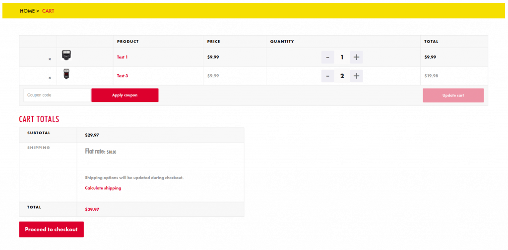
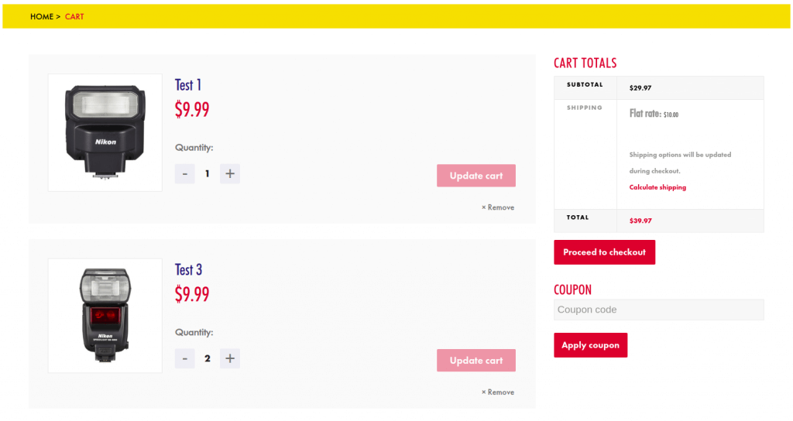
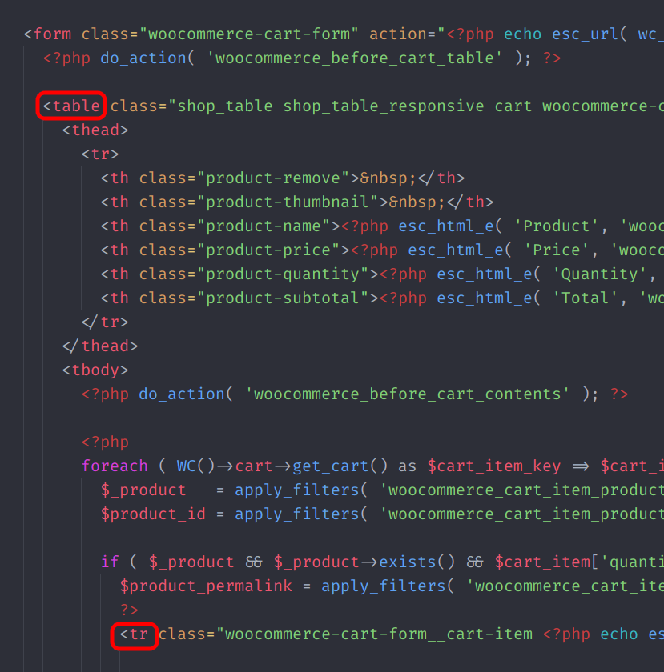
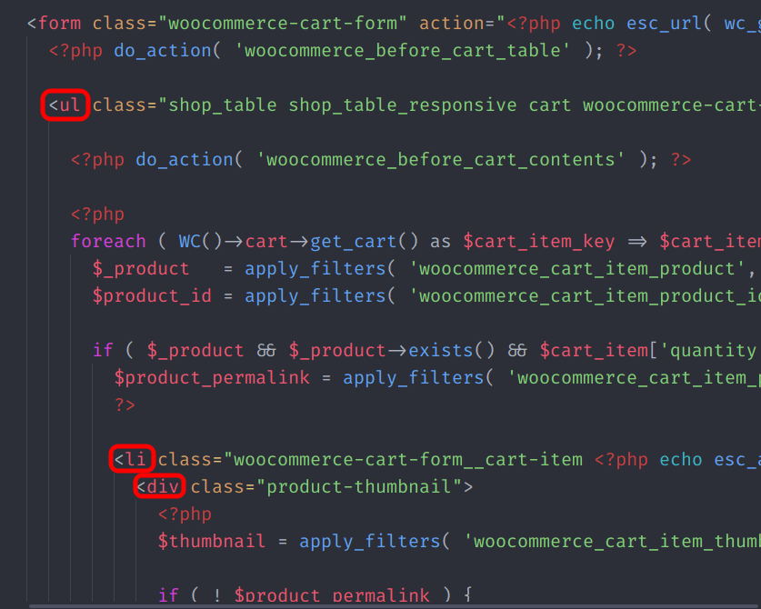
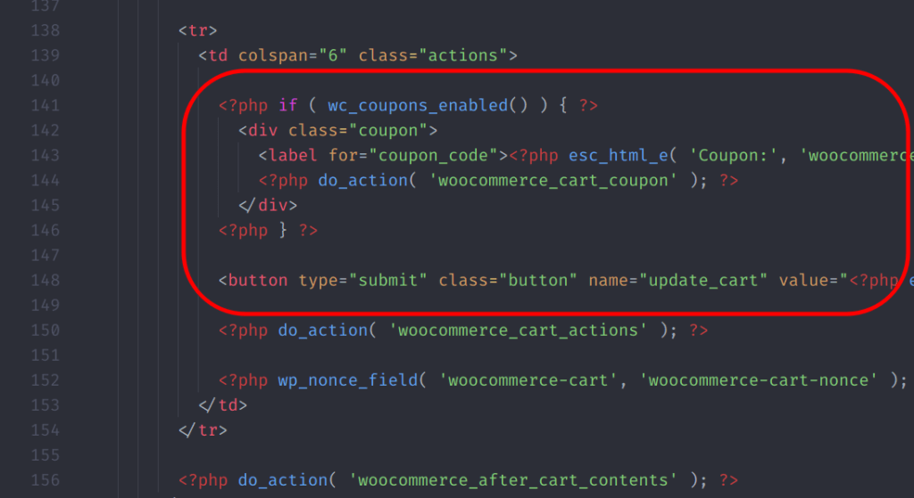
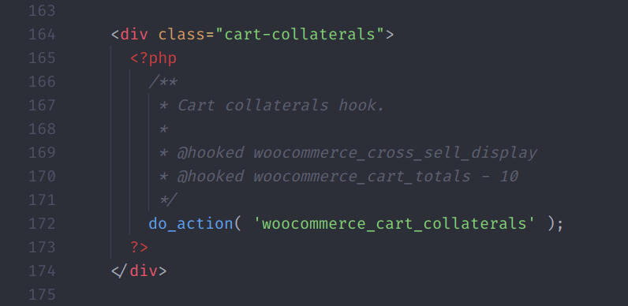
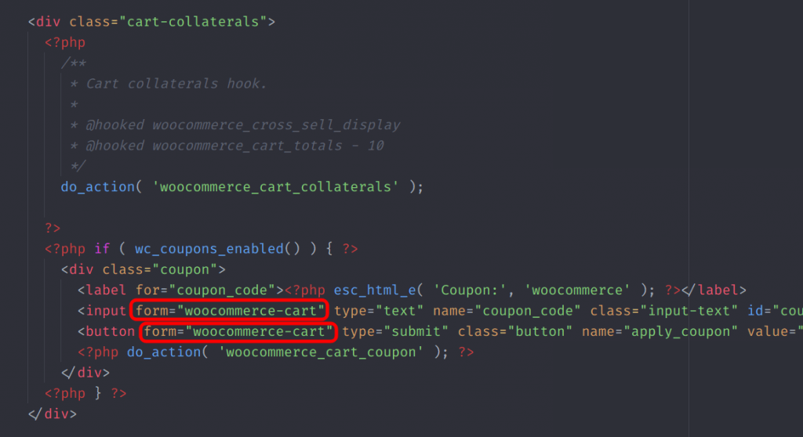
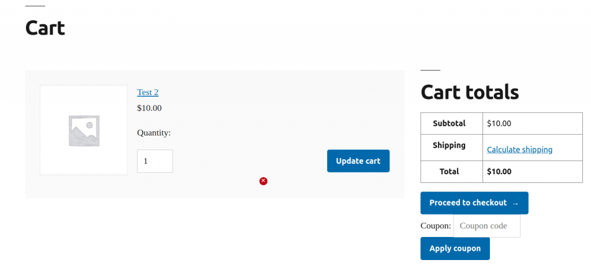

In a previous article, we saw how to customize the product page. Now, let’s customize our cart page.
<!-- more -->

Let’s transform this:


Into this:


The product list was changed from `<table>` to `<ul>`. The cart totals were moved **from the bottom the right** side and the coupons were moved **from the product list to the “cart totals”**.

## 1. Clone `cart.php`

The cart template file is called `cart.php`. But if we change it directly, all our work will be lost (overwritten) once we update the WooCommerce plugin.

The update-safe way to do this is to copy the file we want to change to our theme folder and change this copy. WooCommerce detects the custom file and uses it instead of the default one.

**First, create the structure:**

```bash
cd wp-contents/themes/{yourtheme}
mkdir -p woocommerce/cart
```

::: tip
The `-p` argument on `mkdir -p a/b/c` creates the `a/b/c` structure even if `a` doesn't exist.
:::

**Then, copy the original file to our new structure:**

```bash
cp ../../plugins/woocommerce/templates/cart/cart.php ./woocommerce/cart/
```

## 2. Edit cart.php and change `<table>` to `<ul>`

Refactor the code, changing the `table/tr/td` tags to `ul/li/div`. Feel free to play with the template file and change more elements. You can also add some CSS to change the colors, spacing, fonts, etc.

**From this (table/tr/td):**


**To this (ul/li/div):**


::: tip
After each modification, test it on the browser. Add some CSS styling too.
:::

## 3. Move “Apply Coupons” to the “Cart Totals” section

You need to move this “Apply Coupon” HTML code:


To the “Cart Totals” wrapper:


As the inputs are outside the “form” tag, you need to reference the form on the inputs:


Add an `id` to the form so the reference can work (use a different `id` if you want):


## Final code



```php
<?php
/**
 * Cart Page
 *
 * This template can be overridden by copying it to yourtheme/woocommerce/cart/cart.php.
 *
 * HOWEVER, on occasion WooCommerce will need to update template files and you
 * (the theme developer) will need to copy the new files to your theme to
 * maintain compatibility. We try to do this as little as possible, but it does
 * happen. When this occurs the version of the template file will be bumped and
 * the readme will list any important changes.
 *
 * @see     https://docs.woocommerce.com/document/template-structure/
 * @package WooCommerce/Templates
 * @version 3.5.0
 */

defined( 'ABSPATH' ) || exit;

do_action( 'woocommerce_before_cart' ); ?>

<form class="woocommerce-cart-form" action="<?php echo esc_url( wc_get_cart_url() ); ?>" method="post">
	<?php do_action( 'woocommerce_before_cart_table' ); ?>

	<ul class="shop_table shop_table_responsive cart woocommerce-cart-form__contents">

		<?php do_action( 'woocommerce_before_cart_contents' ); ?>

		<?php
		foreach ( WC()->cart->get_cart() as $cart_item_key => $cart_item ) {
			$_product   = apply_filters( 'woocommerce_cart_item_product', $cart_item['data'], $cart_item, $cart_item_key );
			$product_id = apply_filters( 'woocommerce_cart_item_product_id', $cart_item['product_id'], $cart_item, $cart_item_key );

			if ( $_product && $_product->exists() && $cart_item['quantity'] > 0 && apply_filters( 'woocommerce_cart_item_visible', true, $cart_item, $cart_item_key ) ) {
				$product_permalink = apply_filters( 'woocommerce_cart_item_permalink', $_product->is_visible() ? $_product->get_permalink( $cart_item ) : '', $cart_item, $cart_item_key );
				?>

				<li class="woocommerce-cart-form__cart-item <?php echo esc_attr( apply_filters( 'woocommerce_cart_item_class', 'cart_item', $cart_item, $cart_item_key ) ); ?>">
					<div class="product-thumbnail">
						<?php
						$thumbnail = apply_filters( 'woocommerce_cart_item_thumbnail', $_product->get_image(), $cart_item, $cart_item_key );

						if ( ! $product_permalink ) {
							echo $thumbnail; // PHPCS: XSS ok.
						} else {
							printf( '<a href="%s">%s</a>', esc_url( $product_permalink ), $thumbnail ); // PHPCS: XSS ok.
						}
						?>
					</div>
					<div class="cart-item-details">
						<p class="product-name" data-title="<?php esc_attr_e( 'Product', 'woocommerce' ); ?>">
							<?php
							if ( ! $product_permalink ) {
								echo wp_kses_post( apply_filters( 'woocommerce_cart_item_name', $_product->get_name(), $cart_item, $cart_item_key ) . '&nbsp;' );
							} else {
								echo wp_kses_post( apply_filters( 'woocommerce_cart_item_name', sprintf( '<a href="%s">%s</a>', esc_url( $product_permalink ), $_product->get_name() ), $cart_item, $cart_item_key ) );
							}

							do_action( 'woocommerce_after_cart_item_name', $cart_item, $cart_item_key );

							// Meta data.
							echo wc_get_formatted_cart_item_data( $cart_item ); // PHPCS: XSS ok.

							// Backorder notification.
							if ( $_product->backorders_require_notification() && $_product->is_on_backorder( $cart_item['quantity'] ) ) {
								echo wp_kses_post( apply_filters( 'woocommerce_cart_item_backorder_notification', '<p class="backorder_notification">' . esc_html__( 'Available on backorder', 'woocommerce' ) . '</p>', $product_id ) );
							}
							?>
						</p>

						<p class="product-price" data-title="<?php esc_attr_e( 'Price', 'woocommerce' ); ?>">
							<?php
								echo apply_filters( 'woocommerce_cart_item_price', WC()->cart->get_product_price( $_product ), $cart_item, $cart_item_key ); // PHPCS: XSS ok.
							?>
						</p>

						<div class="product-quantity" data-title="<?php esc_attr_e( 'Quantity', 'woocommerce' ); ?>">
							<p>Quantity:</p>
							<?php
							if ( $_product->is_sold_individually() ) {
								$product_quantity = sprintf( '1 <input type="hidden" name="cart[%s][qty]" value="1" />', $cart_item_key );
							} else {
								$product_quantity = woocommerce_quantity_input( array(
									'input_name'   => "cart[{$cart_item_key}][qty]",
									'input_value'  => $cart_item['quantity'],
									'max_value'    => $_product->get_max_purchase_quantity(),
									'min_value'    => '0',
									'product_name' => $_product->get_name(),
								), $_product, false );
							}

							echo apply_filters( 'woocommerce_cart_item_quantity', $product_quantity, $cart_item_key, $cart_item ); // PHPCS: XSS ok.
							?>

							<button type="submit" class="button" name="update_cart" value="<?php esc_attr_e( 'Update cart', 'woocommerce' ); ?>"><?php esc_html_e( 'Update cart', 'woocommerce' ); ?></button>
						</div>

						<p class="product-remove">
							<?php
								// @codingStandardsIgnoreLine
								echo apply_filters( 'woocommerce_cart_item_remove_link', sprintf(
									'<a href="%s" class="remove" aria-label="%s" data-product_id="%s" data-product_sku="%s">&times;</a>',
									esc_url( wc_get_cart_remove_url( $cart_item_key ) ),
									__( 'Remove this item', 'woocommerce' ),
									esc_attr( $product_id ),
									esc_attr( $_product->get_sku() )
								), $cart_item_key );
							?>
						</p>

					</div>
				</li>
				<?php
			}
		}
		?>

		<?php do_action( 'woocommerce_cart_contents' ); ?>

		<?php do_action( 'woocommerce_cart_actions' ); ?>
		<?php wp_nonce_field( 'woocommerce-cart', 'woocommerce-cart-nonce' ); ?>

		<?php do_action( 'woocommerce_after_cart_contents' ); ?>
	</ul>

	<?php do_action( 'woocommerce_after_cart_table' ); ?>
</form>

<div class="cart-collaterals">
	<?php
		/**
		 * Cart collaterals hook.
		 *
		 * @hooked woocommerce_cross_sell_display
		 * @hooked woocommerce_cart_totals - 10
		 */
		do_action( 'woocommerce_cart_collaterals' );

	?>
	<?php if ( wc_coupons_enabled() ) { ?>
		<div class="coupon">
			<label for="coupon_code"><?php esc_html_e( 'Coupon:', 'woocommerce' ); ?></label>
			<input form="woocommerce-cart" type="text" name="coupon_code" class="input-text" id="coupon_code" value="" placeholder="<?php esc_attr_e( 'Coupon code', 'woocommerce' ); ?>" />
			<button form="woocommerce-cart" type="submit" class="button" name="apply_coupon" value="<?php esc_attr_e( 'Apply coupon', 'woocommerce' ); ?>"><?php esc_attr_e( 'Apply coupon', 'woocommerce' ); ?></button>
			<?php do_action( 'woocommerce_cart_coupon' ); ?>
		</div>
	<?php } ?>
</div>

<?php do_action( 'woocommerce_after_cart' ); ?>


<style media="screen">
/** image at left. */
ul .product-thumbnail {
	height: 225px;
	width: 300px;
	display: inline-block;
}
ul .product-thumbnail img {
	max-width: none;
	height: 100%;
	width: 100%;
	object-fit: contain;
	border: 1px solid #ebebeb;
}

/** item details at right. */
ul .cart-item-details {
	display: inline-block;
	vertical-align: top;
	margin-left: 24px;
	width: 100%;
}

/** no bullets on item list. */
ul.woocommerce-cart-form__contents {
	list-style: none;
	padding-left: 0;
}

/** wrapper: color, margin. */
li.woocommerce-cart-form__cart-item {
	display: flex;
	background-color: #fafafa;
	padding: 36px;
	padding-bottom: 24px;
	margin-bottom: 30px;
}

/** item details: no spacing between elements. */
ul .cart-item-details>* {
	margin: 0;
}

/** "update cart" on each item (right side). */
ul .product-quantity .quantity {
	display: inline-block;
}
ul .product-quantity button {
	float: right;
}

/** cart totals: fixed at right with "sticky". */
#wrap_all, #content { /** parents need to be "overflow: visible". */
	overflow: visible;
}
.woocommerce { /** wrapper needs to be flex. */
	max-width: none !important;
}
.cart-collaterals { /** "sticky". */
	position: sticky;
	display: inline-block;
	vertical-align: top;
	top: 0;
	width: 400px !important;
}
.cart_totals { /** cart totals width. */
	float: left;
	width: 100% !important;
}
.woocommerce-cart-form { /** items width. */
	display: inline-block;
	width: calc(100% - 435px);
	padding-right: 35px;
}
</style>
```
