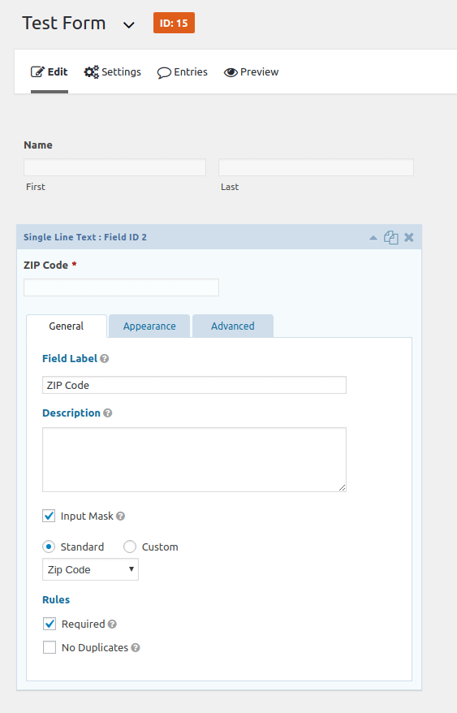

Let’s say you want to populate a state from a ZIP Code (without asking the user to fill it).
<!-- more -->

## 1. ZIP field



## 2. Hidden “State” field


## 3. Take note of 3 IDs: FormID, ZipID, StateID

In our example:

- Form ID: **15**
- ZIP ID: **2**
- State ID: **3**

## 4. Add to your theme’s `functions.php`

Change the numbers **15**, **2**, **3** to your actual IDs (***lines 6 and 8***):

```php
/** functions.php **/

/**
 * Populate state (ex. MO) given a zipcode (form ID 15).
 */
add_action( 'gform_pre_submission_15', 'pre_submission_callback' ); /** Form ID: 15. */
function pre_submission_callback( $form ) {
  $_POST['input_3'] = zipToState( rgpost( 'input_2' ) ); /* State ID: 3, Zipcode ID: 2. */
}

/**
 * Convert a 5-digit ZIP to State (ex. MO, CA, TX, etc).
 */
function zipToState( $zipcode ) {
  /* 000 to 999 */
  $zip_by_state = array(
    '--', '--', '--', '--', '--', 'NY', 'PR', 'PR', 'VI', 'PR', 'MA', 'MA', 'MA', 'MA', 'MA', 'MA', 'MA', 'MA', 'MA', 'MA', 'MA', 'MA', 'MA', 'MA', 'MA', 'MA',
    'MA', 'MA', 'RI', 'RI', 'NH', 'NH', 'NH', 'NH', 'NH', 'NH', 'NH', 'NH', 'NH', 'ME', 'ME', 'ME', 'ME', 'ME', 'ME', 'ME', 'ME', 'ME', 'ME', 'ME', 'VT', 'VT',
    'VT', 'VT', 'VT', 'MA', 'VT', 'VT', 'VT', 'VT', 'CT', 'CT', 'CT', 'CT', 'CT', 'CT', 'CT', 'CT', 'CT', 'CT', 'NJ', 'NJ', 'NJ', 'NJ', 'NJ', 'NJ', 'NJ', 'NJ',
    'NJ', 'NJ', 'NJ', 'NJ', 'NJ', 'NJ', 'NJ', 'NJ', 'NJ', 'NJ', 'NJ', 'NJ', 'AE', 'AE', 'AE', 'AE', 'AE', 'AE', 'AE', 'AE', 'AE', '--', 'NY', 'NY', 'NY', 'NY',
    'NY', 'NY', 'NY', 'NY', 'NY', 'NY', 'NY', 'NY', 'NY', 'NY', 'NY', 'NY', 'NY', 'NY', 'NY', 'NY', 'NY', 'NY', 'NY', 'NY', 'NY', 'NY', 'NY', 'NY', 'NY', 'NY',
    'NY', 'NY', 'NY', 'NY', 'NY', 'NY', 'NY', 'NY', 'NY', 'NY', 'NY', 'NY', 'NY', 'NY', 'NY', 'NY', 'NY', 'NY', 'NY', 'NY', 'PA', 'PA', 'PA', 'PA', 'PA', 'PA',
    'PA', 'PA', 'PA', 'PA', 'PA', 'PA', 'PA', 'PA', 'PA', 'PA', 'PA', 'PA', 'PA', 'PA', 'PA', 'PA', 'PA', 'PA', 'PA', 'PA', 'PA', 'PA', 'PA', 'PA', 'PA', 'PA',
    'PA', 'PA', 'PA', 'PA', 'PA', 'PA', 'PA', 'PA', 'PA', 'PA', '--', 'PA', 'PA', 'PA', 'PA', 'DE', 'DE', 'DE', 'DC', 'VA', 'DC', 'DC', 'DC', 'DC', 'MD', 'MD',
    'MD', 'MD', 'MD', 'MD', 'MD', '--', 'MD', 'MD', 'MD', 'MD', 'MD', 'MD', 'VA', 'VA', 'VA', 'VA', 'VA', 'VA', 'VA', 'VA', 'VA', 'VA', 'VA', 'VA', 'VA', 'VA',
    'VA', 'VA', 'VA', 'VA', 'VA', 'VA', 'VA', 'VA', 'VA', 'VA', 'VA', 'VA', 'VA', 'WV', 'WV', 'WV', 'WV', 'WV', 'WV', 'WV', 'WV', 'WV', 'WV', 'WV', 'WV', 'WV',
    'WV', 'WV', 'WV', 'WV', 'WV', 'WV', 'WV', 'WV', 'WV', '--', 'NC', 'NC', 'NC', 'NC', 'NC', 'NC', 'NC', 'NC', 'NC', 'NC', 'NC', 'NC', 'NC', 'NC', 'NC', 'NC',
    'NC', 'NC', 'NC', 'NC', 'SC', 'SC', 'SC', 'SC', 'SC', 'SC', 'SC', 'SC', 'SC', 'SC', 'GA', 'GA', 'GA', 'GA', 'GA', 'GA', 'GA', 'GA', 'GA', 'GA', 'GA', 'GA',
    'GA', 'GA', 'GA', 'GA', 'GA', 'GA', 'GA', 'GA', 'FL', 'FL', 'FL', 'FL', 'FL', 'FL', 'FL', 'FL', 'FL', 'FL', 'FL', 'FL', 'FL', 'FL', 'FL', 'FL', 'FL', 'FL',
    'FL', 'FL', 'AA', 'FL', 'FL', '--', 'FL', '--', 'FL', 'FL', '--', 'FL', 'AL', 'AL', 'AL', '--', 'AL', 'AL', 'AL', 'AL', 'AL', 'AL', 'AL', 'AL', 'AL', 'AL',
    'AL', 'AL', 'AL', 'AL', 'AL', 'AL', 'TN', 'TN', 'TN', 'TN', 'TN', 'TN', 'TN', 'TN', 'TN', 'TN', 'TN', 'TN', 'TN', 'TN', 'TN', 'TN', 'MS', 'MS', 'MS', 'MS',
    'MS', 'MS', 'MS', 'MS', 'MS', 'MS', 'MS', 'MS', 'GA', '--', 'KY', 'KY', 'KY', 'KY', 'KY', 'KY', 'KY', 'KY', 'KY', 'KY', 'KY', 'KY', 'KY', 'KY', 'KY', 'KY',
    'KY', 'KY', 'KY', '--', 'KY', 'KY', 'KY', 'KY', 'KY', 'KY', 'KY', 'KY', '--', '--', 'OH', 'OH', 'OH', 'OH', 'OH', 'OH', 'OH', 'OH', 'OH', 'OH', 'OH', 'OH',
    'OH', 'OH', 'OH', 'OH', 'OH', 'OH', 'OH', 'OH', 'OH', 'OH', 'OH', 'OH', 'OH', 'OH', 'OH', 'OH', 'OH', '--', 'IN', 'IN', 'IN', 'IN', 'IN', 'IN', 'IN', 'IN',
    'IN', 'IN', 'IN', 'IN', 'IN', 'IN', 'IN', 'IN', 'IN', 'IN', 'IN', 'IN', 'MI', 'MI', 'MI', 'MI', 'MI', 'MI', 'MI', 'MI', 'MI', 'MI', 'MI', 'MI', 'MI', 'MI',
    'MI', 'MI', 'MI', 'MI', 'MI', 'MI', 'IA', 'IA', 'IA', 'IA', 'IA', 'IA', 'IA', 'IA', 'IA', '--', 'IA', 'IA', 'IA', 'IA', 'IA', 'IA', 'IA', '--', '--', '--',
    'IA', 'IA', 'IA', 'IA', 'IA', 'IA', 'IA', 'IA', 'IA', '--', 'WI', 'WI', 'WI', '--', 'WI', 'WI', '--', 'WI', 'WI', 'WI', 'WI', 'WI', 'WI', 'WI', 'WI', 'WI',
    'WI', 'WI', 'WI', 'WI', 'MN', 'MN', '--', 'MN', 'MN', 'MN', 'MN', 'MN', 'MN', 'MN', 'MN', 'MN', 'MN', 'MN', 'MN', 'MN', 'MN', 'MN', '--', 'DC', 'SD', 'SD',
    'SD', 'SD', 'SD', 'SD', 'SD', 'SD', '--', '--', 'ND', 'ND', 'ND', 'ND', 'ND', 'ND', 'ND', 'ND', 'ND', '--', 'MT', 'MT', 'MT', 'MT', 'MT', 'MT', 'MT', 'MT',
    'MT', 'MT', 'IL', 'IL', 'IL', 'IL', 'IL', 'IL', 'IL', 'IL', 'IL', 'IL', 'IL', 'IL', 'IL', 'IL', 'IL', 'IL', 'IL', 'IL', 'IL', 'IL', 'IL', '--', 'IL', 'IL',
    'IL', 'IL', 'IL', 'IL', 'IL', 'IL', 'MO', 'MO', '--', 'MO', 'MO', 'MO', 'MO', 'MO', 'MO', 'MO', 'MO', 'MO', '--', '--', 'MO', 'MO', 'MO', 'MO', 'MO', '--',
    'MO', 'MO', 'MO', 'MO', 'MO', 'MO', 'MO', 'MO', 'MO', '--', 'KS', 'KS', 'KS', '--', 'KS', 'KS', 'KS', 'KS', 'KS', 'KS', 'KS', 'KS', 'KS', 'KS', 'KS', 'KS',
    'KS', 'KS', 'KS', 'KS', 'NE', 'NE', '--', 'NE', 'NE', 'NE', 'NE', 'NE', 'NE', 'NE', 'NE', 'NE', 'NE', 'NE', '--', '--', '--', '--', '--', '--', 'LA', 'LA',
    '--', 'LA', 'LA', 'LA', 'LA', 'LA', 'LA', '--', 'LA', 'LA', 'LA', 'LA', 'LA', '--', 'AR', 'AR', 'AR', 'AR', 'AR', 'AR', 'AR', 'AR', 'AR', 'AR', 'AR', 'AR',
    'AR', 'AR', 'OK', 'OK', '--', 'TX', 'OK', 'OK', 'OK', 'OK', 'OK', 'OK', 'OK', 'OK', '--', 'OK', 'OK', 'OK', 'OK', 'OK', 'OK', 'OK', 'TX', 'TX', 'TX', 'TX',
    'TX', 'TX', 'TX', 'TX', 'TX', 'TX', 'TX', 'TX', 'TX', 'TX', 'TX', 'TX', 'TX', 'TX', 'TX', 'TX', 'TX', 'TX', 'TX', 'TX', 'TX', 'TX', 'TX', 'TX', 'TX', 'TX',
    'TX', 'TX', 'TX', 'TX', 'TX', 'TX', 'TX', 'TX', 'TX', 'TX', 'TX', 'TX', 'TX', 'TX', 'TX', 'TX', 'TX', 'TX', 'TX', 'TX', 'CO', 'CO', 'CO', 'CO', 'CO', 'CO',
    'CO', 'CO', 'CO', 'CO', 'CO', 'CO', 'CO', 'CO', 'CO', 'CO', 'CO', '--', '--', '--', 'WY', 'WY', 'WY', 'WY', 'WY', 'WY', 'WY', 'WY', 'WY', 'WY', 'WY', 'WY',
    'ID', 'ID', 'ID', 'ID', 'ID', 'ID', 'ID', '--', 'UT', 'UT', '--', 'UT', 'UT', 'UT', 'UT', 'UT', '--', '--', 'AZ', 'AZ', 'AZ', 'AZ', '--', 'AZ', 'AZ', 'AZ',
    '--', 'AZ', 'AZ', '--', '--', 'AZ', 'AZ', 'AZ', '--', '--', '--', '--', 'NM', 'NM', '--', 'NM', 'NM', 'NM', '--', 'NM', 'NM', 'NM', 'NM', 'NM', 'NM', 'NM',
    'NM', 'NM', '--', '--', '--', '--', 'NV', 'NV', '--', 'NV', 'NV', 'NV', '--', 'NV', 'NV', '--', 'CA', 'CA', 'CA', 'CA', 'CA', 'CA', 'CA', 'CA', 'CA', '--',
    'CA', 'CA', 'CA', 'CA', 'CA', 'CA', 'CA', 'CA', 'CA', 'CA', 'CA', 'CA', 'CA', 'CA', 'CA', 'CA', 'CA', 'CA', 'CA', '--', 'CA', 'CA', 'CA', 'CA', 'CA', 'CA',
    'CA', 'CA', 'CA', 'CA', 'CA', 'CA', 'CA', 'CA', 'CA', 'CA', 'CA', 'CA', 'CA', 'CA', 'CA', 'CA', 'CA', 'CA', 'CA', 'CA', 'CA', 'CA', 'CA', 'CA', 'CA', 'CA',
    'AP', 'AP', 'AP', 'AP', 'AP', 'HI', 'HI', 'GU', 'OR', 'OR', 'OR', 'OR', 'OR', 'OR', 'OR', 'OR', 'OR', 'OR', 'WA', 'WA', 'WA', 'WA', 'WA', 'WA', 'WA', '--',
    'WA', 'WA', 'WA', 'WA', 'WA', 'WA', 'WA', 'AK', 'AK', 'AK', 'AK', 'AK'
  );

  $prefix = substr( $zipcode, 0, 3 );
  $index  = intval( $prefix ); /* converts prefix to integer */
  return $zip_by_state[ $index ];
}
```
