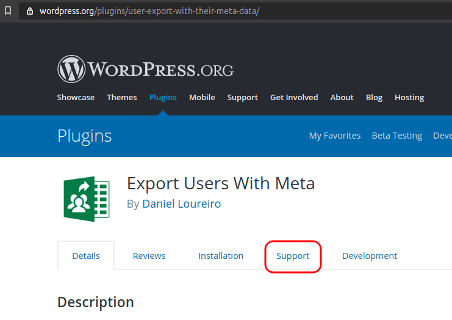
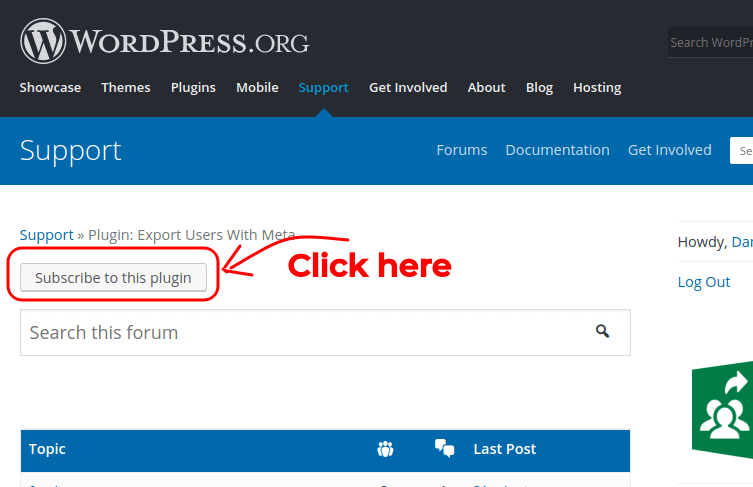

When publishing your plugin to the official WordPress repository, you **HAVE to use SVN**. As for September 2019, WordPress doesn't support GIT repos.
<!-- more -->

Using SVN instead of GIT (as your code version control) wouldn’t be more than a mere inconvenience if it wasn’t for the fact that **WordPress’ SVN is not meant to be used as a code version control**. You need to use something else for this, like GIT.

From WordPress’ [official page](https://developer.wordpress.org/plugins/wordpress-org/how-to-use-subversion/):

> SVN and the Plugin Directory are a release repository. Unlike Git, you shouldn’t commit every small change, as doing so can degrade performance. Please only push finished changes to your SVN repository.

So, if you want to have a code version control (you should have one), you need to set it up separately. Even if you like SVN more than GIT, you must set an additional SVN repo just for your code version control. **You can’t use WordPress’ SVN for code control.**

In this tutorial, I will show you how to use GIT and SVN together, in an organized way. GIT for code control and SVN for publishing only.

## 1. Your current development structure

I am 100% sure you are working in a structure like this:

```bash
my-project
└── wp-content
    └── plugins
        └── my-plugin
            └── my-plugin.php
```

The `my-project` folder is a full WordPress installation, used as a shell for your plugin development.

`my-plugin` is your actual plugin folder. It’s where all development happens.

And obviously, `my-plugin/my-plugin.php` is the plugin’s entry-point.

## 2. The plan

Our final folder structure will be:

```bash
my-project
├── working-env
│   └── wp-content
│       └── plugins
│           └── my-plugin
│               ├── .git
│               └── my-plugin.php
└── svn
    ├── assets
    ├── branches
    ├── tags
    └── trunk
        ├── .git
        └── my-plugin.php
```

The `working-env` folder is our WP installation, just renamed. It is still where we do all our work. Notice that we have initialized GIT on `my-plugin`, which means the plugin folder is the only thing on GIT. We don’t need to keep the whole WP instance on version control nor make backups of it. In case we need to restore the project (ex. install it in a new machine), we re-create “working-env” from a brand new WP installation and clone the GIT repo in the “my-plugin” folder.

The `svn` folder is only used for deployment. It has the 4 standard SVN folders: assets, branches, tags, and trunk. This structure is automatically generated by WordPress once we clone the SVN repository. We don’t need to keep this folder on GIT nor make backups of it. Even if we destroy the entire “svn” folder, we can always restore it from the SVN repo. A quick explanation about its structure: the `assets` folder contains images displayed on the plugin’s page (screenshots, banners and plugin icon). The `trunk` folder is the current stable version that is available for download on WP.

The workflow is: we work on “my-plugin” (“working-env”) and once is tested and ready for deploy, we update the “trunk” folder (with “my-plugin” files), and we call the svn command to submit.

## 3. Preparing your code for publishing

Once your first version is tested and ready to be published, we need to set up the `readme.txt` file (as per [WP’s official guide](https://developer.wordpress.org/plugins/wordpress-org/how-to-use-subversion/)).

We don’t have our GIT and SVN set up yet, but don’t worry – we will do after preparing our code for publishing.

### 3.1. Know the rules

Read the rules for publishing. It only takes a few seconds and you will discover a lot of things that are not allowed (like having a jQuery library on your plugin):
[https://developer.wordpress.org/plugins/wordpress-org/detailed-plugin-guidelines/](https://developer.wordpress.org/plugins/wordpress-org/detailed-plugin-guidelines/)

### 3.2. Choosing a name

Our plugin must have a name and it must follow these rules:

- **Must be unique:** Check the [WP plugin directory](https://wordpress.org/plugins/) to see if there’s another plugin with the same name as yours.
- **Trademark infringement:** Do not use trademarks like “Facebook” in your plugin’s name. It is not allowed. For example, “Facebook Sign-Up” is not okay. If you really want to put a trademark on the name, read [rule #17](https://developer.wordpress.org/plugins/wordpress-org/detailed-plugin-guidelines/#17-plugins-must-respect-trademarks-copyrights-and-project-names) – there are some ways to do it.
- **Bad words:** Not allowed at all.
- **You can’t rename the plugin:** So choose the name wisely.

### 3.3. Edit `readme.txt` (most IMPORTANT step!!!)

**Before publishing your plugin, you MUST edit the `readme.txt` file.** It seems a silly thing to do, but this file actually governs many aspects of the plugin.

The readme file defines the plugin name, version and other control information used for updates and repository management. This file is also the first thing the users will see when looking for plugins on the WP directory (description, screenshots, etc).

If you created your plugin with WP-CLI, you should have a “readme.txt” file with a full example ready to be edited.

::: warning
Important fields you **NEED** to set:

- **Version (stable tag):** Same as in “my-plugin.php” headers (ex. “0.1.0”);
- **License (ex. MIT, GPL2, etc):** Must be a [GPL-compatible license](https://www.gnu.org/licenses/license-list.html#GPLCompatibleLicenses);
- **Changelog:** Set a “0.1.0: First version”;
- **Screenshots:** NO SCREENSHOTS for now – just remove this section (even if you have it, we can only define this section AFTER submitting our plugin for the first time);
- **Plugin name / Short description / Long description, Author (contributors):** Your moment to shine.

For a complete list of all fields (and for a full example):
[https://developer.wordpress.org/plugins/wordpress-org/how-your-readme-txt-works/](https://developer.wordpress.org/plugins/wordpress-org/how-your-readme-txt-works/)
:::

Test your final `readme.txt` file here:
[https://wordpress.org/plugins/developers/readme-validator/](https://wordpress.org/plugins/developers/readme-validator/)

## 4. Create an SVN repository on WordPress

Once your readme.txt is ready, let’s create an empty SVN repository on WordPress:

- **ZIP your plugin** files (except the .git folder if exists);
- **Name it** as `my-plugin.zip` (change “my-plugin” to your plugin’s name);
- **Test the ZIP file** by manually installing the plugin into a different WP installation (Plugins > Add New > Upload Plugin > my-plugin.zip);
- **Submit your ZIP file** to review: [https://wordpress.org/plugins/developers/add/](https://wordpress.org/plugins/developers/add/);

::: warning
It can take a **few days** for your plugin be reviewed. Once approved, you will receive **SVN credentials on your email**.
:::

::: warning
Once approved, the **SVN repo will be empty**. They won’t prefill it with your plugin.
:::

## 5. Setting GIT

While you wait your plugin be approved, let’s set GIT on `wp-content/plugins/my-plugin`.

### Gitignore

If you have used `wp-cli`, you don’t need to do anything: there will be a .gitignore in your folder. If you haven’t used it, then you will need one:

```bash
.DS_Store
wp-cli.local.yml
node_modules/
vendor/
*.zip
*.tar.gz
composer.lock
*.log
phpunit.xml
phpcs.xml
.phpcs.xml
```

***PS:** I prefer to remove the `composer.lock` line as I want it on git control. As per official Composer documentation, `composer.lock` should be in the version control as well as `composer.json` (but never `vendor`).*

### Init your git repo locally

```bash
cd wp-content/plugins/my-plugin
git init
git add -a
git commit -m "my first commit"
```

### On GitHub (GitLab, etc), create a repo, submit the files

On GitHub, follow the second set of instructions, "Push an existing repository...":

```bash
cd wp-content/plugins/my-plugin
```

```bash
git remote add origin https://github.com/username/new_repo
git push -u origin master
```

## 6. Move your WP installation from `my-project` to `my-project\working-env`

```bash
mv my-project working-env
mkdir my-project
mv working-env my-project
```

Check the structure:

```bash
cd my-project
ls
    working-env
```

## 7. Clone your SVN (it will be empty – they don’t pre-fill it with your zip files)

Once the plugin has been approved and you get the SVN credentials on your email:

```bash
cd my-project
```

```bash
svn checkout --depth immediates https://plugins.svn.wordpress.org/your-plugin-name svn
```

Update code (should be empty, but just in case):

```bash
cd svn
```

```bash
# /svn
svn update --set-depth infinity assets
svn update --set-depth infinity trunk
```

Structure of `my-project/svn`:

```bash
# /svn
ls
    /assets/
    /branches/
    /tags/
    /trunk/
```

***PS:** `assets` is where you put the icon/banner/screenshots for your WP’s plugin page. It is not where you put your plugin’s JS/CSS/images.*

## 8. Create a folder for the screenshots/icon/banner (`.wordpress-org`)

It’s a good idea to have this folder even if you don’t have yet screenshots / icon / a banner for your plugin page on WP’s directory.

```bash
# /working-env/wp-content/plugins/my-plugin
mkdir .wordpress-org
```

Now, make sure this folder is not going to be sent to SVN inside our code tree (we will manually push them to `/assets` along trunk and others).

Open `.distignore` and add the line `.wordpress-org` anywhere (at beginning or bottom for example):

```bash
# /working-env/wp-content/plugins/my-plugin
nano .distignore
```

```bash
# .distignore
.wordpress-org
...
```

***PS:** You can name this `.wordpress-org` folder anything you want actually, but I prefer `.wordpress-org` because it is used by many other plugins.*

## 9. Tweak `.distignore`

While you have `.distignore` opened, remove these two lines:

- `vendor`
- `node_modules`

While sending these folders to SVN can cause security issues to your plugin, the security issues are for dev dependencies only and we are going to manually re-generate these folders on production mode, so it is safe to send them to SVN.

Also, add files/folders that you want to have on GitHub but not on SVN. Examples:

- `.github` (GitHub files, like GitHub Action Workflow files);
- `.vscode` (VSCode editor settings);

## 10. [Optional] Add a screenshot for the plugin’s page

Steps:

- Take screenshots (any size, ex. 760×500);
- Save files on `.wordpress-org` folder;
- File names must be on this format: `screenshot-#.jpg (or png)`

::: warning
**Valid** file names: `screenshot-1.jpg`, `screenshot-2.png`.
**Invalid** file names: `main-screen-1.jpg`, `menu-items.png`.
:::

Change “Screenshots” section on `readme.txt`:

```markdown
== Screenshots ==

1. This is a screenshot description
2. This is a description for the second screenshot
```

::: tip
Official Guide:
[https://developer.wordpress.org/plugins/wordpress-org/plugin-assets/#screenshots](https://developer.wordpress.org/plugins/wordpress-org/plugin-assets/#screenshots)
:::

## 11. [Optional] Add Icon and Banner to the plugin page

**Icon ([official guide here](https://developer.wordpress.org/plugins/wordpress-org/plugin-assets/#plugin-icons)):**

- Put files on `.wordpress-org` folder;
- Set filenames accordingly (ex. `icon-256x256.png` – see guide for different formats);
- No need for `readme.txt` changes;

**Banner:**

[https://developer.wordpress.org/plugins/wordpress-org/plugin-assets/#plugin-headers](https://developer.wordpress.org/plugins/wordpress-org/plugin-assets/#plugin-headers)

## 12. [FINAL STEP] Submit plugin

Go to the project root:

```bash
cd my-project
ls
    working-env
    svn
```

Get a clean copy from GIT and save it as `temp-git`. This will be the production version, with no dev code:

```bash
# /
git clone https://github.com/username/my-repo-name temp-git
```

Our root structure will be:

```bash
# /
ls
    working-env
    svn
    temp-git
```

Compile production code for your project:

```bash
# /
cd temp-git
composer install --no-dev
npm install --production
```

Sync SVN/production code (copy code to `trunk`, ignoring files in `.distignore`):

```bash
# /
cd svn
rsync -rc --exclude-from="../temp-git/.distignore" "../temp-git/" trunk/ --delete --delete-excluded
```

Copy files from `.wordpress-org` to SVN (plugin’s screenshots, icons, banner):

```bash
# /svn
rsync -rc "../temp-git/.wordpress-org" assets/ --delete
```

Add files to the SVN control:

```bash
# /svn
svn add . --force
svn status | grep '^\!' | sed 's/! *//' | xargs -I% svn rm %@
```

Create your first version tag (ex. `0.0.1`):

```bash
# /svn
svn cp "trunk" "tags/0.0.1"
```

Fix screenshots MIME types (to avoid downloading them when clicking):

```bash
# /svn
svn propset svn:mime-type image/png assets/*.png || true
svn propset svn:mime-type image/jpeg assets/*.jpg || true
```

Submit your SVN to WP:

```bash
# /svn
svn ci -m 'Adding first version of my plugin'
```

Remove `svn` and `git-temp` folders as they won’t be used anymore:

```bash
# /svn
cd ..
```

```bash
# /
rm -Rf temp-git
rm -Rf svn
```

::: tip
Congratulations! Your plugin is now publicly available for download.
:::

---

## Updating your plugin

Do your changes to `working-env` and test them. Once you are ready, you can proceed.

### Update the version

In this example, let’s change the version from `1.0.0` to `1.0.1`.

Change 2 files: `readme.txt` and `my-plugin.php`. Don’t forget to add a Changelog entry to `readme.txt`.

### Push to GIT

Go to `my-plugin` folder:

```bash
cd working-env/wp-content/plugins/my-plugin
```

Add files, commit, and push:

```bash
git add -i
git commit -m "some changes"
git push origin master
```

### Submit the new code

Follow **step 11**, changing the version number to your current version number.

---

## Getting Support Notifications For Your Plugin

To receive email notifications when your users submit support requests:

- Open your plugin page (ex. [https://wordpress.org/plugins/user-export-with-their-meta-data](https://wordpress.org/plugins/user-export-with-their-meta-data))
- Click on the **“Support”** tab:

- Click on “Subscribe to this plugin”:


---

::: success
Done!
:::
