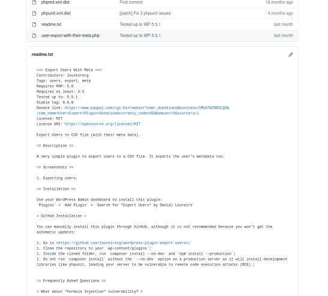
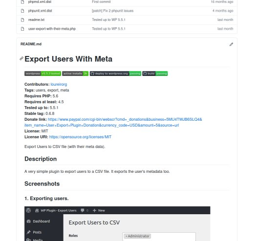

WordPress Plugins hosted on GitHub have a bad readme page by default. 

That's because they can't use markdown, but let's see how to fix this issue.
<!-- more -->

**From this:**

**To this:**

The problem is that the `readme.txt` page must follow a specific WordPress format to work. And this format is not the MarkDown format used on GitHub.

To fix it, you can manually create an additional `README.md` to your project. But good luck keeping it synced with `readme.txt`.

A better approach is to automate the conversion process. Luckily, there’s already a Grunt script for this: [wp_readme_to_markdown](https://github.com/stephenharris/wp-readme-to-markdown) created by Stephen Harris.

Even better, if you created your plugin using `wp scaffold plugin`, you already have it installed.

## Using it

- On your plugin’s root, install the npm pre-defined packages:
`npm install`;
- Run `grunt` to execute the pre-defined tasks;
- Done!

You can configure GitHub Actions to auto-run this command on commits, so you won’t have to manually call this command. I will explain how to on another article.
