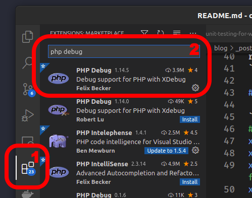
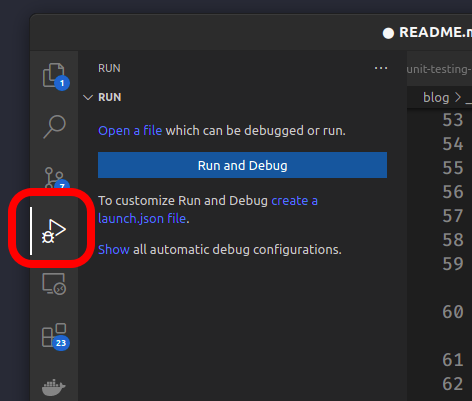
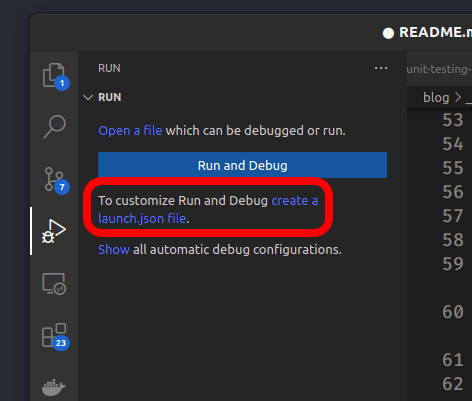
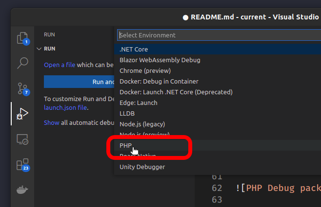
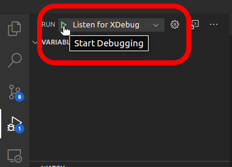
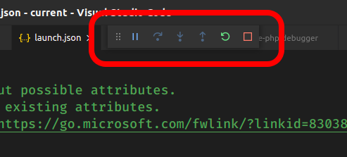
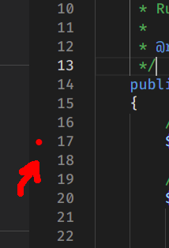
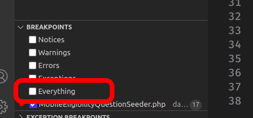

This tutorial shows how to debug PHP on VSCode Editor.
<!-- more -->

## 1. Install xdebug

```bash
sudo apt install php-xdebug
```

## 2. Check installation

Create a temporary file to display your `phpinfo` information:

```bash
cd
echo "<?php phpinfo();" > phpinfo.php
php -S localhost:3000
    PHP 7.3.6-1+ubuntu19.04.1+deb.sury.org+1 Development Server started at Wed Jun  5 17:20:29 2019
    Listening on http://localhost:3000
    Document root is /home/daniel
    Press Ctrl-C to quit.
```

Now, **(1)** open the page, **(2)** search for xdebug, and **(3)** get the `xdebug.ini` path:


Down on the same page, check if the module is enabled:


Now you can remove the `phpinfo.php` file (optional):

```bash
cd
rm phpinfo.php
```

## 3. Add these lines to `xdebug.ini`

```ini
# /etc/php/7.3/cli/conf.d/20-xdebug.ini

# xdebug v2.x
xdebug.remote_enable=1
xdebug.remote_host=127.0.0.1
xdebug.remote_connect_back=1    # Not safe for production servers
xdebug.remote_port=9000
xdebug.remote_handler=dbgp
xdebug.remote_mode=req
xdebug.remote_autostart=true

# xdebug v3.x
xdebug.mode = debug
xdebug.start_with_request = yes
xdebug.client_port = 9000
```

## 4. Install `PHP Debug` plugin on VSCode

On VSCode,
(1) Click on `Extensions` tab (`Ctrl+Shift+X`); and
(2) Install package `PHP Debug` by *Felix Becker*:



## 5. Re-start VSCode editor

## 6. Debugging

### 1. Click on `Run` tab (`Ctrl+Shift+D`)



### 2. Click on `create a launch.json file`



### 3. Click on `PHP`



You can close the `launch.json` file:


### 4. Click on the Play icon



The debugger tools will appear:


### 5. Set breakpoints (click on the ruler)



::: tip
Unselect `Everything` for performance and for your sanity.


:::
