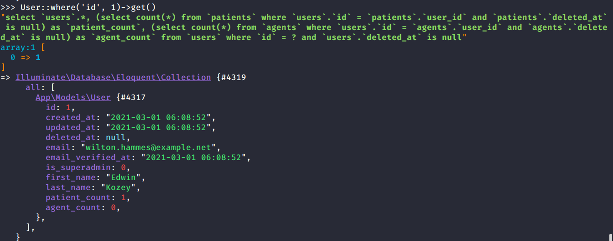

If you want to echo the SQL queries being executed on Tinker:
<!-- more -->

Add `.psysh.php` to your project:

```php
<?php
DB::listen(function ($query) {
    dump("[{$query->time}ms] {$query->sql}");
    if ($query->bindings) {
        dump($query->bindings);
    }
});
```

Now, whenever Tinker executes a query, it logs on screen:

